# 🛒 ER Diagram – Indian E-Commerce Platform

ER model for an Indian e-commerce platform (in the style of Flipkart or Amazon.in) with the entities **Customer, Product, Order, OrderItem, Seller, Category, Payment, Delivery and Address**.

> The diagrams below are written in **Mermaid**, which GitHub renders automatically inside README files. No images or plugins are needed.

---

## 1. Notation Used

| Symbol in diagram | Meaning |
|---|---|
| `PK` | Primary key |
| `FK` | Foreign key |
| `UK` | Unique (candidate) key |
| `PK, FK` | Attribute is both part of the primary key and a foreign key (weak-entity key) |
| **Solid line** `──` | **Identifying** relationship (owner → weak entity) |
| **Dashed line** `- -` | **Non-identifying** (normal) relationship |
| `\|\|` | Exactly one → **total (mandatory)** participation |
| `\|o` | Zero or one → **partial (optional)** participation |
| `\|{` | One or more → **total (mandatory)** participation |
| `o{` | Zero or more → **partial (optional)** participation |
| `"composite: X"` | Attribute is a component of composite attribute **X** |
| `"multi-valued"` | Attribute is multi-valued (stored in its own table) |
| `"partial key"` | Discriminator of a weak entity |
| `"derived"` | Derived attribute (computed, not stored) |

---

## 2. Main ER Diagram

```mermaid
erDiagram
    CUSTOMER {
        string customer_id PK
        string first_name "composite: name"
        string middle_name "composite: name"
        string last_name "composite: name"
        string email UK
        date date_of_birth
        int age "derived from date_of_birth"
        date registered_on
    }

    CUSTOMER_PHONE {
        string customer_id PK, FK
        string phone_number PK "multi-valued, +91 mobile"
    }

    ADDRESS {
        string customer_id PK, FK "owner key"
        int address_seq PK "partial key (weak entity)"
        string house_no "composite: street_address"
        string street "composite: street_address"
        string landmark "composite: street_address"
        string city
        string state
        string pincode "6-digit PIN code"
        string address_type "Home, Work, Other"
    }

    SELLER {
        string seller_id PK
        string business_name
        string gstin UK "15-char GST number"
        string pan UK "10-char PAN"
        string contact_first_name "composite: contact_name"
        string contact_last_name "composite: contact_name"
        string email UK
        string pickup_city "composite: pickup_address"
        string pickup_state "composite: pickup_address"
        string pickup_pincode "composite: pickup_address"
        float rating "derived from reviews"
    }

    SELLER_PHONE {
        string seller_id PK, FK
        string phone_number PK "multi-valued"
    }

    CATEGORY {
        string category_id PK
        string category_name UK
        string description
        string parent_category_id FK "recursive: sub-category"
    }

    PRODUCT {
        string product_id PK
        string seller_id FK
        string category_id FK
        string product_name
        string brand
        decimal mrp "INR"
        decimal selling_price "INR"
        string hsn_code "GST HSN code"
        decimal gst_rate "0, 5, 12, 18 or 28 percent"
        int stock_qty
        string product_type "discriminator for specialization"
    }

    PRODUCT_IMAGE {
        string product_id PK, FK
        string image_url PK "multi-valued"
    }

    ELECTRONICS {
        string product_id PK, FK
        string model_number
        int warranty_months
        string bis_certification "BIS registration no."
    }

    CLOTHING {
        string product_id PK, FK
        string size "XS to XXL"
        string fabric
        string gender "Men, Women, Kids, Unisex"
    }

    BOOK {
        string product_id PK, FK
        string isbn UK
        string author
        string publisher
        string language "Hindi, English, etc."
    }

    GROCERY {
        string product_id PK, FK
        string fssai_license "FSSAI licence no."
        date expiry_date
        boolean is_vegetarian "green or brown dot"
    }

    ORDER {
        string order_id PK
        string customer_id FK
        int address_seq FK "ship-to address of the customer"
        datetime order_date
        string order_status "Placed, Shipped, Delivered, Cancelled, Returned"
        decimal total_amount "derived: sum of order items"
    }

    ORDER_ITEM {
        string order_id PK, FK "owner key"
        int line_no PK "partial key (weak entity)"
        string product_id FK
        int quantity
        decimal unit_price "price at time of order"
        decimal gst_amount
    }

    PAYMENT {
        string payment_id PK
        string order_id FK
        decimal amount "INR"
        string payment_mode "UPI, Card, NetBanking, Wallet, COD, EMI"
        string transaction_ref UK "UPI UTR or gateway ref"
        string payment_status "Pending, Success, Failed, Refunded"
        datetime paid_at
    }

    DELIVERY {
        string order_id PK, FK "owner key"
        int shipment_no PK "partial key (weak entity)"
        string courier_partner "e.g. Delhivery, Ekart, India Post"
        string awb_number UK "airway bill / tracking no."
        date dispatch_date
        date expected_date
        date delivered_date
        string delivery_status
    }

    %% ---------- Relationships ----------
    CUSTOMER ||--|{ CUSTOMER_PHONE : "has"
    CUSTOMER ||--o{ ADDRESS : "owns"
    CUSTOMER ||--o{ ORDER : "places"
    ADDRESS  ||..o{ ORDER : "ships to"

    SELLER   ||--|{ SELLER_PHONE : "has"
    SELLER   ||..o{ PRODUCT : "sells"

    CATEGORY ||..o{ PRODUCT : "classifies"
    CATEGORY |o..o{ CATEGORY : "parent of"

    PRODUCT  ||--|{ PRODUCT_IMAGE : "has"
    PRODUCT  ||..o{ ORDER_ITEM : "appears in"

    ORDER    ||--|{ ORDER_ITEM : "contains"
    ORDER    ||..|{ PAYMENT : "paid by"
    ORDER    ||--o{ DELIVERY : "shipped as"

    PRODUCT  ||--o| ELECTRONICS : "is a"
    PRODUCT  ||--o| CLOTHING : "is a"
    PRODUCT  ||--o| BOOK : "is a"
    PRODUCT  ||--o| GROCERY : "is a"
```

