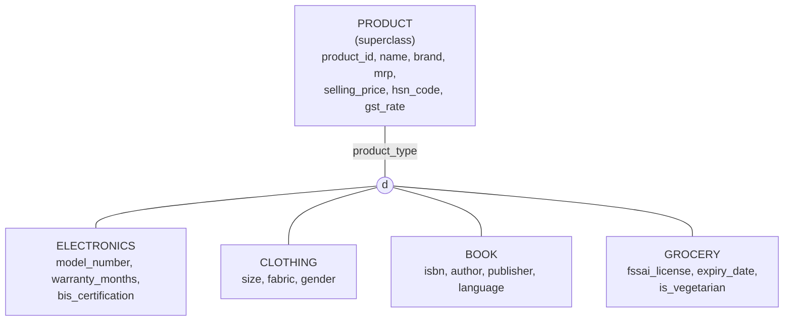

# Experiment 1 – ER Diagram for an Indian E-Commerce Platform

## Aim

To design an **Entity–Relationship (ER) diagram** for an Indian e-commerce platform with the entities **Customer, Product, Order, OrderItem, Seller, Category, Payment, Delivery and Address**, and to specify **primary keys, composite and multi-valued attributes, weak entities, specialization of Product, and participation constraints**.

## Software / Tools Required

- **Mermaid** (diagram-as-code, rendered automatically by GitHub)
- Any text editor, or GitHub's web editor
- *(Optional)* draw.io, Lucidchart or MySQL Workbench for a hand-drawn version

---

## 1. Theory

### 1.1 ER Model

The **Entity–Relationship model** is a high-level conceptual data model. It describes the data an application needs as **entities**, their **attributes**, and the **relationships** between them, before any tables are created.

### 1.2 Basic Concepts

| Concept | Definition | Example in this design |
|---|---|---|
| **Entity** | A real-world object with an independent existence | Customer, Product, Seller |
| **Entity set** | Collection of entities of the same type | All customers |
| **Attribute** | A property that describes an entity | `email`, `mrp`, `pincode` |
| **Relationship** | An association between two or more entities | Customer *places* Order |
| **Degree** | Number of entity sets in a relationship | *places* is binary (degree 2) |

### 1.3 Types of Attributes

| Type | Meaning | Chen Notation | Example |
|---|---|---|---|
| **Simple** | Cannot be divided further | Oval | `gst_rate` |
| **Composite** | Made of smaller sub-attributes | Oval with child ovals | `name` → first, middle, last |
| **Multi-valued** | Can hold several values for one entity | Double oval | Customer `phone_numbers` |
| **Derived** | Computed from other attributes | Dashed oval | `age` from `date_of_birth` |
| **Key** | Uniquely identifies an entity | Underlined oval | `customer_id` |

### 1.4 Keys

| Key | Definition | Example |
|---|---|---|
| **Super key** | Any set of attributes that uniquely identifies a row | {`seller_id`, `business_name`} |
| **Candidate key** | A minimal super key | `seller_id`, `gstin`, `pan` |
| **Primary key** | The candidate key chosen to identify rows | `seller_id` |
| **Partial key (discriminator)** | Identifies a weak entity *within* its owner | `line_no` in OrderItem |
| **Foreign key** | Attribute that refers to the primary key of another entity | `seller_id` in Product |

### 1.5 Strong and Weak Entities

| Strong Entity | Weak Entity |
|---|---|
| Has its own primary key | Has no primary key of its own, only a partial key |
| Exists independently | Depends on an **owner (identifying) entity** |
| Single rectangle | **Double rectangle** |
| Normal relationship (single diamond) | **Identifying relationship** (double diamond) |
| e.g. Customer, Order | e.g. Address, OrderItem, Delivery |

### 1.6 Constraints on Relationships

**Cardinality ratio**: the maximum number of relationship instances an entity can take part in: **1 : 1**, **1 : N**, **M : N**.

**Participation constraint**: whether every entity must take part in the relationship:

| Participation | Meaning | Chen Notation | Example |
|---|---|---|---|
| **Total** (mandatory) | Every entity **must** participate | Double line | Every Order is placed by a Customer |
| **Partial** (optional) | Some entities may not participate | Single line | A Customer may have placed no Order |

### 1.7 Specialization and Generalization

**Specialization** divides a superclass into **subclasses** based on a distinguishing characteristic. Each subclass inherits all the superclass's attributes and adds its own.

| Constraint | Options |
|---|---|
| **Disjointness** | **Disjoint (d)**: an entity belongs to at most one subclass. **Overlapping (o)**: it may belong to several. |
| **Completeness** | **Total**: every superclass entity must be in some subclass. **Partial**: some need not be. |

---

## 2. Procedure

1. Study the requirements of an Indian e-commerce platform: customers, sellers, products, orders, payments and deliveries.
2. Identify the **entities** and decide which are **strong** and which are **weak**.
3. List the **attributes** of each entity and classify them as simple, composite, multi-valued or derived.
4. Choose a **primary key** for every strong entity and a **partial key** for every weak entity.
5. Identify the **relationships**, then fix their **cardinality** and **participation** constraints.
6. Model the **specialization** of Product into its subclasses and state the disjointness and completeness constraints.
7. Draw the ER diagram in **Mermaid** so it renders directly on GitHub.
8. Document every design decision in tables.

---

## 3. Entities Identified

| Entity | Type | Description |
|---|---|---|
| **Customer** | Strong | A registered buyer on the platform |
| **Seller** | Strong | A business that lists products (registered with GSTIN and PAN) |
| **Category** | Strong | Product category. Can contain sub-categories (recursive). |
| **Product** | Strong (superclass) | An item for sale, specialised into Electronics, Clothing, Book and Grocery |
| **Order** | Strong | A purchase made by a customer |
| **Payment** | Strong | A payment attempt against an order (UPI, Card, COD…) |
| **Address** | **Weak** (owner: Customer) | A saved delivery address of a customer |
| **OrderItem** | **Weak** (owner: Order) | One line of an order: a product and its quantity |
| **Delivery** | **Weak** (owner: Order) | A shipment of an order through a courier partner |

---

## 4. Notation Used in the Diagram

| Symbol in diagram | Meaning |
|---|---|
| `PK` | Primary key |
| `FK` | Foreign key |
| `UK` | Unique (candidate) key |
| `PK, FK` | Attribute is both part of the primary key and a foreign key (weak-entity key) |
| **Solid line** `──` | **Identifying** relationship (owner → weak entity) |
| **Dashed line** `- -` | **Non-identifying** (normal) relationship |
| `\|\|` | Exactly one → **total (mandatory)** participation |
| `\|o` | Zero or one → **partial (optional)** participation |
| `\|{` | One or more → **total (mandatory)** participation |
| `o{` | Zero or more → **partial (optional)** participation |
| `"composite: X"` | Attribute is a component of composite attribute **X** |
| `"multi-valued"` | Attribute is multi-valued (stored in its own table) |
| `"partial key"` | Discriminator of a weak entity |
| `"derived"` | Derived attribute (computed, not stored) |

---

## 5. ER Diagram

---

## 6. Specialization of Product (ISA Hierarchy)

| Property | Value | Reason |
|---|---|---|
| **Disjointness** | **Disjoint (d)** | A product belongs to at most one subclass (a book cannot also be clothing). |
| **Completeness** | **Partial** | Some products (e.g. furniture, toys) belong to none of the four subclasses and stay plain `PRODUCT`. |
| **Defining attribute** | `product_type` | Attribute-defined specialization: its value decides the subclass. |
| **Inheritance** | Each subclass inherits all `PRODUCT` attributes and uses `product_id` as its PK and FK. |

---

## 7. Primary Keys

| Entity | Primary Key | Type |
|---|---|---|
| Customer | `customer_id` | Simple |
| Address | (`customer_id`, `address_seq`) | Composite: owner key + partial key |
| Seller | `seller_id` | Simple (`gstin`, `pan` are candidate keys) |
| Category | `category_id` | Simple |
| Product | `product_id` | Simple |
| Electronics / Clothing / Book / Grocery | `product_id` | Inherited from Product |
| Order | `order_id` | Simple |
| OrderItem | (`order_id`, `line_no`) | Composite: owner key + partial key |
| Payment | `payment_id` | Simple (`transaction_ref` is a candidate key) |
| Delivery | (`order_id`, `shipment_no`) | Composite: owner key + partial key |

---

## 8. Composite Attributes

| Entity | Composite Attribute | Components |
|---|---|---|
| Customer | `name` | first_name, middle_name, last_name |
| Address | `street_address` | house_no, street, landmark |
| Address | full address | street_address, city, state, pincode |
| Seller | `contact_name` | contact_first_name, contact_last_name |
| Seller | `pickup_address` | pickup_city, pickup_state, pickup_pincode |

## 9. Multi-valued Attributes

| Entity | Multi-valued Attribute | Mapped To |
|---|---|---|
| Customer | phone_numbers | `CUSTOMER_PHONE` (customer_id, phone_number) |
| Seller | phone_numbers | `SELLER_PHONE` (seller_id, phone_number) |
| Product | images | `PRODUCT_IMAGE` (product_id, image_url) |

## 10. Derived Attributes

| Entity | Attribute | Derived From |
|---|---|---|
| Customer | `age` | date_of_birth |
| Order | `total_amount` | Σ (quantity × unit_price + gst_amount) of its order items |
| Seller | `rating` | Customer reviews |

---

## 11. Weak Entities

| Weak Entity | Owner (Identifying) Entity | Identifying Relationship | Partial Key | Full Key |
|---|---|---|---|---|
| **ADDRESS** | CUSTOMER | owns | `address_seq` | (customer_id, address_seq) |
| **ORDER_ITEM** | ORDER | contains | `line_no` | (order_id, line_no) |
| **DELIVERY** | ORDER | shipped as | `shipment_no` | (order_id, shipment_no) |

A weak entity cannot exist without its owner, so its participation in the identifying relationship is always **total**. Deleting a customer deletes their addresses, and deleting an order deletes its items and shipments.

---

## 12. Relationships, Cardinality and Participation Constraints

| Relationship | Entities | Cardinality | Participation | Meaning |
|---|---|---|---|---|
| places | Customer – Order | 1 : N | Customer **partial**, Order **total** | A customer may have no orders; every order belongs to exactly one customer. |
| owns *(identifying)* | Customer – Address | 1 : N | Customer **partial**, Address **total** | A customer may save 0+ addresses; an address cannot exist without its customer. |
| ships to | Address – Order | 1 : N | Address **partial**, Order **total** | Every order is shipped to exactly one address. |
| sells | Seller – Product | 1 : N | Seller **partial**, Product **total** | A new seller may have no listings; every product has one seller. |
| classifies | Category – Product | 1 : N | Category **partial**, Product **total** | Every product is in one category. |
| parent of *(recursive)* | Category – Category | 1 : N | **Partial** both sides | Electronics → Mobiles → Smartphones; top-level categories have no parent. |
| contains *(identifying)* | Order – OrderItem | 1 : N | **Total** both sides | An order has at least one item; an item belongs to exactly one order. |
| appears in | Product – OrderItem | 1 : N | Product **partial**, OrderItem **total** | A product may never be ordered; every item refers to one product. |
| paid by | Order – Payment | 1 : N | **Total** both sides | Every order has at least one payment record (retries and COD included). |
| shipped as *(identifying)* | Order – Delivery | 1 : N | Order **partial**, Delivery **total** | An order may be split into several shipments; a cancelled order has none. |
| is a *(specialization)* | Product – Subclasses | 1 : 0..1 | Product **partial**, Subclass **total** | Disjoint, partial specialization. |

> **Many-to-many resolved:** Order ↔ Product is M : N, resolved through the weak entity **ORDER_ITEM**, which stores `quantity`, `unit_price` and `gst_amount`.

---

## 13. Indian-Specific Design Choices

- **GSTIN, PAN** on Seller and **HSN code, GST rate** on Product for GST invoicing.
- **6-digit PIN code** and **state** on Address for delivery serviceability and IGST/CGST/SGST calculation.
- **Payment modes:** UPI, Cards, NetBanking, Wallets, **Cash on Delivery** and EMI; `transaction_ref` stores the UPI UTR.
- **Courier partners** and **AWB number** on Delivery for shipment tracking.
- **FSSAI licence** and veg/non-veg marking on Grocery; **BIS certification** on Electronics.
- All amounts are in **INR (₹)**.

---

## Result

The ER diagram for the **Indian e-commerce platform** was designed with **9 core entities**: 6 strong and 3 weak. These are supported by 3 tables for multi-valued attributes and 4 subclasses.

- **Primary keys** were chosen for every entity. The weak entities **Address, OrderItem and Delivery** are identified by their owner's key plus a partial key.
- **Composite attributes** (name, street address, pickup address), **multi-valued attributes** (phone numbers, product images) and **derived attributes** (age, order total, seller rating) were identified.
- **Product** was specialised into **Electronics, Clothing, Book and Grocery**, using a **disjoint, partial** specialization.
- **Cardinality and participation constraints** were specified for all 11 relationships, and the M : N relationship between Order and Product was resolved through OrderItem.

The diagram is written in **Mermaid** and renders directly on GitHub. This ER model is converted into a relational schema in **Experiment 2**.
