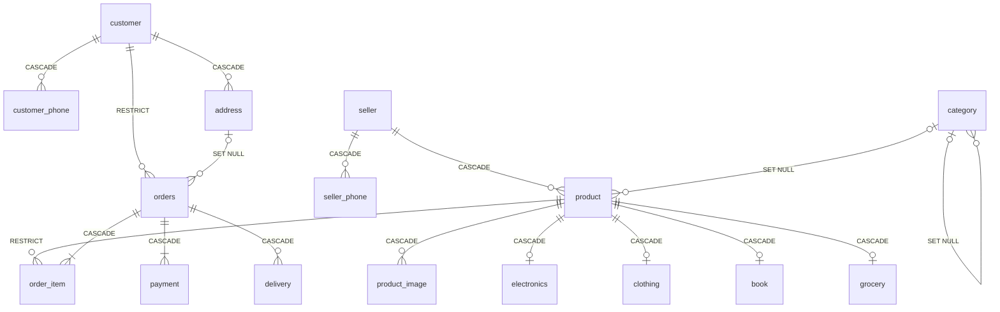

# Experiment 2 – ER Diagram to Relational Schema (MySQL)

## Aim

To convert the ER diagram of the **Indian E-Commerce Platform** (Experiment 1) into a relational schema, write complete **MySQL `CREATE TABLE`** statements with **PRIMARY KEY, FOREIGN KEY, NOT NULL, UNIQUE, CHECK, ON DELETE CASCADE and ON DELETE SET NULL** constraints, insert sample data, and demonstrate **referential integrity violations**.

## Software Required

- MySQL Server 8.0.16 or later (needed for enforced `CHECK` constraints)
- MySQL Workbench or the MySQL command-line client

## Files

| File | Description |
|---|---|
| [`ecommerce_schema.sql`](ecommerce_schema.sql) | Complete script: tables, sample data, violations, CASCADE and SET NULL demos |
| `README.md` | This lab record |

**How to run:**

```bash
mysql -u root -p --force < ecommerce_schema.sql
```

> `--force` lets the script continue after the **intentional** errors in Part C. In MySQL Workbench, run the script with *"Continue on SQL error"* turned on.

---

## Theory

### Relational Integrity Constraints

| Constraint | Purpose |
|---|---|
| **PRIMARY KEY** | Uniquely identifies each row. It cannot be NULL (*entity integrity*). |
| **FOREIGN KEY** | A value must match an existing primary key in the parent table or be NULL (*referential integrity*). |
| **NOT NULL** | The column must always have a value. |
| **UNIQUE** | No two rows may have the same value (candidate key). Multiple NULLs are allowed. |
| **CHECK** | The value must satisfy a condition (domain integrity). |

### Referential Actions (what happens to child rows when a parent row is deleted or updated)

| Action | Effect on child rows |
|---|---|
| **CASCADE** | Child rows are deleted or updated together with the parent. |
| **SET NULL** | The child's foreign key is set to `NULL`. The column must be nullable. |
| **RESTRICT / NO ACTION** | The parent delete or update is **rejected** while child rows exist (MySQL's default). |

---

## Step 1: ER-to-Relational Mapping Rules Applied

| # | ER Construct | Mapping Rule | Applied To |
|---|---|---|---|
| 1 | Strong entity | One table. The key attribute becomes the PK. | `customer`, `seller`, `category`, `product`, `orders`, `payment` |
| 2 | Composite attribute | Only the simple components are stored as columns. | `name` → first/middle/last_name; `street_address` → house_no, street, landmark; `pickup_address` → pickup_city/state/pincode |
| 3 | Multi-valued attribute | New table with PK = (owner PK, attribute). | `customer_phone`, `seller_phone`, `product_image` |
| 4 | Derived attribute | Not stored. Computed with a query. | `age`, `total_amount`, `rating` |
| 5 | Weak entity | Table with PK = (owner PK + partial key). FK to owner uses `ON DELETE CASCADE`. | `address`, `order_item`, `delivery` |
| 6 | 1 : N relationship | PK of the "1" side becomes an FK on the "N" side. | customer→orders, seller→product, category→product, orders→payment |
| 7 | M : N relationship | Resolved through a separate table. | orders ↔ product via `order_item` |
| 8 | Recursive relationship | FK referencing the same table. | `category.parent_category_id` |
| 9 | Specialization (disjoint, partial) | One table for the superclass and one per subclass. Subclass PK is also an FK to the superclass. | `product` → `electronics`, `clothing`, `book`, `grocery` |
| 10 | Total participation | FK declared `NOT NULL`. | `orders.customer_id`, `order_item.product_id`, `payment.order_id` |
| 11 | Partial participation | FK left nullable. | `product.category_id`, `orders.ship_address` |

> `ORDER` is a reserved word in SQL, so the Order entity becomes the table **`orders`**.

---

## Step 2: Relational Schema

Primary keys are in **bold**. Foreign keys are in *italics* with an arrow (→) to the referenced table.

```
CUSTOMER       (customer_id, first_name, middle_name, last_name, email, date_of_birth, registered_on)
CUSTOMER_PHONE (customer_id → CUSTOMER, phone_number)
ADDRESS        (customer_id → CUSTOMER, address_seq, house_no, street, landmark, city, state, pincode, address_type)
SELLER         (seller_id, business_name, gstin, pan, contact_first_name, contact_last_name, email,
                pickup_city, pickup_state, pickup_pincode)
SELLER_PHONE   (seller_id → SELLER, phone_number)
CATEGORY       (category_id, category_name, description, parent_category_id → CATEGORY)
PRODUCT        (product_id, seller_id → SELLER, category_id → CATEGORY, product_name, brand, mrp,
                selling_price, hsn_code, gst_rate, stock_qty, product_type)
PRODUCT_IMAGE  (product_id → PRODUCT, image_url)
ELECTRONICS    (product_id → PRODUCT, model_number, warranty_months, bis_certification)
CLOTHING       (product_id → PRODUCT, size, fabric, gender)
BOOK           (product_id → PRODUCT, isbn, author, publisher, language)
GROCERY        (product_id → PRODUCT, fssai_license, expiry_date, is_vegetarian)
ORDERS         (order_id, customer_id → CUSTOMER, (ship_customer_id, ship_address_seq) → ADDRESS,
                order_date, order_status)
ORDER_ITEM     (order_id → ORDERS, line_no, product_id → PRODUCT, quantity, unit_price, gst_amount)
PAYMENT        (payment_id, order_id → ORDERS, amount, payment_mode, transaction_ref, payment_status, paid_at)
DELIVERY       (order_id → ORDERS, shipment_no, courier_partner, awb_number, dispatch_date,
                expected_date, delivered_date, delivery_status)
```

| Table | Primary Key | Unique (Candidate) Keys |
|---|---|---|
| customer | `customer_id` | `email` |
| customer_phone | (`customer_id`, `phone_number`) | – |
| address | (`customer_id`, `address_seq`) | – |
| seller | `seller_id` | `gstin`, `pan`, `email` |
| seller_phone | (`seller_id`, `phone_number`) | – |
| category | `category_id` | `category_name` |
| product | `product_id` | – |
| product_image | (`product_id`, `image_url`) | – |
| electronics / clothing / grocery | `product_id` | – |
| book | `product_id` | `isbn` |
| orders | `order_id` | – |
| order_item | (`order_id`, `line_no`) | – |
| payment | `payment_id` | `transaction_ref` |
| delivery | (`order_id`, `shipment_no`) | `awb_number` |

### Schema Diagram (foreign key links)



### Foreign Keys and Referential Actions

| Child Table | Foreign Key | Parent | ON DELETE | ON UPDATE | Reason |
|---|---|---|---|---|---|
| customer_phone | customer_id | customer | **CASCADE** | CASCADE | Multi-valued attribute belongs to its owner. |
| address | customer_id | customer | **CASCADE** | CASCADE | Weak entity dies with its owner. |
| orders | customer_id | customer | **RESTRICT** | CASCADE | Order history must not be lost. |
| orders | (ship_customer_id, ship_address_seq) | address | **SET NULL** | CASCADE | Customer may delete a saved address; the old order stays. |
| seller_phone | seller_id | seller | **CASCADE** | CASCADE | Multi-valued attribute. |
| product | seller_id | seller | **CASCADE** | CASCADE | Seller leaves, so their listings are removed. |
| product | category_id | category | **SET NULL** | CASCADE | Product becomes "uncategorized" instead of being deleted. |
| category | parent_category_id | category | **SET NULL** | CASCADE | Sub-category becomes top-level. |
| product_image | product_id | product | **CASCADE** | CASCADE | Multi-valued attribute. |
| electronics / clothing / book / grocery | product_id | product | **CASCADE** | CASCADE | Subclass row cannot exist without its superclass row. |
| order_item | order_id | orders | **CASCADE** | CASCADE | Weak entity dies with its owner. |
| order_item | product_id | product | **RESTRICT** | CASCADE | A product that has been sold cannot be deleted. |
| payment | order_id | orders | **CASCADE** | CASCADE | Payments belong to their order. |
| delivery | order_id | orders | **CASCADE** | CASCADE | Weak entity dies with its owner. |

> **Why does `orders` use separate `ship_customer_id` and `ship_address_seq` columns?** `address` has a composite key (`customer_id`, `address_seq`). `ON DELETE SET NULL` sets **every** column of the foreign key to NULL. If the FK reused `orders.customer_id`, which is `NOT NULL`, MySQL would reject the table with *ERROR 1830*. Separate nullable columns fix this.

---

## Step 3: CREATE TABLE Statements

```sql
DROP DATABASE IF EXISTS ecommerce_db;
CREATE DATABASE ecommerce_db;
USE ecommerce_db;

-- ---------- 1. CUSTOMER (strong entity, composite attribute "name") ----
CREATE TABLE customer (
    customer_id    VARCHAR(10)  PRIMARY KEY,
    first_name     VARCHAR(50)  NOT NULL,          -- composite: name
    middle_name    VARCHAR(50),                    -- composite: name
    last_name      VARCHAR(50)  NOT NULL,          -- composite: name
    email          VARCHAR(100) NOT NULL UNIQUE,
    date_of_birth  DATE,                           -- age is derived, not stored
    registered_on  DATE         NOT NULL DEFAULT (CURRENT_DATE)
);

-- ---------- 2. CUSTOMER_PHONE (multi-valued attribute) ----------------
CREATE TABLE customer_phone (
    customer_id   VARCHAR(10) NOT NULL,
    phone_number  CHAR(10)    NOT NULL,
    PRIMARY KEY (customer_id, phone_number),
    CONSTRAINT chk_cust_phone CHECK (phone_number REGEXP '^[6-9][0-9]{9}$'),
    CONSTRAINT fk_cphone_customer FOREIGN KEY (customer_id)
        REFERENCES customer(customer_id)
        ON DELETE CASCADE ON UPDATE CASCADE
);

-- ---------- 3. ADDRESS (weak entity, owner = CUSTOMER) -----------------
CREATE TABLE address (
    customer_id   VARCHAR(10) NOT NULL,            -- owner key
    address_seq   INT         NOT NULL,            -- partial key
    house_no      VARCHAR(20) NOT NULL,            -- composite: street_address
    street        VARCHAR(100) NOT NULL,           -- composite: street_address
    landmark      VARCHAR(100),                    -- composite: street_address
    city          VARCHAR(50) NOT NULL,
    state         VARCHAR(50) NOT NULL,
    pincode       CHAR(6)     NOT NULL,
    address_type  ENUM('Home','Work','Other') NOT NULL DEFAULT 'Home',
    PRIMARY KEY (customer_id, address_seq),
    CONSTRAINT chk_pincode CHECK (pincode REGEXP '^[1-9][0-9]{5}$'),
    CONSTRAINT fk_address_customer FOREIGN KEY (customer_id)
        REFERENCES customer(customer_id)
        ON DELETE CASCADE ON UPDATE CASCADE
);

-- ---------- 4. SELLER --------------------------------------------------
CREATE TABLE seller (
    seller_id           VARCHAR(10)  PRIMARY KEY,
    business_name       VARCHAR(100) NOT NULL,
    gstin               CHAR(15)     NOT NULL UNIQUE,
    pan                 CHAR(10)     NOT NULL UNIQUE,
    contact_first_name  VARCHAR(50)  NOT NULL,     -- composite: contact_name
    contact_last_name   VARCHAR(50),               -- composite: contact_name
    email               VARCHAR(100) NOT NULL UNIQUE,
    pickup_city         VARCHAR(50)  NOT NULL,     -- composite: pickup_address
    pickup_state        VARCHAR(50)  NOT NULL,     -- composite: pickup_address
    pickup_pincode      CHAR(6)      NOT NULL,     -- composite: pickup_address
    CONSTRAINT chk_pan   CHECK (pan   REGEXP '^[A-Z]{5}[0-9]{4}[A-Z]$'),
    CONSTRAINT chk_gstin CHECK (gstin REGEXP '^[0-9]{2}[A-Z]{5}[0-9]{4}[A-Z][1-9A-Z]Z[0-9A-Z]$')
);

-- ---------- 5. SELLER_PHONE (multi-valued attribute) ------------------
CREATE TABLE seller_phone (
    seller_id     VARCHAR(10) NOT NULL,
    phone_number  CHAR(10)    NOT NULL,
    PRIMARY KEY (seller_id, phone_number),
    CONSTRAINT fk_sphone_seller FOREIGN KEY (seller_id)
        REFERENCES seller(seller_id)
        ON DELETE CASCADE ON UPDATE CASCADE
);

-- ---------- 6. CATEGORY (recursive relationship "parent of") ----------
CREATE TABLE category (
    category_id         VARCHAR(10)  PRIMARY KEY,
    category_name       VARCHAR(100) NOT NULL UNIQUE,
    description         VARCHAR(255),
    parent_category_id  VARCHAR(10)  NULL,
    CONSTRAINT fk_category_parent FOREIGN KEY (parent_category_id)
        REFERENCES category(category_id)
        ON DELETE SET NULL ON UPDATE CASCADE
);

-- ---------- 7. PRODUCT (superclass of the specialization) -------------
CREATE TABLE product (
    product_id     VARCHAR(10)   PRIMARY KEY,
    seller_id      VARCHAR(10)   NOT NULL,
    category_id    VARCHAR(10)   NULL,             -- SET NULL if category removed
    product_name   VARCHAR(150)  NOT NULL,
    brand          VARCHAR(50),
    mrp            DECIMAL(10,2) NOT NULL,
    selling_price  DECIMAL(10,2) NOT NULL,
    hsn_code       VARCHAR(8)    NOT NULL,
    gst_rate       DECIMAL(4,2)  NOT NULL,
    stock_qty      INT           NOT NULL DEFAULT 0,
    product_type   ENUM('Electronics','Clothing','Book','Grocery','Other') NOT NULL DEFAULT 'Other',
    CONSTRAINT chk_price    CHECK (selling_price > 0 AND selling_price <= mrp),
    CONSTRAINT chk_gst_rate CHECK (gst_rate IN (0, 5, 12, 18, 28)),
    CONSTRAINT chk_stock    CHECK (stock_qty >= 0),
    CONSTRAINT fk_product_seller FOREIGN KEY (seller_id)
        REFERENCES seller(seller_id)
        ON DELETE CASCADE ON UPDATE CASCADE,
    CONSTRAINT fk_product_category FOREIGN KEY (category_id)
        REFERENCES category(category_id)
        ON DELETE SET NULL ON UPDATE CASCADE
);

-- ---------- 8. PRODUCT_IMAGE (multi-valued attribute) -----------------
CREATE TABLE product_image (
    product_id  VARCHAR(10)  NOT NULL,
    image_url   VARCHAR(255) NOT NULL,
    PRIMARY KEY (product_id, image_url),
    CONSTRAINT fk_pimage_product FOREIGN KEY (product_id)
        REFERENCES product(product_id)
        ON DELETE CASCADE ON UPDATE CASCADE
);

-- ---------- 9-12. SUBCLASSES (disjoint, partial specialization) --------
CREATE TABLE electronics (
    product_id         VARCHAR(10) PRIMARY KEY,
    model_number       VARCHAR(50) NOT NULL,
    warranty_months    INT         NOT NULL DEFAULT 12,
    bis_certification  VARCHAR(30),
    CONSTRAINT fk_elec_product FOREIGN KEY (product_id)
        REFERENCES product(product_id)
        ON DELETE CASCADE ON UPDATE CASCADE
);

CREATE TABLE clothing (
    product_id  VARCHAR(10) PRIMARY KEY,
    size        ENUM('XS','S','M','L','XL','XXL') NOT NULL,
    fabric      VARCHAR(30) NOT NULL,
    gender      ENUM('Men','Women','Kids','Unisex') NOT NULL,
    CONSTRAINT fk_cloth_product FOREIGN KEY (product_id)
        REFERENCES product(product_id)
        ON DELETE CASCADE ON UPDATE CASCADE
);

CREATE TABLE book (
    product_id  VARCHAR(10)  PRIMARY KEY,
    isbn        CHAR(13)     NOT NULL UNIQUE,
    author      VARCHAR(100) NOT NULL,
    publisher   VARCHAR(100),
    language    VARCHAR(30)  NOT NULL DEFAULT 'English',
    CONSTRAINT fk_book_product FOREIGN KEY (product_id)
        REFERENCES product(product_id)
        ON DELETE CASCADE ON UPDATE CASCADE
);

CREATE TABLE grocery (
    product_id     VARCHAR(10) PRIMARY KEY,
    fssai_license  CHAR(14)    NOT NULL,
    expiry_date    DATE        NOT NULL,
    is_vegetarian  BOOLEAN     NOT NULL DEFAULT TRUE,
    CONSTRAINT fk_grocery_product FOREIGN KEY (product_id)
        REFERENCES product(product_id)
        ON DELETE CASCADE ON UPDATE CASCADE
);

-- ---------- 13. ORDERS ("ORDER" is a reserved word in MySQL) ----------
CREATE TABLE orders (
    order_id          VARCHAR(12) PRIMARY KEY,
    customer_id       VARCHAR(10) NOT NULL,
    ship_customer_id  VARCHAR(10) NULL,            -- FK to ADDRESS (part 1)
    ship_address_seq  INT         NULL,            -- FK to ADDRESS (part 2)
    order_date        DATETIME    NOT NULL DEFAULT CURRENT_TIMESTAMP,
    order_status      ENUM('Placed','Shipped','Delivered','Cancelled','Returned')
                      NOT NULL DEFAULT 'Placed',
    CONSTRAINT fk_orders_customer FOREIGN KEY (customer_id)
        REFERENCES customer(customer_id)
        ON DELETE RESTRICT ON UPDATE CASCADE,      -- keep order history
    CONSTRAINT fk_orders_address FOREIGN KEY (ship_customer_id, ship_address_seq)
        REFERENCES address(customer_id, address_seq)
        ON DELETE SET NULL ON UPDATE CASCADE
);

-- ---------- 14. ORDER_ITEM (weak entity, owner = ORDERS) --------------
CREATE TABLE order_item (
    order_id    VARCHAR(12)   NOT NULL,            -- owner key
    line_no     INT           NOT NULL,            -- partial key
    product_id  VARCHAR(10)   NOT NULL,
    quantity    INT           NOT NULL,
    unit_price  DECIMAL(10,2) NOT NULL,
    gst_amount  DECIMAL(10,2) NOT NULL DEFAULT 0,
    PRIMARY KEY (order_id, line_no),
    CONSTRAINT chk_qty CHECK (quantity > 0),
    CONSTRAINT fk_oitem_order FOREIGN KEY (order_id)
        REFERENCES orders(order_id)
        ON DELETE CASCADE ON UPDATE CASCADE,
    CONSTRAINT fk_oitem_product FOREIGN KEY (product_id)
        REFERENCES product(product_id)
        ON DELETE RESTRICT ON UPDATE CASCADE       -- cannot delete a sold product
);

-- ---------- 15. PAYMENT -----------------------------------------------
CREATE TABLE payment (
    payment_id       VARCHAR(12)   PRIMARY KEY,
    order_id         VARCHAR(12)   NOT NULL,
    amount           DECIMAL(10,2) NOT NULL,
    payment_mode     ENUM('UPI','Card','NetBanking','Wallet','COD','EMI') NOT NULL,
    transaction_ref  VARCHAR(30)   UNIQUE,         -- NULL allowed for COD
    payment_status   ENUM('Pending','Success','Failed','Refunded') NOT NULL DEFAULT 'Pending',
    paid_at          DATETIME,
    CONSTRAINT chk_amount CHECK (amount > 0),
    CONSTRAINT fk_payment_order FOREIGN KEY (order_id)
        REFERENCES orders(order_id)
        ON DELETE CASCADE ON UPDATE CASCADE
);

-- ---------- 16. DELIVERY (weak entity, owner = ORDERS) ----------------
CREATE TABLE delivery (
    order_id         VARCHAR(12) NOT NULL,         -- owner key
    shipment_no      INT         NOT NULL,         -- partial key
    courier_partner  VARCHAR(50) NOT NULL,
    awb_number       VARCHAR(20) NOT NULL UNIQUE,
    dispatch_date    DATE,
    expected_date    DATE,
    delivered_date   DATE,
    delivery_status  ENUM('Pending','In Transit','Out for Delivery','Delivered','RTO')
                     NOT NULL DEFAULT 'Pending',
    PRIMARY KEY (order_id, shipment_no),
    CONSTRAINT fk_delivery_order FOREIGN KEY (order_id)
        REFERENCES orders(order_id)
        ON DELETE CASCADE ON UPDATE CASCADE
);

SHOW TABLES;
```

---

## Step 4: Insert Sample Data

```sql
INSERT INTO customer (customer_id, first_name, middle_name, last_name, email, date_of_birth, registered_on) VALUES
('C001', 'Aarav',  NULL,     'Sharma', 'aarav.sharma@gmail.com', '1998-04-12', '2024-01-10'),
('C002', 'Priya',  'Lakshmi','Iyer',   'priya.iyer@yahoo.in',    '2000-09-25', '2024-03-05'),
('C003', 'Rohan',  NULL,     'Das',    'rohan.das@outlook.com',  '1995-12-01', '2025-02-18'),
('C004', 'Sneha',  NULL,     'Patel',  'sneha.patel@gmail.com',  '2001-06-30', '2025-07-22');

INSERT INTO customer_phone VALUES
('C001', '9876543210'), ('C001', '8765432109'),
('C002', '9123456780'),
('C003', '7012345678'),
('C004', '6301234567');

INSERT INTO address VALUES
('C001', 1, '12B',  'MG Road',          'Near Metro Station', 'Bengaluru', 'Karnataka',   '560001', 'Home'),
('C001', 2, '4th Floor, Tower A', 'Outer Ring Road', 'Embassy Tech Village', 'Bengaluru', 'Karnataka', '560103', 'Work'),
('C002', 1, '7',    'T Nagar Main Road', NULL,                'Chennai',   'Tamil Nadu',  '600017', 'Home'),
('C003', 1, '22/5', 'Salt Lake Sector V', 'Opp. City Centre', 'Kolkata',   'West Bengal', '700091', 'Home'),
('C004', 1, '101',  'CG Road',          'Navrangpura',        'Ahmedabad', 'Gujarat',     '380009', 'Home');

INSERT INTO seller VALUES
('S001', 'TechWorld Electronics', '29AABCT1234F1Z5', 'AABCT1234F', 'Vikram', 'Rao',   'sales@techworld.in',   'Bengaluru', 'Karnataka',   '560034'),
('S002', 'Desi Threads',          '24AAFCD5678K1Z2', 'AAFCD5678K', 'Meera',  'Shah',  'hello@desithreads.in', 'Surat',     'Gujarat',     '395003'),
('S003', 'Book Bazaar',           '07AAGCB9012M1Z8', 'AAGCB9012M', 'Anil',   'Gupta', 'orders@bookbazaar.in', 'New Delhi', 'Delhi',       '110002'),
('S004', 'Kisan Fresh Foods',     '27AAHCK3456P1Z1', 'AAHCK3456P', 'Suresh', 'Patil', 'care@kisanfresh.in',   'Pune',      'Maharashtra', '411001');

INSERT INTO seller_phone VALUES
('S001', '8045671234'), ('S001', '9845012345'),
('S002', '9909012345'),
('S003', '9811098110'),
('S004', '9822098220');

INSERT INTO category VALUES
('CAT01', 'Electronics',       'Electronic gadgets',        NULL),
('CAT02', 'Mobiles',           'Smartphones and feature phones', 'CAT01'),
('CAT03', 'Fashion',           'Clothing and accessories',  NULL),
('CAT04', 'Ethnic Wear',       'Kurtas, sarees, sherwanis', 'CAT03'),
('CAT05', 'Books',             'Printed books',             NULL),
('CAT06', 'Grocery',           'Daily essentials',          NULL),
('CAT07', 'Home Decor',        'Furniture and decor',       NULL);

INSERT INTO product VALUES
('P001', 'S001', 'CAT02', 'Redmi Note 13 5G (8GB/256GB)', 'Xiaomi',   20999.00, 17999.00, '8517', 18, 50,  'Electronics'),
('P002', 'S001', 'CAT01', 'boAt Airdopes 141',            'boAt',      4490.00,  1299.00, '8518', 18, 200, 'Electronics'),
('P003', 'S002', 'CAT04', 'Cotton Straight Kurta',        'Fabindia',  1999.00,  1499.00, '6211', 5,  120, 'Clothing'),
('P004', 'S003', 'CAT05', 'Wings of Fire',                'Universities Press', 399.00, 299.00, '4901', 0, 80, 'Book'),
('P005', 'S004', 'CAT06', 'Basmati Rice 5kg',             'India Gate', 899.00,   749.00, '1006', 5,  300, 'Grocery'),
('P006', 'S004', 'CAT07', 'Brass Diya Set (Pack of 4)',   'Handicraft', 599.00,   449.00, '7419', 12, 60,  'Other');

INSERT INTO product_image VALUES
('P001', 'https://cdn.example.in/p001_front.jpg'),
('P001', 'https://cdn.example.in/p001_back.jpg'),
('P003', 'https://cdn.example.in/p003.jpg'),
('P004', 'https://cdn.example.in/p004.jpg');

INSERT INTO electronics VALUES
('P001', 'RN13-5G-256', 12, 'R-41234567'),
('P002', 'AD141-BLK',   12, 'R-41987654');
INSERT INTO clothing VALUES ('P003', 'L', 'Cotton', 'Men');
INSERT INTO book     VALUES ('P004', '9788173711466', 'A. P. J. Abdul Kalam', 'Universities Press', 'English');
INSERT INTO grocery  VALUES ('P005', '10014011001234', '2027-06-30', TRUE);
-- P006 (Brass Diya Set) belongs to no subclass -> partial specialization

INSERT INTO orders VALUES
('ORD1001', 'C001', 'C001', 1, '2026-09-01 10:15:00', 'Delivered'),
('ORD1002', 'C002', 'C002', 1, '2026-09-05 18:40:00', 'Shipped'),
('ORD1003', 'C001', 'C001', 2, '2026-09-10 09:05:00', 'Placed'),
('ORD1004', 'C003', 'C003', 1, '2026-09-12 21:30:00', 'Delivered');

INSERT INTO order_item VALUES
('ORD1001', 1, 'P001', 1, 17999.00, 2745.61),
('ORD1001', 2, 'P002', 2,  1299.00,  396.31),
('ORD1002', 1, 'P003', 2,  1499.00,  142.76),
('ORD1003', 1, 'P004', 3,   299.00,    0.00),
('ORD1003', 2, 'P005', 1,   749.00,   35.67),
('ORD1004', 1, 'P006', 2,   449.00,   96.21);

INSERT INTO payment VALUES
('PAY5001', 'ORD1001', 20597.00, 'UPI',        'UTR426101234567', 'Success', '2026-09-01 10:16:00'),
('PAY5002', 'ORD1002',  2998.00, 'Card',       'RZP_KJ8H2L9P0Q',  'Success', '2026-09-05 18:41:00'),
('PAY5003', 'ORD1003',  1646.00, 'COD',        NULL,              'Pending', NULL),
('PAY5004', 'ORD1004',   898.00, 'UPI',        'UTR426109876543', 'Failed',  '2026-09-12 21:31:00'),
('PAY5005', 'ORD1004',   898.00, 'NetBanking', 'NB20260912ICIC01','Success', '2026-09-12 21:35:00');

INSERT INTO delivery VALUES
('ORD1001', 1, 'Delhivery',  'DLV1234567890', '2026-09-02', '2026-09-05', '2026-09-04', 'Delivered'),
('ORD1001', 2, 'Ekart',      'EKT9876543210', '2026-09-02', '2026-09-06', '2026-09-06', 'Delivered'),
('ORD1002', 1, 'Blue Dart',  'BD55667788',    '2026-09-06', '2026-09-09', NULL,         'In Transit'),
('ORD1004', 1, 'India Post', 'EE123456789IN', '2026-09-13', '2026-09-18', '2026-09-17', 'Delivered');

-- Row count of every table
SELECT 'customer' AS table_name, COUNT(*) AS row_count FROM customer
UNION ALL SELECT 'customer_phone', COUNT(*) FROM customer_phone
UNION ALL SELECT 'address',        COUNT(*) FROM address
UNION ALL SELECT 'seller',         COUNT(*) FROM seller
UNION ALL SELECT 'seller_phone',   COUNT(*) FROM seller_phone
UNION ALL SELECT 'category',       COUNT(*) FROM category
UNION ALL SELECT 'product',        COUNT(*) FROM product
UNION ALL SELECT 'product_image',  COUNT(*) FROM product_image
UNION ALL SELECT 'electronics',    COUNT(*) FROM electronics
UNION ALL SELECT 'clothing',       COUNT(*) FROM clothing
UNION ALL SELECT 'book',           COUNT(*) FROM book
UNION ALL SELECT 'grocery',        COUNT(*) FROM grocery
UNION ALL SELECT 'orders',         COUNT(*) FROM orders
UNION ALL SELECT 'order_item',     COUNT(*) FROM order_item
UNION ALL SELECT 'payment',        COUNT(*) FROM payment
UNION ALL SELECT 'delivery',       COUNT(*) FROM delivery;
```

**Output:**

```
+----------------+-----------+
| table_name     | row_count |
+----------------+-----------+
| customer       |         4 |
| customer_phone |         5 |
| address        |         5 |
| seller         |         4 |
| seller_phone   |         5 |
| category       |         7 |
| product        |         6 |
| product_image  |         4 |
| electronics    |         2 |
| clothing       |         1 |
| book           |         1 |
| grocery        |         1 |
| orders         |         4 |
| order_item     |         6 |
| payment        |         5 |
| delivery       |         4 |
+----------------+-----------+
```

---

## Step 5: Demonstrating Referential Integrity and Constraint Violations

Each statement below is **expected to fail**. The error shows the constraint doing its job.

| # | Statement | Constraint Violated | Expected Error |
|---|---|---|---|
| C1 | `INSERT INTO orders (order_id, customer_id) VALUES ('ORD9999', 'C999');` | FK: customer `C999` does not exist | **ERROR 1452** Cannot add or update a child row: a foreign key constraint fails (`fk_orders_customer`) |
| C2 | `INSERT INTO order_item VALUES ('ORD1001', 3, 'P999', 1, 100.00, 0);` | FK: product `P999` does not exist | **ERROR 1452** … (`fk_oitem_product`) |
| C3 | `DELETE FROM product WHERE product_id = 'P001';` | `ON DELETE RESTRICT`: P001 is in an order | **ERROR 1451** Cannot delete or update a parent row: a foreign key constraint fails (`fk_oitem_product`) |
| C4 | `DELETE FROM customer WHERE customer_id = 'C001';` | `ON DELETE RESTRICT`: C001 has orders | **ERROR 1451** … (`fk_orders_customer`) |
| C5 | `UPDATE product SET seller_id = 'S999' WHERE product_id = 'P002';` | FK: seller `S999` does not exist | **ERROR 1452** … (`fk_product_seller`) |
| C6 | `INSERT INTO customer (customer_id, first_name, last_name, email) VALUES ('C005','Kabir','Singh',NULL);` | NOT NULL | **ERROR 1048** Column 'email' cannot be null |
| C7 | `INSERT INTO customer (…) VALUES ('C005','Kabir','Singh','aarav.sharma@gmail.com');` | UNIQUE on `email` | **ERROR 1062** Duplicate entry 'aarav.sharma@gmail.com' for key 'customer.email' |
| C8 | `INSERT INTO address VALUES ('C002', 1, …);` | PRIMARY KEY of the weak entity | **ERROR 1062** Duplicate entry 'C002-1' for key 'address.PRIMARY' |
| C9 | `INSERT INTO address VALUES ('C004', 2, …, '38005', 'Work');` | CHECK: PIN code must be 6 digits | **ERROR 3819** Check constraint 'chk_pincode' is violated. |
| C10 | `INSERT INTO delivery VALUES ('ORD7777', 1, …);` | Weak entity without an owner | **ERROR 1452** … (`fk_delivery_order`) |
| C11 | `DROP TABLE seller;` | Table is still referenced | **ERROR 3730** Cannot drop table 'seller' referenced by a foreign key constraint 'fk_product_seller' on table 'product'. |

**Output (MySQL 8.0 command line):**

```
mysql> INSERT INTO orders (order_id, customer_id) VALUES ('ORD9999', 'C999');
ERROR 1452 (23000): Cannot add or update a child row: a foreign key constraint fails (`ecommerce_db`.`orders`, CONSTRAINT `fk_orders_customer` FOREIGN KEY (`customer_id`) REFERENCES `customer` (`customer_id`) ...)

mysql> INSERT INTO order_item VALUES ('ORD1001', 3, 'P999', 1, 100.00, 0);
ERROR 1452 (23000): Cannot add or update a child row: a foreign key constraint fails (`ecommerce_db`.`order_item`, CONSTRAINT `fk_oitem_product` FOREIGN KEY (`product_id`) REFERENCES `product` (`product_id`) ...)

mysql> DELETE FROM product WHERE product_id = 'P001';
ERROR 1451 (23000): Cannot delete or update a parent row: a foreign key constraint fails (`ecommerce_db`.`order_item`, CONSTRAINT `fk_oitem_product` FOREIGN KEY (`product_id`) REFERENCES `product` (`product_id`) ...)

mysql> DELETE FROM customer WHERE customer_id = 'C001';
ERROR 1451 (23000): Cannot delete or update a parent row: a foreign key constraint fails (`ecommerce_db`.`orders`, CONSTRAINT `fk_orders_customer` FOREIGN KEY (`customer_id`) REFERENCES `customer` (`customer_id`) ...)

mysql> UPDATE product SET seller_id = 'S999' WHERE product_id = 'P002';
ERROR 1452 (23000): Cannot add or update a child row: a foreign key constraint fails (`ecommerce_db`.`product`, CONSTRAINT `fk_product_seller` FOREIGN KEY (`seller_id`) REFERENCES `seller` (`seller_id`) ...)

mysql> INSERT INTO customer (customer_id, first_name, last_name, email) VALUES ('C005', 'Kabir', 'Singh', NULL);
ERROR 1048 (23000): Column 'email' cannot be null

mysql> INSERT INTO customer (customer_id, first_name, last_name, email) VALUES ('C005', 'Kabir', 'Singh', 'aarav.sharma@gmail.com');
ERROR 1062 (23000): Duplicate entry 'aarav.sharma@gmail.com' for key 'customer.email'

mysql> INSERT INTO address VALUES ('C002', 1, '9', 'Anna Salai', NULL, 'Chennai', 'Tamil Nadu', '600002', 'Work');
ERROR 1062 (23000): Duplicate entry 'C002-1' for key 'address.PRIMARY'

mysql> INSERT INTO address VALUES ('C004', 2, '5', 'SG Highway', NULL, 'Ahmedabad', 'Gujarat', '38005', 'Work');
ERROR 3819 (HY000): Check constraint 'chk_pincode' is violated.

mysql> INSERT INTO delivery VALUES ('ORD7777', 1, 'Delhivery', 'DLV0000000001', NULL, NULL, NULL, 'Pending');
ERROR 1452 (23000): Cannot add or update a child row: a foreign key constraint fails (`ecommerce_db`.`delivery`, CONSTRAINT `fk_delivery_order` FOREIGN KEY (`order_id`) REFERENCES `orders` (`order_id`) ...)

mysql> DROP TABLE seller;
ERROR 3730 (HY000): Cannot drop table 'seller' referenced by a foreign key constraint 'fk_product_seller' on table 'product'.
```

> Exact wording varies slightly between MySQL versions (and MariaDB), but the error numbers 1452, 1451, 1048 and 1062 are the same.

---

## Step 6: Demonstrating ON DELETE CASCADE

```sql
-- D1. Deleting an ORDER cascades to ORDER_ITEM, PAYMENT and DELIVERY
SELECT 'BEFORE' AS stage,
       (SELECT COUNT(*) FROM order_item WHERE order_id = 'ORD1001') AS items,
       (SELECT COUNT(*) FROM payment    WHERE order_id = 'ORD1001') AS payments,
       (SELECT COUNT(*) FROM delivery   WHERE order_id = 'ORD1001') AS deliveries;

DELETE FROM orders WHERE order_id = 'ORD1001';

SELECT 'AFTER' AS stage,
       (SELECT COUNT(*) FROM order_item WHERE order_id = 'ORD1001') AS items,
       (SELECT COUNT(*) FROM payment    WHERE order_id = 'ORD1001') AS payments,
       (SELECT COUNT(*) FROM delivery   WHERE order_id = 'ORD1001') AS deliveries;

-- D2. Deleting a CUSTOMER with no orders cascades to phones and addresses
DELETE FROM customer WHERE customer_id = 'C004';
SELECT * FROM customer_phone WHERE customer_id = 'C004';   -- Empty set
SELECT * FROM address        WHERE customer_id = 'C004';   -- Empty set

-- D3. ON UPDATE CASCADE: renaming a seller ID updates all its products
UPDATE seller SET seller_id = 'S010' WHERE seller_id = 'S003';
SELECT product_id, seller_id FROM product WHERE product_id = 'P004';
SELECT * FROM seller_phone WHERE seller_id = 'S010';
```

**Output:**

```
+--------+-------+----------+------------+
| stage  | items | payments | deliveries |
+--------+-------+----------+------------+
| BEFORE |     2 |        1 |          2 |
+--------+-------+----------+------------+
+-------+-------+----------+------------+
| stage | items | payments | deliveries |
+-------+-------+----------+------------+
| AFTER |     0 |        0 |          0 |
+-------+-------+----------+------------+
Empty set   -- customer_phone of C004
Empty set   -- address of C004
+------------+-----------+
| product_id | seller_id |
+------------+-----------+
| P004       | S010      |
+------------+-----------+
+-----------+--------------+
| seller_id | phone_number |
+-----------+--------------+
| S010      | 9811098110   |
+-----------+--------------+
```

**Observation:**

- Deleting order `ORD1001` automatically removed its **2 order items, 1 payment and 2 deliveries**. These are weak or dependent entities.
- Deleting customer `C004`, who had no orders, removed their phone numbers and addresses.
- `ON UPDATE CASCADE` carried the new seller ID `S010` into `product` and `seller_phone`.

---

## Step 7: Demonstrating ON DELETE SET NULL

```sql
-- E1. Deleting parent category 'Fashion' -> sub-category parent becomes NULL
DELETE FROM category WHERE category_id = 'CAT03';
SELECT category_id, category_name, parent_category_id FROM category WHERE category_id = 'CAT04';

-- E2. Deleting category 'Home Decor' -> its product's category_id becomes NULL
DELETE FROM category WHERE category_id = 'CAT07';
SELECT product_id, product_name, category_id FROM product WHERE product_id = 'P006';

-- E3. Deleting a saved address -> order is kept, ship-to address becomes NULL
DELETE FROM address WHERE customer_id = 'C001' AND address_seq = 2;
SELECT order_id, customer_id, ship_customer_id, ship_address_seq FROM orders WHERE order_id = 'ORD1003';
```

**Output:**

```
+-------------+---------------+--------------------+
| category_id | category_name | parent_category_id |
+-------------+---------------+--------------------+
| CAT04       | Ethnic Wear   | NULL               |
+-------------+---------------+--------------------+
+------------+----------------------------+-------------+
| product_id | product_name               | category_id |
+------------+----------------------------+-------------+
| P006       | Brass Diya Set (Pack of 4) | NULL        |
+------------+----------------------------+-------------+
+----------+-------------+------------------+------------------+
| order_id | customer_id | ship_customer_id | ship_address_seq |
+----------+-------------+------------------+------------------+
| ORD1003  | C001        | NULL             |             NULL |
+----------+-------------+------------------+------------------+
```

**Observation:** The child rows were **kept**, and only their foreign key became `NULL`:

- *Ethnic Wear* became a top-level category.
- *Brass Diya Set* became uncategorized.
- Order `ORD1003` kept its history but lost the link to the deleted Work address.

---

## Step 8: Verifying Constraints from the Data Dictionary

```sql
SELECT rc.TABLE_NAME, rc.CONSTRAINT_NAME, rc.REFERENCED_TABLE_NAME,
       rc.DELETE_RULE, rc.UPDATE_RULE
FROM information_schema.REFERENTIAL_CONSTRAINTS rc
WHERE rc.CONSTRAINT_SCHEMA = 'ecommerce_db'
ORDER BY rc.TABLE_NAME, rc.CONSTRAINT_NAME;
```

**Output:**

```
+----------------+---------------------+-----------------------+-------------+-------------+
| TABLE_NAME     | CONSTRAINT_NAME     | REFERENCED_TABLE_NAME | DELETE_RULE | UPDATE_RULE |
+----------------+---------------------+-----------------------+-------------+-------------+
| address        | fk_address_customer | customer              | CASCADE     | CASCADE     |
| book           | fk_book_product     | product               | CASCADE     | CASCADE     |
| category       | fk_category_parent  | category              | SET NULL    | CASCADE     |
| clothing       | fk_cloth_product    | product               | CASCADE     | CASCADE     |
| customer_phone | fk_cphone_customer  | customer              | CASCADE     | CASCADE     |
| delivery       | fk_delivery_order   | orders                | CASCADE     | CASCADE     |
| electronics    | fk_elec_product     | product               | CASCADE     | CASCADE     |
| grocery        | fk_grocery_product  | product               | CASCADE     | CASCADE     |
| orders         | fk_orders_address   | address               | SET NULL    | CASCADE     |
| orders         | fk_orders_customer  | customer              | RESTRICT    | CASCADE     |
| order_item     | fk_oitem_order      | orders                | CASCADE     | CASCADE     |
| order_item     | fk_oitem_product    | product               | RESTRICT    | CASCADE     |
| payment        | fk_payment_order    | orders                | CASCADE     | CASCADE     |
| product        | fk_product_category | category              | SET NULL    | CASCADE     |
| product        | fk_product_seller   | seller                | CASCADE     | CASCADE     |
| product_image  | fk_pimage_product   | product               | CASCADE     | CASCADE     |
| seller_phone   | fk_sphone_seller    | seller                | CASCADE     | CASCADE     |
+----------------+---------------------+-----------------------+-------------+-------------+
```

---

## Result

The ER diagram of the Indian e-commerce platform was converted into **16 relational tables** in MySQL.

- Primary key, foreign key, NOT NULL, UNIQUE and CHECK constraints were applied.
- Sample data was inserted successfully.
- Referential integrity violations were rejected with errors 1452 and 1451, and NOT NULL, UNIQUE and CHECK violations were also rejected.
- `ON DELETE CASCADE` removed dependent rows, and `ON DELETE SET NULL` kept the child rows with a NULL foreign key.
