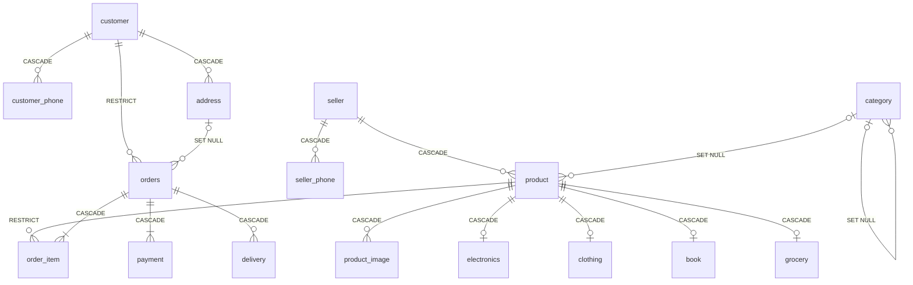

# Experiment 2 – ER Diagram to Relational Schema (MySQL)

## Aim

To convert the ER diagram of the **Indian E-Commerce Platform** (Experiment 1) into a relational schema, write complete **MySQL `CREATE TABLE`** statements with **PRIMARY KEY, FOREIGN KEY, NOT NULL, UNIQUE, CHECK, ON DELETE CASCADE and ON DELETE SET NULL** constraints, insert sample data, and demonstrate **referential integrity violations**.

## Software Required

- MySQL Server 8.0.16 or later (needed for enforced `CHECK` constraints)
- MySQL Workbench or the MySQL command-line client

## Files

| File | Description |
|---|---|
| [`ecommerce_schema.sql`](ecommerce_schema.sql) | Complete script: tables, sample data, violations, CASCADE and SET NULL demos |
| `README.md` | This lab record |

**How to run:**

```bash
mysql -u root -p --force < ecommerce_schema.sql
```

> `--force` lets the script continue after the **intentional** errors in Part C. In MySQL Workbench, run the script with *"Continue on SQL error"* turned on.

---

## Theory

### Relational Integrity Constraints

| Constraint | Purpose |
|---|---|
| **PRIMARY KEY** | Uniquely identifies each row. It cannot be NULL (*entity integrity*). |
| **FOREIGN KEY** | A value must match an existing primary key in the parent table or be NULL (*referential integrity*). |
| **NOT NULL** | The column must always have a value. |
| **UNIQUE** | No two rows may have the same value (candidate key). Multiple NULLs are allowed. |
| **CHECK** | The value must satisfy a condition (domain integrity). |

### Referential Actions (what happens to child rows when a parent row is deleted or updated)

| Action | Effect on child rows |
|---|---|
| **CASCADE** | Child rows are deleted or updated together with the parent. |
| **SET NULL** | The child's foreign key is set to `NULL`. The column must be nullable. |
| **RESTRICT / NO ACTION** | The parent delete or update is **rejected** while child rows exist (MySQL's default). |

---

## Step 1: ER-to-Relational Mapping Rules Applied

| # | ER Construct | Mapping Rule | Applied To |
|---|---|---|---|
| 1 | Strong entity | One table. The key attribute becomes the PK. | `customer`, `seller`, `category`, `product`, `orders`, `payment` |
| 2 | Composite attribute | Only the simple components are stored as columns. | `name` → first/middle/last_name; `street_address` → house_no, street, landmark; `pickup_address` → pickup_city/state/pincode |
| 3 | Multi-valued attribute | New table with PK = (owner PK, attribute). | `customer_phone`, `seller_phone`, `product_image` |
| 4 | Derived attribute | Not stored. Computed with a query. | `age`, `total_amount`, `rating` |
| 5 | Weak entity | Table with PK = (owner PK + partial key). FK to owner uses `ON DELETE CASCADE`. | `address`, `order_item`, `delivery` |
| 6 | 1 : N relationship | PK of the "1" side becomes an FK on the "N" side. | customer→orders, seller→product, category→product, orders→payment |
| 7 | M : N relationship | Resolved through a separate table. | orders ↔ product via `order_item` |
| 8 | Recursive relationship | FK referencing the same table. | `category.parent_category_id` |
| 9 | Specialization (disjoint, partial) | One table for the superclass and one per subclass. Subclass PK is also an FK to the superclass. | `product` → `electronics`, `clothing`, `book`, `grocery` |
| 10 | Total participation | FK declared `NOT NULL`. | `orders.customer_id`, `order_item.product_id`, `payment.order_id` |
| 11 | Partial participation | FK left nullable. | `product.category_id`, `orders.ship_address` |

> `ORDER` is a reserved word in SQL, so the Order entity becomes the table **`orders`**.

---

## Step 2: Relational Schema

Primary keys are in **bold**. Foreign keys are in *italics* with an arrow (→) to the referenced table.

```
CUSTOMER       (customer_id, first_name, middle_name, last_name, email, date_of_birth, registered_on)
CUSTOMER_PHONE (customer_id → CUSTOMER, phone_number)
ADDRESS        (customer_id → CUSTOMER, address_seq, house_no, street, landmark, city, state, pincode, address_type)
SELLER         (seller_id, business_name, gstin, pan, contact_first_name, contact_last_name, email,
                pickup_city, pickup_state, pickup_pincode)
SELLER_PHONE   (seller_id → SELLER, phone_number)
CATEGORY       (category_id, category_name, description, parent_category_id → CATEGORY)
PRODUCT        (product_id, seller_id → SELLER, category_id → CATEGORY, product_name, brand, mrp,
                selling_price, hsn_code, gst_rate, stock_qty, product_type)
PRODUCT_IMAGE  (product_id → PRODUCT, image_url)
ELECTRONICS    (product_id → PRODUCT, model_number, warranty_months, bis_certification)
CLOTHING       (product_id → PRODUCT, size, fabric, gender)
BOOK           (product_id → PRODUCT, isbn, author, publisher, language)
GROCERY        (product_id → PRODUCT, fssai_license, expiry_date, is_vegetarian)
ORDERS         (order_id, customer_id → CUSTOMER, (ship_customer_id, ship_address_seq) → ADDRESS,
                order_date, order_status)
ORDER_ITEM     (order_id → ORDERS, line_no, product_id → PRODUCT, quantity, unit_price, gst_amount)
PAYMENT        (payment_id, order_id → ORDERS, amount, payment_mode, transaction_ref, payment_status, paid_at)
DELIVERY       (order_id → ORDERS, shipment_no, courier_partner, awb_number, dispatch_date,
                expected_date, delivered_date, delivery_status)
```

| Table | Primary Key | Unique (Candidate) Keys |
|---|---|---|
| customer | `customer_id` | `email` |
| customer_phone | (`customer_id`, `phone_number`) | – |
| address | (`customer_id`, `address_seq`) | – |
| seller | `seller_id` | `gstin`, `pan`, `email` |
| seller_phone | (`seller_id`, `phone_number`) | – |
| category | `category_id` | `category_name` |
| product | `product_id` | – |
| product_image | (`product_id`, `image_url`) | – |
| electronics / clothing / grocery | `product_id` | – |
| book | `product_id` | `isbn` |
| orders | `order_id` | – |
| order_item | (`order_id`, `line_no`) | – |
| payment | `payment_id` | `transaction_ref` |
| delivery | (`order_id`, `shipment_no`) | `awb_number` |

### Schema Diagram (foreign key links)



### Foreign Keys and Referential Actions

| Child Table | Foreign Key | Parent | ON DELETE | ON UPDATE | Reason |
|---|---|---|---|---|---|
| customer_phone | customer_id | customer | **CASCADE** | CASCADE | Multi-valued attribute belongs to its owner. |
| address | customer_id | customer | **CASCADE** | CASCADE | Weak entity dies with its owner. |
| orders | customer_id | customer | **RESTRICT** | CASCADE | Order history must not be lost. |
| orders | (ship_customer_id, ship_address_seq) | address | **SET NULL** | CASCADE | Customer may delete a saved address; the old order stays. |
| seller_phone | seller_id | seller | **CASCADE** | CASCADE | Multi-valued attribute. |
| product | seller_id | seller | **CASCADE** | CASCADE | Seller leaves, so their listings are removed. |
| product | category_id | category | **SET NULL** | CASCADE | Product becomes "uncategorized" instead of being deleted. |
| category | parent_category_id | category | **SET NULL** | CASCADE | Sub-category becomes top-level. |
| product_image | product_id | product | **CASCADE** | CASCADE | Multi-valued attribute. |
| electronics / clothing / book / grocery | product_id | product | **CASCADE** | CASCADE | Subclass row cannot exist without its superclass row. |
| order_item | order_id | orders | **CASCADE** | CASCADE | Weak entity dies with its owner. |
| order_item | product_id | product | **RESTRICT** | CASCADE | A product that has been sold cannot be deleted. |
| payment | order_id | orders | **CASCADE** | CASCADE | Payments belong to their order. |
| delivery | order_id | orders | **CASCADE** | CASCADE | Weak entity dies with its owner. |

> **Why does `orders` use separate `ship_customer_id` and `ship_address_seq` columns?** `address` has a composite key (`customer_id`, `address_seq`). `ON DELETE SET NULL` sets **every** column of the foreign key to NULL. If the FK reused `orders.customer_id`, which is `NOT NULL`, MySQL would reject the table with *ERROR 1830*. Separate nullable columns fix this.

---

## Step 3: CREATE TABLE Statements

```sql
DROP DATABASE IF EXISTS ecommerce_db;
CREATE DATABASE ecommerce_db;
USE ecommerce_db;

-- ---------- 1. CUSTOMER (strong entity, composite attribute "name") ----
CREATE TABLE customer (
    customer_id    VARCHAR(10)  PRIMARY KEY,
    first_name     VARCHAR(50)  NOT NULL,          -- composite: name
    middle_name    VARCHAR(50),                    -- composite: name
    last_name      VARCHAR(50)  NOT NULL,          -- composite: name
    email          VARCHAR(100) NOT NULL UNIQUE,
    date_of_birth  DATE,                           -- age is derived, not stored
    registered_on  DATE         NOT NULL DEFAULT (CURRENT_DATE)
);

-- ---------- 2. CUSTOMER_PHONE (multi-valued attribute) ----------------
CREATE TABLE customer_phone (
    customer_id   VARCHAR(10) NOT NULL,
    phone_number  CHAR(10)    NOT NULL,
    PRIMARY KEY (customer_id, phone_number),
    CONSTRAINT chk_cust_phone CHECK (phone_number REGEXP '^[6-9][0-9]{9}$'),
    CONSTRAINT fk_cphone_customer FOREIGN KEY (customer_id)
        REFERENCES customer(customer_id)
        ON DELETE CASCADE ON UPDATE CASCADE
);

-- ---------- 3. ADDRESS (weak entity, owner = CUSTOMER) -----------------
CREATE TABLE address (
    customer_id   VARCHAR(10) NOT NULL,            -- owner key
    address_seq   INT         NOT NULL,            -- partial key
    house_no      VARCHAR(20) NOT NULL,            -- composite: street_address
    street        VARCHAR(100) NOT NULL,           -- composite: street_address
    landmark      VARCHAR(100),                    -- composite: street_address
    city          VARCHAR(50) NOT NULL,
    state         VARCHAR(50) NOT NULL,
    pincode       CHAR(6)     NOT NULL,
    address_type  ENUM('Home','Work','Other') NOT NULL DEFAULT 'Home',
    PRIMARY KEY (customer_id, address_seq),
    CONSTRAINT chk_pincode CHECK (pincode REGEXP '^[1-9][0-9]{5}$'),
    CONSTRAINT fk_address_customer FOREIGN KEY (customer_id)
        REFERENCES customer(customer_id)
        ON DELETE CASCADE ON UPDATE CASCADE
);

-- ---------- 4. SELLER --------------------------------------------------
CREATE TABLE seller (
    seller_id           VARCHAR(10)  PRIMARY KEY,
    business_name       VARCHAR(100) NOT NULL,
    gstin               CHAR(15)     NOT NULL UNIQUE,
    pan                 CHAR(10)     NOT NULL UNIQUE,
    contact_first_name  VARCHAR(50)  NOT NULL,     -- composite: contact_name
    contact_last_name   VARCHAR(50),               -- composite: contact_name
    email               VARCHAR(100) NOT NULL UNIQUE,
    pickup_city         VARCHAR(50)  NOT NULL,     -- composite: pickup_address
    pickup_state        VARCHAR(50)  NOT NULL,     -- composite: pickup_address
    pickup_pincode      CHAR(6)      NOT NULL,     -- composite: pickup_address
    CONSTRAINT chk_pan   CHECK (pan   REGEXP '^[A-Z]{5}[0-9]{4}[A-Z]$'),
    CONSTRAINT chk_gstin CHECK (gstin REGEXP '^[0-9]{2}[A-Z]{5}[0-9]{4}[A-Z][1-9A-Z]Z[0-9A-Z]$')
);

-- ---------- 5. SELLER_PHONE (multi-valued attribute) ------------------
CREATE TABLE seller_phone (
    seller_id     VARCHAR(10) NOT NULL,
    phone_number  CHAR(10)    NOT NULL,
    PRIMARY KEY (seller_id, phone_number),
    CONSTRAINT fk_sphone_seller FOREIGN KEY (seller_id)
        REFERENCES seller(seller_id)
        ON DELETE CASCADE ON UPDATE CASCADE
);

-- ---------- 6. CATEGORY (recursive relationship "parent of") ----------
CREATE TABLE category (
    category_id         VARCHAR(10)  PRIMARY KEY,
    category_name       VARCHAR(100) NOT NULL UNIQUE,
    description         VARCHAR(255),
    parent_category_id  VARCHAR(10)  NULL,
    CONSTRAINT fk_category_parent FOREIGN KEY (parent_category_id)
        REFERENCES category(category_id)
        ON DELETE SET NULL ON UPDATE CASCADE
);

-- ---------- 7. PRODUCT (superclass of the specialization) -------------
CREATE TABLE product (
    product_id     VARCHAR(10)   PRIMARY KEY,
    seller_id      VARCHAR(10)   NOT NULL,
    category_id    VARCHAR(10)   NULL,             -- SET NULL if category removed
    product_name   VARCHAR(150)  NOT NULL,
    brand          VARCHAR(50),
    mrp            DECIMAL(10,2) NOT NULL,
    selling_price  DECIMAL(10,2) NOT NULL,
    hsn_code       VARCHAR(8)    NOT NULL,
    gst_rate       DECIMAL(4,2)  NOT NULL,
    stock_qty      INT           NOT NULL DEFAULT 0,
    product_type   ENUM('Electronics','Clothing','Book','Grocery','Other') NOT NULL DEFAULT 'Other',
    CONSTRAINT chk_price    CHECK (selling_price > 0 AND selling_price <= mrp),
    CONSTRAINT chk_gst_rate CHECK (gst_rate IN (0, 5, 12, 18, 28)),
    CONSTRAINT chk_stock    CHECK (stock_qty >= 0),
    CONSTRAINT fk_product_seller FOREIGN KEY (seller_id)
        REFERENCES seller(seller_id)
        ON DELETE CASCADE ON UPDATE CASCADE,
    CONSTRAINT fk_product_category FOREIGN KEY (category_id)
        REFERENCES category(category_id)
        ON DELETE SET NULL ON UPDATE CASCADE
);

-- ---------- 8. PRODUCT_IMAGE (multi-valued attribute) -----------------
CREATE TABLE product_image (
    product_id  VARCHAR(10)  NOT NULL,
    image_url   VARCHAR(255) NOT NULL,
    PRIMARY KEY (product_id, image_url),
    CONSTRAINT fk_pimage_product FOREIGN KEY (product_id)
        REFERENCES product(product_id)
        ON DELETE CASCADE ON UPDATE CASCADE
);

-- ---------- 9-12. SUBCLASSES (disjoint, partial specialization) --------
CREATE TABLE electronics (
    product_id         VARCHAR(10) PRIMARY KEY,
    model_number       VARCHAR(50) NOT NULL,
    warranty_months    INT         NOT NULL DEFAULT 12,
    bis_certification  VARCHAR(30),
    CONSTRAINT fk_elec_product FOREIGN KEY (product_id)
        REFERENCES product(product_id)
        ON DELETE CASCADE ON UPDATE CASCADE
);

CREATE TABLE clothing (
    product_id  VARCHAR(10) PRIMARY KEY,
    size        ENUM('XS','S','M','L','XL','XXL') NOT NULL,
    fabric      VARCHAR(30) NOT NULL,
    gender      ENUM('Men','Women','Kids','Unisex') NOT NULL,
    CONSTRAINT fk_cloth_product FOREIGN KEY (product_id)
        REFERENCES product(product_id)
        ON DELETE CASCADE ON UPDATE CASCADE
);

CREATE TABLE book (
    product_id  VARCHAR(10)  PRIMARY KEY,
    isbn        CHAR(13)     NOT NULL UNIQUE,
    author      VARCHAR(100) NOT NULL,
    publisher   VARCHAR(100),
    language    VARCHAR(30)  NOT NULL DEFAULT 'English',
    CONSTRAINT fk_book_product FOREIGN KEY (product_id)
        REFERENCES product(product_id)
        ON DELETE CASCADE ON UPDATE CASCADE
);

CREATE TABLE grocery (
    product_id     VARCHAR(10) PRIMARY KEY,
    fssai_license  CHAR(14)    NOT NULL,
    expiry_date    DATE        NOT NULL,
    is_vegetarian  BOOLEAN     NOT NULL DEFAULT TRUE,
    CONSTRAINT fk_grocery_product FOREIGN KEY (product_id)
        REFERENCES product(product_id)
        ON DELETE CASCADE ON UPDATE CASCADE
);

-- ---------- 13. ORDERS ("ORDER" is a reserved word in MySQL) ----------
CREATE TABLE orders (
    order_id          VARCHAR(12) PRIMARY KEY,
    customer_id       VARCHAR(10) NOT NULL,
    ship_customer_id  VARCHAR(10) NULL,            -- FK to ADDRESS (part 1)
    ship_address_seq  INT         NULL,            -- FK to ADDRESS (part 2)
    order_date        DATETIME    NOT NULL DEFAULT CURRENT_TIMESTAMP,
    order_status      ENUM('Placed','Shipped','Delivered','Cancelled','Returned')
                      NOT NULL DEFAULT 'Placed',
    CONSTRAINT fk_orders_customer FOREIGN KEY (customer_id)
        REFERENCES customer(customer_id)
        ON DELETE RESTRICT ON UPDATE CASCADE,      -- keep order history
    CONSTRAINT fk_orders_address FOREIGN KEY (ship_customer_id, ship_address_seq)
        REFERENCES address(customer_id, address_seq)
        ON DELETE SET NULL ON UPDATE CASCADE
);

-- ---------- 14. ORDER_ITEM (weak entity, owner = ORDERS) --------------
CREATE TABLE order_item (
    order_id    VARCHAR(12)   NOT NULL,            -- owner key
    line_no     INT           NOT NULL,            -- partial key
    product_id  VARCHAR(10)   NOT NULL,
    quantity    INT           NOT NULL,
    unit_price  DECIMAL(10,2) NOT NULL,
    gst_amount  DECIMAL(10,2) NOT NULL DEFAULT 0,
    PRIMARY KEY (order_id, line_no),
    CONSTRAINT chk_qty CHECK (quantity > 0),
    CONSTRAINT fk_oitem_order FOREIGN KEY (order_id)
        REFERENCES orders(order_id)
        ON DELETE CASCADE ON UPDATE CASCADE,
    CONSTRAINT fk_oitem_product FOREIGN KEY (product_id)
        REFERENCES product(product_id)
        ON DELETE RESTRICT ON UPDATE CASCADE       -- cannot delete a sold product
);

-- ---------- 15. PAYMENT -----------------------------------------------
CREATE TABLE payment (
    payment_id       VARCHAR(12)   PRIMARY KEY,
    order_id         VARCHAR(12)   NOT NULL,
    amount           DECIMAL(10,2) NOT NULL,
    payment_mode     ENUM('UPI','Card','NetBanking','Wallet','COD','EMI') NOT NULL,
    transaction_ref  VARCHAR(30)   UNIQUE,         -- NULL allowed for COD
    payment_status   ENUM('Pending','Success','Failed','Refunded') NOT NULL DEFAULT 'Pending',
    paid_at          DATETIME,
    CONSTRAINT chk_amount CHECK (amount > 0),
    CONSTRAINT fk_payment_order FOREIGN KEY (order_id)
        REFERENCES orders(order_id)
        ON DELETE CASCADE ON UPDATE CASCADE
);

-- ---------- 16. DELIVERY (weak entity, owner = ORDERS) ----------------
CREATE TABLE delivery (
    order_id         VARCHAR(12) NOT NULL,         -- owner key
    shipment_no      INT         NOT NULL,         -- partial key
    courier_partner  VARCHAR(50) NOT NULL,
    awb_number       VARCHAR(20) NOT NULL UNIQUE,
    dispatch_date    DATE,
    expected_date    DATE,
    delivered_date   DATE,
    delivery_status  ENUM('Pending','In Transit','Out for Delivery','Delivered','RTO')
                     NOT NULL DEFAULT 'Pending',
    PRIMARY KEY (order_id, shipment_no),
    CONSTRAINT fk_delivery_order FOREIGN KEY (order_id)
        REFERENCES orders(order_id)
        ON DELETE CASCADE ON UPDATE CASCADE
);

SHOW TABLES;
```

