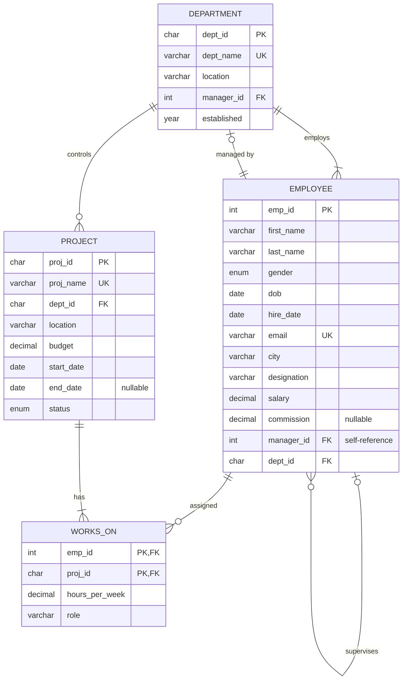

# Experiment 3 – Employee–Department–Project Schema and SQL Queries

## Aim

To create an **Employee–Department–Project** schema in MySQL, insert at least **30 employees across 5 departments and 8 projects**, and write SQL queries demonstrating **selection, projection, aggregate functions, GROUP BY, HAVING, CASE expressions and ORDER BY**.

## Software Required

- MySQL Server 8.0 or later
- MySQL Workbench or the MySQL command-line client

## Files

| File | Description |
|---|---|
| [`company_queries.sql`](company_queries.sql) | Complete script: schema, sample data and all 36 queries |
| `README.md` | This lab record |

**How to run:**

```bash
mysql -u root -p -t < company_queries.sql
```

---

## 1. Theory

### SQL Clauses and Relational Algebra

| Concept | SQL | Relational Algebra | Purpose |
|---|---|---|---|
| Selection | `WHERE` | σ (sigma) | Choose rows that satisfy a condition |
| Projection | `SELECT col1, col2` / `DISTINCT` | π (pi) | Choose columns |
| Aggregation | `COUNT, SUM, AVG, MIN, MAX` | 𝒢 (gamma) | Summarise many rows into one value |
| Grouping | `GROUP BY` | 𝒢 with grouping attributes | Aggregate per group |
| Group filter | `HAVING` | σ applied after 𝒢 | Keep only groups that satisfy a condition |
| Conditional logic | `CASE … WHEN … THEN … END` | – | If-then-else inside a query |
| Sorting | `ORDER BY … ASC / DESC` | τ (tau) | Order the result |

### Logical Order of Execution

SQL is **written** in the order `SELECT → FROM → WHERE → GROUP BY → HAVING → ORDER BY`, but it is **evaluated** in this order:

```
FROM / JOIN  →  WHERE  →  GROUP BY  →  HAVING  →  SELECT  →  DISTINCT  →  ORDER BY  →  LIMIT
```

That is why:
- `WHERE` cannot use aggregate functions, because the groups don't exist yet. Use `HAVING` for that.
- `ORDER BY` can use a column alias defined in `SELECT`, because `SELECT` has already run.

### WHERE vs HAVING

| WHERE | HAVING |
|---|---|
| Filters individual **rows** | Filters **groups** |
| Applied **before** `GROUP BY` | Applied **after** `GROUP BY` |
| Cannot contain aggregate functions | Usually contains aggregate functions |

---

## 2. ER Diagram



## 3. Relational Schema

```
DEPARTMENT (dept_id, dept_name, location, manager_id → EMPLOYEE, established)
EMPLOYEE   (emp_id, first_name, last_name, gender, dob, hire_date, email, city, designation,
            salary, commission, manager_id → EMPLOYEE, dept_id → DEPARTMENT)
PROJECT    (proj_id, proj_name, dept_id → DEPARTMENT, location, budget, start_date, end_date, status)
WORKS_ON   (emp_id → EMPLOYEE, proj_id → PROJECT, hours_per_week, role)
```

| Table | Primary Key | Foreign Keys | Other Constraints |
|---|---|---|---|
| department | `dept_id` | `manager_id` → employee (SET NULL) | `dept_name` UNIQUE |
| employee | `emp_id` | `dept_id` → department (RESTRICT); `manager_id` → employee (SET NULL) | `email` UNIQUE, `salary > 0` |
| project | `proj_id` | `dept_id` → department (RESTRICT) | `proj_name` UNIQUE, `budget > 0` |
| works_on | (`emp_id`, `proj_id`) | `emp_id` → employee (CASCADE); `proj_id` → project (CASCADE) | `hours_per_week` between 1 and 48 |

> `department.manager_id` and `employee.dept_id` refer to each other. So `department` is created first, and its foreign key to `employee` is added afterwards with `ALTER TABLE`.

---

## 4. Implementation

### 4.1 Create Database and Tables

```sql
DROP DATABASE IF EXISTS company_db;
CREATE DATABASE company_db;
USE company_db;

CREATE TABLE department (
    dept_id       CHAR(3)      PRIMARY KEY,
    dept_name     VARCHAR(50)  NOT NULL UNIQUE,
    location      VARCHAR(50)  NOT NULL,
    manager_id    INT          NULL,               -- FK added after EMPLOYEE exists
    established   YEAR         NOT NULL
);

CREATE TABLE employee (
    emp_id        INT           PRIMARY KEY,
    first_name    VARCHAR(30)   NOT NULL,
    last_name     VARCHAR(30)   NOT NULL,
    gender        ENUM('M','F') NOT NULL,
    dob           DATE          NOT NULL,
    hire_date     DATE          NOT NULL,
    email         VARCHAR(100)  NOT NULL UNIQUE,
    city          VARCHAR(30)   NOT NULL,
    designation   VARCHAR(50)   NOT NULL,
    salary        DECIMAL(10,2) NOT NULL,          -- monthly salary in INR
    commission    DECIMAL(10,2) NULL,              -- only sales/marketing staff
    manager_id    INT           NULL,
    dept_id       CHAR(3)       NOT NULL,
    CONSTRAINT chk_salary CHECK (salary > 0),
    CONSTRAINT fk_emp_manager FOREIGN KEY (manager_id)
        REFERENCES employee(emp_id) ON DELETE SET NULL,
    CONSTRAINT fk_emp_dept FOREIGN KEY (dept_id)
        REFERENCES department(dept_id) ON DELETE RESTRICT ON UPDATE CASCADE
);

ALTER TABLE department
    ADD CONSTRAINT fk_dept_manager FOREIGN KEY (manager_id)
        REFERENCES employee(emp_id) ON DELETE SET NULL;

CREATE TABLE project (
    proj_id       CHAR(3)       PRIMARY KEY,
    proj_name     VARCHAR(60)   NOT NULL UNIQUE,
    dept_id       CHAR(3)       NOT NULL,          -- controlling department
    location      VARCHAR(50)   NOT NULL,
    budget        DECIMAL(12,2) NOT NULL,          -- INR
    start_date    DATE          NOT NULL,
    end_date      DATE          NULL,
    status        ENUM('Planned','Ongoing','Completed') NOT NULL DEFAULT 'Planned',
    CONSTRAINT chk_budget CHECK (budget > 0),
    CONSTRAINT fk_proj_dept FOREIGN KEY (dept_id)
        REFERENCES department(dept_id) ON DELETE RESTRICT ON UPDATE CASCADE
);

-- M:N relationship EMPLOYEE <-> PROJECT
CREATE TABLE works_on (
    emp_id          INT          NOT NULL,
    proj_id         CHAR(3)      NOT NULL,
    hours_per_week  DECIMAL(4,1) NOT NULL,
    role            VARCHAR(30)  NOT NULL,
    PRIMARY KEY (emp_id, proj_id),
    CONSTRAINT chk_hours CHECK (hours_per_week BETWEEN 1 AND 48),
    CONSTRAINT fk_wo_emp  FOREIGN KEY (emp_id)  REFERENCES employee(emp_id) ON DELETE CASCADE,
    CONSTRAINT fk_wo_proj FOREIGN KEY (proj_id) REFERENCES project(proj_id) ON DELETE CASCADE
);
```

### 4.2 Insert Sample Data

| Department | Location | Employees | Projects |
|---|---|---|---|
| D01 – Engineering | Bengaluru | 10 | P01 UPI Payment Gateway, P02 Mobile App Revamp, P03 AI Chatbot (Hindi-English) |
| D02 – Human Resources | Mumbai | 4 | P04 Campus Hiring Drive 2026 |
| D03 – Finance | Mumbai | 5 | P05 GST Compliance Automation |
| D04 – Marketing | New Delhi | 6 | P06 Diwali Festive Campaign |
| D05 – Operations | Chennai | 7 | P07 Warehouse Automation, P08 Tier-2 City Expansion |
| **Total** | | **32** | **8** |

Salaries are monthly, in INR. Employees 114 and 131 are not assigned to any project.

<details>
<summary><b>Click to view the INSERT statements</b></summary>

```sql
INSERT INTO department (dept_id, dept_name, location, established) VALUES
('D01', 'Engineering',     'Bengaluru', 2010),
('D02', 'Human Resources', 'Mumbai',    2010),
('D03', 'Finance',         'Mumbai',    2011),
('D04', 'Marketing',       'New Delhi', 2013),
('D05', 'Operations',      'Chennai',   2012);

INSERT INTO employee VALUES
-- Engineering (10)
(101,'Rajesh','Kumar','M','1980-03-15','2012-06-01','rajesh.kumar@company.in','Bengaluru','Engineering Manager',210000,NULL,NULL,'D01'),
(102,'Ananya','Reddy','F','1988-07-22','2015-08-17','ananya.reddy@company.in','Hyderabad','Tech Lead',165000,NULL,101,'D01'),
(103,'Vikram','Singh','M','1990-11-05','2016-01-11','vikram.singh@company.in','Bengaluru','Senior Software Engineer',135000,NULL,102,'D01'),
(104,'Sneha','Kulkarni','F','1993-02-14','2018-07-02','sneha.kulkarni@company.in','Pune','Senior Software Engineer',128000,NULL,102,'D01'),
(105,'Arjun','Nair','M','1995-09-30','2019-03-18','arjun.nair@company.in','Kochi','Software Engineer',95000,NULL,102,'D01'),
(106,'Pooja','Desai','F','1996-12-08','2020-09-07','pooja.desai@company.in','Ahmedabad','Software Engineer',88000,NULL,102,'D01'),
(107,'Karthik','Iyer','M','1997-05-19','2021-07-12','karthik.iyer@company.in','Chennai','Software Engineer',82000,NULL,103,'D01'),
(108,'Divya','Menon','F','1998-08-25','2022-08-01','divya.menon@company.in','Bengaluru','Associate Engineer',62000,NULL,103,'D01'),
(109,'Rahul','Verma','M','1999-01-10','2023-07-17','rahul.verma@company.in','Lucknow','Associate Engineer',58000,NULL,104,'D01'),
(110,'Neha','Joshi','F','2000-04-03','2024-01-08','neha.joshi@company.in','Jaipur','Associate Engineer',55000,NULL,104,'D01'),
-- Human Resources (4)
(111,'Meenakshi','Pillai','F','1982-06-11','2010-04-05','meenakshi.pillai@company.in','Mumbai','HR Manager',150000,NULL,NULL,'D02'),
(112,'Sanjay','Gupta','M','1989-10-02','2016-11-14','sanjay.gupta@company.in','Mumbai','HR Business Partner',90000,NULL,111,'D02'),
(113,'Ritu','Saxena','F','1994-03-27','2019-06-03','ritu.saxena@company.in','Delhi','Recruiter',60000,NULL,111,'D02'),
(114,'Aditya','Bhatt','M','1998-12-15','2023-02-20','aditya.bhatt@company.in','Mumbai','HR Executive',42000,NULL,111,'D02'),
-- Finance (5)
(115,'Suresh','Agarwal','M','1978-09-09','2009-01-12','suresh.agarwal@company.in','Kolkata','Finance Manager',185000,NULL,NULL,'D03'),
(116,'Kavita','Mehta','F','1987-05-17','2014-05-26','kavita.mehta@company.in','Mumbai','Senior Accountant',105000,NULL,115,'D03'),
(117,'Manoj','Tiwari','M','1991-08-21','2017-10-09','manoj.tiwari@company.in','Varanasi','Accountant',72000,NULL,116,'D03'),
(118,'Lakshmi','Rao','F','1995-01-29','2020-02-10','lakshmi.rao@company.in','Hyderabad','Financial Analyst',85000,NULL,115,'D03'),
(119,'Imran','Khan','M','1997-07-07','2022-04-18','imran.khan@company.in','Bhopal','Accounts Executive',48000,NULL,116,'D03'),
-- Marketing (6)
(120,'Nisha','Malhotra','F','1984-04-18','2013-03-04','nisha.malhotra@company.in','Delhi','Marketing Manager',160000,20000,NULL,'D04'),
(121,'Rohit','Bansal','M','1990-02-28','2017-05-15','rohit.bansal@company.in','Delhi','Brand Manager',110000,15000,120,'D04'),
(122,'Shreya','Ghosh','F','1993-09-12','2019-08-19','shreya.ghosh@company.in','Kolkata','Digital Marketing Specialist',78000,8000,121,'D04'),
(123,'Aman','Chauhan','M','1996-06-06','2021-01-25','aman.chauhan@company.in','Chandigarh','SEO Analyst',56000,NULL,121,'D04'),
(124,'Tanvi','Kapoor','F','1998-11-20','2022-11-07','tanvi.kapoor@company.in','Noida','Content Writer',45000,NULL,121,'D04'),
(125,'Farhan','Siddiqui','M','1995-03-03','2020-10-12','farhan.siddiqui@company.in','Lucknow','Sales Executive',52000,12000,120,'D04'),
-- Operations (7)
(126,'Venkatesh','Subramanian','M','1981-12-24','2011-09-19','venkatesh.s@company.in','Chennai','Operations Manager',175000,NULL,NULL,'D05'),
(127,'Deepa','Krishnan','F','1988-01-16','2015-02-02','deepa.krishnan@company.in','Chennai','Logistics Lead',98000,NULL,126,'D05'),
(128,'Harish','Gowda','M','1992-07-30','2018-04-16','harish.gowda@company.in','Mysuru','Supply Chain Analyst',76000,NULL,127,'D05'),
(129,'Swati','Mishra','F','1994-10-10','2019-12-02','swati.mishra@company.in','Patna','Operations Executive',54000,NULL,127,'D05'),
(130,'Gaurav','Yadav','M','1997-02-22','2021-06-14','gaurav.yadav@company.in','Kanpur','Operations Executive',50000,NULL,127,'D05'),
(131,'Bhavna','Thakur','F','1999-05-05','2023-09-04','bhavna.thakur@company.in','Shimla','Operations Trainee',35000,NULL,127,'D05'),
(132,'Naveen','Prasad','M','1986-08-08','2014-07-21','naveen.prasad@company.in','Chennai','Quality Manager',120000,NULL,126,'D05');

UPDATE department SET manager_id = 101 WHERE dept_id = 'D01';
UPDATE department SET manager_id = 111 WHERE dept_id = 'D02';
UPDATE department SET manager_id = 115 WHERE dept_id = 'D03';
UPDATE department SET manager_id = 120 WHERE dept_id = 'D04';
UPDATE department SET manager_id = 126 WHERE dept_id = 'D05';

INSERT INTO project VALUES
('P01','UPI Payment Gateway',       'D01','Bengaluru', 4500000,'2025-01-15','2025-12-31','Completed'),
('P02','Mobile App Revamp',         'D01','Bengaluru', 3200000,'2025-06-01','2026-12-31','Ongoing'),
('P03','AI Chatbot (Hindi-English)','D01','Hyderabad', 2800000,'2026-02-01','2027-03-31','Ongoing'),
('P04','Campus Hiring Drive 2026',  'D02','Mumbai',     600000,'2026-01-10','2026-08-31','Completed'),
('P05','GST Compliance Automation', 'D03','Mumbai',    1500000,'2025-09-01','2026-11-30','Ongoing'),
('P06','Diwali Festive Campaign',   'D04','New Delhi', 2200000,'2026-08-01','2026-11-15','Ongoing'),
('P07','Warehouse Automation',      'D05','Chennai',   5000000,'2026-04-01','2027-09-30','Ongoing'),
('P08','Tier-2 City Expansion',     'D05','Pune',      3500000,'2026-12-01',NULL,        'Planned');

INSERT INTO works_on VALUES
(101,'P01', 5,'Sponsor'),   (102,'P01',20,'Lead'),      (103,'P01',30,'Developer'),
(105,'P01',35,'Developer'), (118,'P01',10,'Analyst'),
(102,'P02',15,'Architect'), (104,'P02',30,'Lead'),      (106,'P02',40,'Developer'),
(108,'P02',35,'Developer'), (122,'P02',10,'Consultant'),
(101,'P03', 5,'Sponsor'),   (103,'P03',10,'Developer'), (107,'P03',40,'Developer'),
(109,'P03',40,'Developer'), (110,'P03',40,'Developer'), (124,'P03',15,'Content'),
(111,'P04',10,'Sponsor'),   (112,'P04',25,'Lead'),      (113,'P04',40,'Recruiter'),
(108,'P04', 5,'Panelist'),  (104,'P04', 5,'Panelist'),
(115,'P05',10,'Sponsor'),   (116,'P05',30,'Lead'),      (117,'P05',40,'Analyst'),
(119,'P05',40,'Analyst'),   (105,'P05', 5,'Developer'),
(120,'P06',15,'Sponsor'),   (121,'P06',35,'Lead'),      (122,'P06',30,'Specialist'),
(123,'P06',40,'SEO'),       (125,'P06',30,'Sales'),
(126,'P07',10,'Sponsor'),   (127,'P07',35,'Lead'),      (128,'P07',40,'Analyst'),
(129,'P07',40,'Executive'), (130,'P07',40,'Executive'), (132,'P07',15,'Quality'),
(126,'P08', 5,'Sponsor'),   (132,'P08',10,'Planning'),  (118,'P08',10,'Analyst');
```

</details>

**Row counts after inserting:**

```
+------------+-----------+
| table_name | row_count |
+------------+-----------+
| department |         5 |
| employee   |        32 |
| project    |         8 |
| works_on   |        40 |
+------------+-----------+
```

---

## 5. Queries and Output

| Concept | Queries |
|---|---|
| Selection (σ) | Q1, Q2, Q3, Q4, Q5, Q6, Q7, Q8, Q9 |
| Projection (π) | Q10, Q11, Q12, Q13 |
| Aggregate Functions | Q14, Q15 |
| GROUP BY | Q16, Q17, Q18, Q19, Q20 |
| HAVING | Q21, Q22, Q23, Q24, Q25 |
| CASE Expressions | Q26, Q27, Q28, Q29, Q30 |
| ORDER BY | Q31, Q32, Q33, Q34, Q35 |
| All Concepts Together | Q36 |

> Queries without `ORDER BY` may return rows in a different order on your machine. SQL does not guarantee row order unless you ask for it. Q13 uses `CURDATE()`, so ages and experience depend on the day you run it.

### 5.1 Selection (σ) – filtering rows with WHERE

Selection picks the **rows** that satisfy a condition. Relational algebra: σ<sub>condition</sub>(R).

#### Q1. Display all departments.

```sql
SELECT * FROM department;
```

**Output:**

```
+---------+-----------------+-----------+------------+-------------+
| dept_id | dept_name       | location  | manager_id | established |
+---------+-----------------+-----------+------------+-------------+
| D01     | Engineering     | Bengaluru |        101 |        2010 |
| D02     | Human Resources | Mumbai    |        111 |        2010 |
| D03     | Finance         | Mumbai    |        115 |        2011 |
| D04     | Marketing       | New Delhi |        120 |        2013 |
| D05     | Operations      | Chennai   |        126 |        2012 |
+---------+-----------------+-----------+------------+-------------+
```

#### Q2. Engineering employees earning more than Rs 1,00,000 per month (WHERE with AND).

```sql
SELECT emp_id, first_name, last_name, designation, salary
FROM employee
WHERE dept_id = 'D01' AND salary > 100000;
```

**Output:**

```
+--------+------------+-----------+--------------------------+-----------+
| emp_id | first_name | last_name | designation              | salary    |
+--------+------------+-----------+--------------------------+-----------+
|    101 | Rajesh     | Kumar     | Engineering Manager      | 210000.00 |
|    102 | Ananya     | Reddy     | Tech Lead                | 165000.00 |
|    103 | Vikram     | Singh     | Senior Software Engineer | 135000.00 |
|    104 | Sneha      | Kulkarni  | Senior Software Engineer | 128000.00 |
+--------+------------+-----------+--------------------------+-----------+
```

#### Q3. Employees with salary between Rs 50,000 and Rs 80,000 (BETWEEN).

```sql
SELECT emp_id, first_name, designation, salary
FROM employee
WHERE salary BETWEEN 50000 AND 80000;
```

**Output:**

```
+--------+------------+------------------------------+----------+
| emp_id | first_name | designation                  | salary   |
+--------+------------+------------------------------+----------+
|    108 | Divya      | Associate Engineer           | 62000.00 |
|    109 | Rahul      | Associate Engineer           | 58000.00 |
|    110 | Neha       | Associate Engineer           | 55000.00 |
|    113 | Ritu       | Recruiter                    | 60000.00 |
|    117 | Manoj      | Accountant                   | 72000.00 |
|    122 | Shreya     | Digital Marketing Specialist | 78000.00 |
|    123 | Aman       | SEO Analyst                  | 56000.00 |
|    125 | Farhan     | Sales Executive              | 52000.00 |
|    128 | Harish     | Supply Chain Analyst         | 76000.00 |
|    129 | Swati      | Operations Executive         | 54000.00 |
|    130 | Gaurav     | Operations Executive         | 50000.00 |
+--------+------------+------------------------------+----------+
```

#### Q4. Employees based in Mumbai, Chennai or Delhi (IN).

```sql
SELECT emp_id, first_name, last_name, city
FROM employee
WHERE city IN ('Mumbai', 'Chennai', 'Delhi');
```

**Output:**

```
+--------+------------+-------------+---------+
| emp_id | first_name | last_name   | city    |
+--------+------------+-------------+---------+
|    107 | Karthik    | Iyer        | Chennai |
|    111 | Meenakshi  | Pillai      | Mumbai  |
|    112 | Sanjay     | Gupta       | Mumbai  |
|    113 | Ritu       | Saxena      | Delhi   |
|    114 | Aditya     | Bhatt       | Mumbai  |
|    116 | Kavita     | Mehta       | Mumbai  |
|    120 | Nisha      | Malhotra    | Delhi   |
|    121 | Rohit      | Bansal      | Delhi   |
|    126 | Venkatesh  | Subramanian | Chennai |
|    127 | Deepa      | Krishnan    | Chennai |
|    132 | Naveen     | Prasad      | Chennai |
+--------+------------+-------------+---------+
```

#### Q5. Employees whose designation contains 'Manager' (LIKE).

```sql
SELECT emp_id, first_name, designation
FROM employee
WHERE designation LIKE '%Manager%';
```

**Output:**

```
+--------+------------+---------------------+
| emp_id | first_name | designation         |
+--------+------------+---------------------+
|    101 | Rajesh     | Engineering Manager |
|    111 | Meenakshi  | HR Manager          |
|    115 | Suresh     | Finance Manager     |
|    120 | Nisha      | Marketing Manager   |
|    121 | Rohit      | Brand Manager       |
|    126 | Venkatesh  | Operations Manager  |
|    132 | Naveen     | Quality Manager     |
+--------+------------+---------------------+
```

#### Q6. Employees who report to no one, i.e. top-level managers (IS NULL).

```sql
SELECT emp_id, first_name, last_name, designation
FROM employee
WHERE manager_id IS NULL;
```

**Output:**

```
+--------+------------+-------------+---------------------+
| emp_id | first_name | last_name   | designation         |
+--------+------------+-------------+---------------------+
|    101 | Rajesh     | Kumar       | Engineering Manager |
|    111 | Meenakshi  | Pillai      | HR Manager          |
|    115 | Suresh     | Agarwal     | Finance Manager     |
|    120 | Nisha      | Malhotra    | Marketing Manager   |
|    126 | Venkatesh  | Subramanian | Operations Manager  |
+--------+------------+-------------+---------------------+
```

#### Q7. Employees who earn a commission (IS NOT NULL).

```sql
SELECT emp_id, first_name, salary, commission
FROM employee
WHERE commission IS NOT NULL;
```

**Output:**

```
+--------+------------+-----------+------------+
| emp_id | first_name | salary    | commission |
+--------+------------+-----------+------------+
|    120 | Nisha      | 160000.00 |   20000.00 |
|    121 | Rohit      | 110000.00 |   15000.00 |
|    122 | Shreya     |  78000.00 |    8000.00 |
|    125 | Farhan     |  52000.00 |   12000.00 |
+--------+------------+-----------+------------+
```

#### Q8. Female employees hired on or after 1 Jan 2020, or anyone from Finance (AND / OR / dates).

```sql
SELECT emp_id, first_name, gender, hire_date, dept_id
FROM employee
WHERE (gender = 'F' AND hire_date >= '2020-01-01') OR dept_id = 'D03';
```

**Output:**

```
+--------+------------+--------+------------+---------+
| emp_id | first_name | gender | hire_date  | dept_id |
+--------+------------+--------+------------+---------+
|    106 | Pooja      | F      | 2020-09-07 | D01     |
|    108 | Divya      | F      | 2022-08-01 | D01     |
|    110 | Neha       | F      | 2024-01-08 | D01     |
|    115 | Suresh     | M      | 2009-01-12 | D03     |
|    116 | Kavita     | F      | 2014-05-26 | D03     |
|    117 | Manoj      | M      | 2017-10-09 | D03     |
|    118 | Lakshmi    | F      | 2020-02-10 | D03     |
|    119 | Imran      | M      | 2022-04-18 | D03     |
|    124 | Tanvi      | F      | 2022-11-07 | D04     |
|    131 | Bhavna     | F      | 2023-09-04 | D05     |
+--------+------------+--------+------------+---------+
```

#### Q9. Projects that are NOT completed (NOT / <>).

```sql
SELECT proj_id, proj_name, status
FROM project
WHERE status <> 'Completed';
```

**Output:**

```
+---------+----------------------------+---------+
| proj_id | proj_name                  | status  |
+---------+----------------------------+---------+
| P02     | Mobile App Revamp          | Ongoing |
| P03     | AI Chatbot (Hindi-English) | Ongoing |
| P05     | GST Compliance Automation  | Ongoing |
| P06     | Diwali Festive Campaign    | Ongoing |
| P07     | Warehouse Automation       | Ongoing |
| P08     | Tier-2 City Expansion      | Planned |
+---------+----------------------------+---------+
```

### 5.2 Projection (π) – choosing columns

Projection picks the **columns** to display, removes duplicates with `DISTINCT`, and can compute new columns. Relational algebra: π<sub>columns</sub>(R).

#### Q10. Only the name and designation columns of employees.

```sql
SELECT first_name, last_name, designation
FROM employee
WHERE dept_id = 'D02';
```

**Output:**

```
+------------+-----------+---------------------+
| first_name | last_name | designation         |
+------------+-----------+---------------------+
| Meenakshi  | Pillai    | HR Manager          |
| Sanjay     | Gupta     | HR Business Partner |
| Ritu       | Saxena    | Recruiter           |
| Aditya     | Bhatt     | HR Executive        |
+------------+-----------+---------------------+
```

#### Q11. Distinct cities where employees live (DISTINCT).

```sql
SELECT DISTINCT city
FROM employee
ORDER BY city;
```

**Output:**

```
+------------+
| city       |
+------------+
| Ahmedabad  |
| Bengaluru  |
| Bhopal     |
| Chandigarh |
| Chennai    |
| Delhi      |
| Hyderabad  |
| Jaipur     |
| Kanpur     |
| Kochi      |
| Kolkata    |
| Lucknow    |
| Mumbai     |
| Mysuru     |
| Noida      |
| Patna      |
| Pune       |
| Shimla     |
| Varanasi   |
+------------+
```

#### Q12. Computed columns with aliases: full name, annual CTC, total monthly pay.

```sql
SELECT emp_id,
       CONCAT(first_name, ' ', last_name)       AS full_name,
       salary                                   AS monthly_salary,
       salary * 12                              AS annual_ctc,
       salary + IFNULL(commission, 0)           AS total_monthly_pay
FROM employee
WHERE dept_id = 'D04';
```

**Output:**

```
+--------+-----------------+----------------+------------+-------------------+
| emp_id | full_name       | monthly_salary | annual_ctc | total_monthly_pay |
+--------+-----------------+----------------+------------+-------------------+
|    120 | Nisha Malhotra  |      160000.00 | 1920000.00 |         180000.00 |
|    121 | Rohit Bansal    |      110000.00 | 1320000.00 |         125000.00 |
|    122 | Shreya Ghosh    |       78000.00 |  936000.00 |          86000.00 |
|    123 | Aman Chauhan    |       56000.00 |  672000.00 |          56000.00 |
|    124 | Tanvi Kapoor    |       45000.00 |  540000.00 |          45000.00 |
|    125 | Farhan Siddiqui |       52000.00 |  624000.00 |          64000.00 |
+--------+-----------------+----------------+------------+-------------------+
```

#### Q13. Age and experience in years (derived attributes).

```sql
SELECT emp_id, first_name,
       TIMESTAMPDIFF(YEAR, dob, CURDATE())       AS age,
       TIMESTAMPDIFF(YEAR, hire_date, CURDATE()) AS experience_years
FROM employee
WHERE dept_id = 'D05';
```

**Output:**

```
+--------+------------+------+------------------+
| emp_id | first_name | age  | experience_years |
+--------+------------+------+------------------+
|    126 | Venkatesh  |   44 |               15 |
|    127 | Deepa      |   38 |               11 |
|    128 | Harish     |   34 |                8 |
|    129 | Swati      |   31 |                6 |
|    130 | Gaurav     |   29 |                5 |
|    131 | Bhavna     |   27 |                3 |
|    132 | Naveen     |   40 |               12 |
+--------+------------+------+------------------+
```

### 5.3 Aggregate Functions

`COUNT`, `SUM`, `AVG`, `MIN` and `MAX` reduce many rows to one value. All of them except `COUNT(*)` ignore NULLs.

#### Q14. Company-wide salary statistics.

```sql
SELECT COUNT(*)           AS total_employees,
       COUNT(commission)  AS with_commission,
       SUM(salary)        AS total_monthly_payroll,
       ROUND(AVG(salary), 2) AS avg_salary,
       MIN(salary)        AS min_salary,
       MAX(salary)        AS max_salary
FROM employee;
```

**Output:**

```
+-----------------+-----------------+-----------------------+------------+------------+------------+
| total_employees | with_commission | total_monthly_payroll | avg_salary | min_salary | max_salary |
+-----------------+-----------------+-----------------------+------------+------------+------------+
|              32 |               4 |            3024000.00 |   94500.00 |   35000.00 |  210000.00 |
+-----------------+-----------------+-----------------------+------------+------------+------------+
```

#### Q15. COUNT(DISTINCT) and project budget totals.

```sql
SELECT COUNT(DISTINCT city)  AS distinct_cities,
       COUNT(DISTINCT designation) AS distinct_designations,
       (SELECT SUM(budget) FROM project) AS total_project_budget,
       (SELECT COUNT(*) FROM project WHERE end_date IS NULL) AS projects_without_end_date
FROM employee;
```

**Output:**

```
+-----------------+-----------------------+----------------------+---------------------------+
| distinct_cities | distinct_designations | total_project_budget | projects_without_end_date |
+-----------------+-----------------------+----------------------+---------------------------+
|              19 |                    26 |          23300000.00 |                         1 |
+-----------------+-----------------------+----------------------+---------------------------+
```

### 5.4 GROUP BY

`GROUP BY` splits rows into groups and applies the aggregate to each group. Every non-aggregated column in `SELECT` must appear in `GROUP BY`.

#### Q16. Department-wise headcount and salary statistics.

```sql
SELECT d.dept_name,
       COUNT(e.emp_id)         AS headcount,
       SUM(e.salary)           AS total_salary,
       ROUND(AVG(e.salary), 2) AS avg_salary,
       MIN(e.salary)           AS min_salary,
       MAX(e.salary)           AS max_salary
FROM department d
JOIN employee e ON e.dept_id = d.dept_id
GROUP BY d.dept_id, d.dept_name;
```

**Output:**

```
+-----------------+-----------+--------------+------------+------------+------------+
| dept_name       | headcount | total_salary | avg_salary | min_salary | max_salary |
+-----------------+-----------+--------------+------------+------------+------------+
| Engineering     |        10 |   1078000.00 |  107800.00 |   55000.00 |  210000.00 |
| Human Resources |         4 |    342000.00 |   85500.00 |   42000.00 |  150000.00 |
| Finance         |         5 |    495000.00 |   99000.00 |   48000.00 |  185000.00 |
| Marketing       |         6 |    501000.00 |   83500.00 |   45000.00 |  160000.00 |
| Operations      |         7 |    608000.00 |   86857.14 |   35000.00 |  175000.00 |
+-----------------+-----------+--------------+------------+------------+------------+
```

#### Q17. Gender-wise count and average salary.

```sql
SELECT gender, COUNT(*) AS employees, ROUND(AVG(salary), 2) AS avg_salary
FROM employee
GROUP BY gender;
```

**Output:**

```
+--------+-----------+------------+
| gender | employees | avg_salary |
+--------+-----------+------------+
| M      |        17 |   97411.76 |
| F      |        15 |   91200.00 |
+--------+-----------+------------+
```

#### Q18. Multi-column grouping: department and gender.

```sql
SELECT dept_id, gender, COUNT(*) AS employees
FROM employee
GROUP BY dept_id, gender
ORDER BY dept_id, gender;
```

**Output:**

```
+---------+--------+-----------+
| dept_id | gender | employees |
+---------+--------+-----------+
| D01     | M      |         5 |
| D01     | F      |         5 |
| D02     | M      |         2 |
| D02     | F      |         2 |
| D03     | M      |         3 |
| D03     | F      |         2 |
| D04     | M      |         3 |
| D04     | F      |         3 |
| D05     | M      |         4 |
| D05     | F      |         3 |
+---------+--------+-----------+
```

#### Q19. Project-wise team size and total weekly hours.

```sql
SELECT p.proj_id, p.proj_name,
       COUNT(w.emp_id)       AS team_size,
       SUM(w.hours_per_week) AS total_hours
FROM project p
JOIN works_on w ON w.proj_id = p.proj_id
GROUP BY p.proj_id, p.proj_name;
```

**Output:**

```
+---------+----------------------------+-----------+-------------+
| proj_id | proj_name                  | team_size | total_hours |
+---------+----------------------------+-----------+-------------+
| P01     | UPI Payment Gateway        |         5 |       100.0 |
| P02     | Mobile App Revamp          |         5 |       130.0 |
| P03     | AI Chatbot (Hindi-English) |         6 |       150.0 |
| P04     | Campus Hiring Drive 2026   |         5 |        85.0 |
| P05     | GST Compliance Automation  |         5 |       125.0 |
| P06     | Diwali Festive Campaign    |         5 |       150.0 |
| P07     | Warehouse Automation       |         6 |       180.0 |
| P08     | Tier-2 City Expansion      |         3 |        25.0 |
+---------+----------------------------+-----------+-------------+
```

#### Q20. Number of employees hired each year.

```sql
SELECT YEAR(hire_date) AS hire_year, COUNT(*) AS hired
FROM employee
GROUP BY YEAR(hire_date)
ORDER BY hire_year;
```

**Output:**

```
+-----------+-------+
| hire_year | hired |
+-----------+-------+
|      2009 |     1 |
|      2010 |     1 |
|      2011 |     1 |
|      2012 |     1 |
|      2013 |     1 |
|      2014 |     2 |
|      2015 |     2 |
|      2016 |     2 |
|      2017 |     2 |
|      2018 |     2 |
|      2019 |     4 |
|      2020 |     3 |
|      2021 |     3 |
|      2022 |     3 |
|      2023 |     3 |
|      2024 |     1 |
+-----------+-------+
```

### 5.5 HAVING

`HAVING` filters **groups** after aggregation. `WHERE` filters **rows** before grouping.

#### Q21. Departments with more than 5 employees.

```sql
SELECT dept_id, COUNT(*) AS headcount
FROM employee
GROUP BY dept_id
HAVING COUNT(*) > 5;
```

**Output:**

```
+---------+-----------+
| dept_id | headcount |
+---------+-----------+
| D01     |        10 |
| D04     |         6 |
| D05     |         7 |
+---------+-----------+
```

#### Q22. Departments whose average salary exceeds Rs 95,000.

```sql
SELECT d.dept_name, ROUND(AVG(e.salary), 2) AS avg_salary
FROM department d
JOIN employee e ON e.dept_id = d.dept_id
GROUP BY d.dept_name
HAVING AVG(e.salary) > 95000;
```

**Output:**

```
+-------------+------------+
| dept_name   | avg_salary |
+-------------+------------+
| Engineering |  107800.00 |
| Finance     |   99000.00 |
+-------------+------------+
```

#### Q23. Projects with more than 4 members AND at least 150 total weekly hours.

```sql
SELECT proj_id, COUNT(*) AS members, SUM(hours_per_week) AS total_hours
FROM works_on
GROUP BY proj_id
HAVING COUNT(*) > 4 AND SUM(hours_per_week) >= 150;
```

**Output:**

```
+---------+---------+-------------+
| proj_id | members | total_hours |
+---------+---------+-------------+
| P03     |       6 |       150.0 |
| P06     |       5 |       150.0 |
| P07     |       6 |       180.0 |
+---------+---------+-------------+
```

#### Q24. Among employees earning >= Rs 50,000, cities with at least 2 such employees.

```sql
SELECT city, COUNT(*) AS employees, MAX(salary) AS highest_salary
FROM employee
WHERE salary >= 50000
GROUP BY city
HAVING COUNT(*) >= 2;
```

**Output:**

```
+-----------+-----------+----------------+
| city      | employees | highest_salary |
+-----------+-----------+----------------+
| Bengaluru |         3 |      210000.00 |
| Chennai   |         4 |      175000.00 |
| Delhi     |         3 |      160000.00 |
| Hyderabad |         2 |      165000.00 |
| Kolkata   |         2 |      185000.00 |
| Lucknow   |         2 |       58000.00 |
| Mumbai    |         3 |      150000.00 |
+-----------+-----------+----------------+
```

#### Q25. Employees working on more than one project.

```sql
SELECT e.emp_id, e.first_name, COUNT(w.proj_id) AS projects, SUM(w.hours_per_week) AS weekly_hours
FROM employee e
JOIN works_on w ON w.emp_id = e.emp_id
GROUP BY e.emp_id, e.first_name
HAVING COUNT(w.proj_id) > 1;
```

**Output:**

```
+--------+------------+----------+--------------+
| emp_id | first_name | projects | weekly_hours |
+--------+------------+----------+--------------+
|    101 | Rajesh     |        2 |         10.0 |
|    102 | Ananya     |        2 |         35.0 |
|    103 | Vikram     |        2 |         40.0 |
|    104 | Sneha      |        2 |         35.0 |
|    105 | Arjun      |        2 |         40.0 |
|    108 | Divya      |        2 |         40.0 |
|    118 | Lakshmi    |        2 |         20.0 |
|    122 | Shreya     |        2 |         40.0 |
|    126 | Venkatesh  |        2 |         15.0 |
|    132 | Naveen     |        2 |         25.0 |
+--------+------------+----------+--------------+
```

### 5.6 CASE Expressions

`CASE` adds if-then-else logic inside a query. A **searched CASE** tests conditions (`CASE WHEN salary > … THEN …`). A **simple CASE** compares one value (`CASE status WHEN 'Ongoing' THEN …`).

#### Q26. Salary grade for each Engineering employee.

```sql
SELECT emp_id, first_name, salary,
       CASE
           WHEN salary >= 150000 THEN 'A - Leadership'
           WHEN salary >= 100000 THEN 'B - Senior'
           WHEN salary >=  60000 THEN 'C - Mid'
           ELSE                       'D - Junior'
       END AS salary_grade
FROM employee
WHERE dept_id = 'D01';
```

**Output:**

```
+--------+------------+-----------+----------------+
| emp_id | first_name | salary    | salary_grade   |
+--------+------------+-----------+----------------+
|    101 | Rajesh     | 210000.00 | A - Leadership |
|    102 | Ananya     | 165000.00 | A - Leadership |
|    103 | Vikram     | 135000.00 | B - Senior     |
|    104 | Sneha      | 128000.00 | B - Senior     |
|    105 | Arjun      |  95000.00 | C - Mid        |
|    106 | Pooja      |  88000.00 | C - Mid        |
|    107 | Karthik    |  82000.00 | C - Mid        |
|    108 | Divya      |  62000.00 | C - Mid        |
|    109 | Rahul      |  58000.00 | D - Junior     |
|    110 | Neha       |  55000.00 | D - Junior     |
+--------+------------+-----------+----------------+
```

#### Q27. Project priority derived from status.

```sql
SELECT proj_id, proj_name, status,
       CASE status
           WHEN 'Ongoing'   THEN 'High'
           WHEN 'Planned'   THEN 'Medium'
           WHEN 'Completed' THEN 'Closed'
       END AS priority
FROM project;
```

**Output:**

```
+---------+----------------------------+-----------+----------+
| proj_id | proj_name                  | status    | priority |
+---------+----------------------------+-----------+----------+
| P01     | UPI Payment Gateway        | Completed | Closed   |
| P02     | Mobile App Revamp          | Ongoing   | High     |
| P03     | AI Chatbot (Hindi-English) | Ongoing   | High     |
| P04     | Campus Hiring Drive 2026   | Completed | Closed   |
| P05     | GST Compliance Automation  | Ongoing   | High     |
| P06     | Diwali Festive Campaign    | Ongoing   | High     |
| P07     | Warehouse Automation       | Ongoing   | High     |
| P08     | Tier-2 City Expansion      | Planned   | Medium   |
+---------+----------------------------+-----------+----------+
```

#### Q28. Number of employees in each salary grade.

```sql
SELECT CASE
           WHEN salary >= 150000 THEN 'A - Leadership'
           WHEN salary >= 100000 THEN 'B - Senior'
           WHEN salary >=  60000 THEN 'C - Mid'
           ELSE                       'D - Junior'
       END AS salary_grade,
       COUNT(*) AS employees
FROM employee
GROUP BY salary_grade
ORDER BY salary_grade;
```

**Output:**

```
+----------------+-----------+
| salary_grade   | employees |
+----------------+-----------+
| A - Leadership |         6 |
| B - Senior     |         5 |
| C - Mid        |        11 |
| D - Junior     |        10 |
+----------------+-----------+
```

#### Q29. Pivot: male/female count and senior staff per department.

```sql
SELECT dept_id,
       SUM(CASE WHEN gender = 'M' THEN 1 ELSE 0 END)        AS male,
       SUM(CASE WHEN gender = 'F' THEN 1 ELSE 0 END)        AS female,
       COUNT(CASE WHEN salary >= 100000 THEN 1 END)         AS earning_1L_plus,
       COUNT(*)                                             AS total
FROM employee
GROUP BY dept_id;
```

**Output:**

```
+---------+------+--------+-----------------+-------+
| dept_id | male | female | earning_1L_plus | total |
+---------+------+--------+-----------------+-------+
| D01     |    5 |      5 |               4 |    10 |
| D02     |    2 |      2 |               1 |     4 |
| D03     |    3 |      2 |               2 |     5 |
| D04     |    3 |      3 |               2 |     6 |
| D05     |    4 |      3 |               2 |     7 |
+---------+------+--------+-----------------+-------+
```

#### Q30. Diwali bonus calculation based on experience.

```sql
SELECT emp_id, first_name, hire_date, salary,
       CASE
           WHEN hire_date <  '2015-01-01' THEN 0.20
           WHEN hire_date <  '2020-01-01' THEN 0.15
           ELSE                                0.10
       END AS bonus_rate,
       ROUND(salary * CASE
           WHEN hire_date <  '2015-01-01' THEN 0.20
           WHEN hire_date <  '2020-01-01' THEN 0.15
           ELSE                                0.10
       END, 0) AS diwali_bonus
FROM employee
WHERE dept_id = 'D03';
```

**Output:**

```
+--------+------------+------------+-----------+------------+--------------+
| emp_id | first_name | hire_date  | salary    | bonus_rate | diwali_bonus |
+--------+------------+------------+-----------+------------+--------------+
|    115 | Suresh     | 2009-01-12 | 185000.00 |       0.20 |        37000 |
|    116 | Kavita     | 2014-05-26 | 105000.00 |       0.20 |        21000 |
|    117 | Manoj      | 2017-10-09 |  72000.00 |       0.15 |        10800 |
|    118 | Lakshmi    | 2020-02-10 |  85000.00 |       0.10 |         8500 |
|    119 | Imran      | 2022-04-18 |  48000.00 |       0.10 |         4800 |
+--------+------------+------------+-----------+------------+--------------+
```

### 5.7 ORDER BY

`ORDER BY` sorts the result: `ASC` (the default) or `DESC`, on several columns, on an alias or on a `CASE` expression. `LIMIT` keeps the first *n* rows.

#### Q31. Top 5 highest-paid employees (DESC + LIMIT).

```sql
SELECT emp_id, first_name, designation, salary
FROM employee
ORDER BY salary DESC
LIMIT 5;
```

**Output:**

```
+--------+------------+---------------------+-----------+
| emp_id | first_name | designation         | salary    |
+--------+------------+---------------------+-----------+
|    101 | Rajesh     | Engineering Manager | 210000.00 |
|    115 | Suresh     | Finance Manager     | 185000.00 |
|    126 | Venkatesh  | Operations Manager  | 175000.00 |
|    102 | Ananya     | Tech Lead           | 165000.00 |
|    120 | Nisha      | Marketing Manager   | 160000.00 |
+--------+------------+---------------------+-----------+
```

#### Q32. Multi-column sort: department ascending, salary descending.

```sql
SELECT dept_id, first_name, salary
FROM employee
WHERE dept_id IN ('D02', 'D03')
ORDER BY dept_id ASC, salary DESC;
```

**Output:**

```
+---------+------------+-----------+
| dept_id | first_name | salary    |
+---------+------------+-----------+
| D02     | Meenakshi  | 150000.00 |
| D02     | Sanjay     |  90000.00 |
| D02     | Ritu       |  60000.00 |
| D02     | Aditya     |  42000.00 |
| D03     | Suresh     | 185000.00 |
| D03     | Kavita     | 105000.00 |
| D03     | Lakshmi    |  85000.00 |
| D03     | Manoj      |  72000.00 |
| D03     | Imran      |  48000.00 |
+---------+------------+-----------+
```

#### Q33. Sort by an aggregate alias: departments by total payroll.

```sql
SELECT dept_id, SUM(salary) AS payroll
FROM employee
GROUP BY dept_id
ORDER BY payroll DESC;
```

**Output:**

```
+---------+------------+
| dept_id | payroll    |
+---------+------------+
| D01     | 1078000.00 |
| D05     |  608000.00 |
| D04     |  501000.00 |
| D03     |  495000.00 |
| D02     |  342000.00 |
+---------+------------+
```

#### Q34. Custom order: Ongoing projects first, then Planned, then Completed.

```sql
SELECT proj_id, proj_name, status, budget
FROM project
ORDER BY CASE status
             WHEN 'Ongoing'   THEN 1
             WHEN 'Planned'   THEN 2
             WHEN 'Completed' THEN 3
         END,
         budget DESC;
```

**Output:**

```
+---------+----------------------------+-----------+------------+
| proj_id | proj_name                  | status    | budget     |
+---------+----------------------------+-----------+------------+
| P07     | Warehouse Automation       | Ongoing   | 5000000.00 |
| P02     | Mobile App Revamp          | Ongoing   | 3200000.00 |
| P03     | AI Chatbot (Hindi-English) | Ongoing   | 2800000.00 |
| P06     | Diwali Festive Campaign    | Ongoing   | 2200000.00 |
| P05     | GST Compliance Automation  | Ongoing   | 1500000.00 |
| P08     | Tier-2 City Expansion      | Planned   | 3500000.00 |
| P01     | UPI Payment Gateway        | Completed | 4500000.00 |
| P04     | Campus Hiring Drive 2026   | Completed |  600000.00 |
+---------+----------------------------+-----------+------------+
```

#### Q35. Newest joiners first, ties broken by name.

```sql
SELECT emp_id, first_name, hire_date
FROM employee
ORDER BY hire_date DESC, first_name
LIMIT 6;
```

**Output:**

```
+--------+------------+------------+
| emp_id | first_name | hire_date  |
+--------+------------+------------+
|    110 | Neha       | 2024-01-08 |
|    131 | Bhavna     | 2023-09-04 |
|    109 | Rahul      | 2023-07-17 |
|    114 | Aditya     | 2023-02-20 |
|    124 | Tanvi      | 2022-11-07 |
|    108 | Divya      | 2022-08-01 |
+--------+------------+------------+
```

### 5.8 All Concepts Together

One query that uses selection, projection, aggregates, `GROUP BY`, `HAVING`, `CASE` and `ORDER BY`.

#### Q36. Department report: only departments with avg salary > 85,000, excluding trainees, with a pay band label, sorted by average salary.

```sql
SELECT d.dept_name,
       d.location,
       COUNT(e.emp_id)                                   AS headcount,
       ROUND(AVG(e.salary), 0)                           AS avg_salary,
       COUNT(CASE WHEN e.salary >= 100000 THEN 1 END)    AS senior_staff,
       CASE
           WHEN AVG(e.salary) >= 100000 THEN 'High-pay'
           WHEN AVG(e.salary) >=  90000 THEN 'Mid-pay'
           ELSE                              'Standard'
       END                                               AS pay_band
FROM department d
JOIN employee e ON e.dept_id = d.dept_id
WHERE e.designation NOT LIKE '%Trainee%'
GROUP BY d.dept_id, d.dept_name, d.location
HAVING AVG(e.salary) > 85000
ORDER BY avg_salary DESC;
```

**Output:**

```
+-----------------+-----------+-----------+------------+--------------+----------+
| dept_name       | location  | headcount | avg_salary | senior_staff | pay_band |
+-----------------+-----------+-----------+------------+--------------+----------+
| Engineering     | Bengaluru |        10 |     107800 |            4 | High-pay |
| Finance         | Mumbai    |         5 |      99000 |            2 | Mid-pay  |
| Operations      | Chennai   |         6 |      95500 |            2 | Mid-pay  |
| Human Resources | Mumbai    |         4 |      85500 |            1 | Standard |
+-----------------+-----------+-----------+------------+--------------+----------+
```

---

## Result

An Employee–Department–Project schema was created in MySQL with **5 departments, 32 employees, 8 projects and 40 project assignments**. The 36 queries demonstrate:

- **Selection** with `WHERE`, `AND/OR`, `BETWEEN`, `IN`, `LIKE`, `IS NULL` and `<>`.
- **Projection** with column lists, `DISTINCT`, aliases and computed columns.
- **Aggregate functions** `COUNT`, `SUM`, `AVG`, `MIN` and `MAX`.
- **GROUP BY** on one or more columns, and **HAVING** to filter groups.
- **Searched and simple CASE** expressions, including CASE inside aggregates for pivot-style reports.
- **ORDER BY** on several columns, aliases and CASE expressions, with `LIMIT`.

All queries ran successfully and produced the outputs shown.
