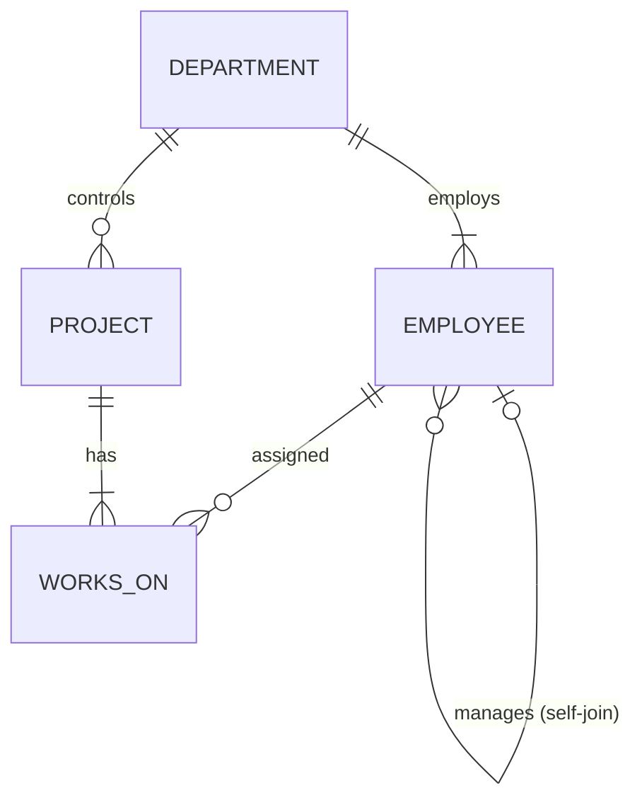

# Experiment 4 – Joins, Subqueries, Set Operations and EXPLAIN

## Aim

Using the Employee–Department–Project schema, to write queries with **INNER JOIN, LEFT JOIN, self-join, 3-way join, correlated subqueries, EXISTS, and simulated INTERSECT and EXCEPT**, and to **compare execution plans using EXPLAIN**.

## Software Required

- MySQL Server 8.0 or later. Native `INTERSECT` and `EXCEPT` (Q26, Q29) need 8.0.31 or later. `EXPLAIN ANALYZE` needs 8.0.18 or later.
- MySQL Workbench or the MySQL command-line client

## Files

| File | Description |
|---|---|
| [`joins_subqueries.sql`](joins_subqueries.sql) | All 30 queries and 11 EXPLAIN comparisons |
| [`../Experiment-3/company_queries.sql`](../Experiment-3/company_queries.sql) | Creates and fills `company_db` (prerequisite) |
| `README.md` | This lab record |

**How to run:**

```bash
mysql -u root -p -t < ../Experiment-3/company_queries.sql   # creates the schema and data
mysql -u root -p -t < joins_subqueries.sql                  # runs Experiment 4
```

> All outputs below were captured on **MySQL 8.0.46**. Row estimates, costs and times in EXPLAIN can differ slightly on other versions.

---

## 1. Theory

### 1.1 Types of Joins

| Join | Returns | Typical Use |
|---|---|---|
| **INNER JOIN** | Only rows that match in both tables | Employee with their department |
| **LEFT (OUTER) JOIN** | All rows of the left table, with NULLs where there is no match | Include employees without projects |
| **RIGHT (OUTER) JOIN** | All rows of the right table, with NULLs where there is no match | Mirror image of LEFT JOIN |
| **Self-join** | A table joined to itself with two aliases | Employee and their manager |
| **Multi-way join** | Three or more tables chained by keys | Employee → works_on → project |
| **Anti-join** | Rows in A with **no** match in B (`LEFT JOIN … IS NULL` / `NOT EXISTS`) | Employees with no project |
| **Semi-join** | Rows in A with **at least one** match in B, without duplicates (`IN` / `EXISTS`) | Employees with some project |

```
   INNER JOIN            LEFT JOIN           LEFT JOIN … WHERE B.key IS NULL
   ( A (■) B )          ( ■■■(■) B )          ( ■■■( ) B )
   only overlap         all of A              A minus overlap (anti-join)
```

### 1.2 Subqueries

| Type | Description | Evaluated |
|---|---|---|
| **Non-correlated** | The inner query does not use outer columns | Once |
| **Correlated** | The inner query uses a column of the outer query (`e2.dept_id = e.dept_id`) | Once **per outer row**, unless the optimizer rewrites it |
| **EXISTS** | TRUE if the subquery returns at least one row | Stops at the first match |
| **NOT EXISTS** | TRUE if the subquery returns no rows | NULL-safe, unlike `NOT IN` |

### 1.3 Simulating INTERSECT and EXCEPT

MySQL did not support `INTERSECT` or `EXCEPT` before **8.0.31**. They can be simulated like this:

| Set Operation | Meaning | Simulation in MySQL |
|---|---|---|
| A **INTERSECT** B | Rows in both A and B | `… WHERE x IN (B)`, `… WHERE EXISTS (B)` or `A INNER JOIN B` |
| A **EXCEPT** B | Rows in A but not in B | `… WHERE x NOT IN (B)`, `… WHERE NOT EXISTS (B)` or `A LEFT JOIN B … WHERE B.x IS NULL` |
| A **UNION** B | Rows in A or B | Supported natively |

### 1.4 Reading EXPLAIN Output

| Column | Meaning |
|---|---|
| `id` | Query block number. Rows with the same id are joined together. |
| `select_type` | `SIMPLE`, `PRIMARY`, `SUBQUERY`, `DEPENDENT SUBQUERY` (correlated), `DERIVED` (subquery in FROM), `MATERIALIZED` |
| `table` | Table being read, in the **order MySQL actually reads it** |
| `type` | **Access type**: how rows are found (see below) |
| `possible_keys` / `key` | Indexes that could be used / the index actually chosen |
| `rows` | Estimated rows to examine |
| `filtered` | Estimated % of rows that survive the WHERE condition |
| `Extra` | `Using where`, `Using index` (covering index), `Using temporary`, `Using filesort`, `FirstMatch`, `Not exists`… |

**Access types from best to worst:**

```
system → const → eq_ref → ref → range → index → ALL
(1 row)  (PK =)  (PK join) (index =) (index range) (full index scan) (full table scan)
```

---

## 2. Schema Used (from Experiment 3)



```
DEPARTMENT (dept_id, dept_name, location, manager_id → EMPLOYEE, established)
EMPLOYEE   (emp_id, first_name, last_name, gender, dob, hire_date, email, city, designation,
            salary, commission, manager_id → EMPLOYEE, dept_id → DEPARTMENT)
PROJECT    (proj_id, proj_name, dept_id → DEPARTMENT, location, budget, start_date, end_date, status)
WORKS_ON   (emp_id → EMPLOYEE, proj_id → PROJECT, hours_per_week, role)
```

**Data:** 5 departments, 32 employees, 8 projects and 40 assignments. Employees 114 (Aditya) and 131 (Bhavna) are on no project.

---

## 3. Query Index

| Part | Concept | Queries |
|---|---|---|
| A | INNER JOIN | Q1–Q3 |
| B | LEFT JOIN / RIGHT JOIN | Q4–Q8 |
| C | Self-join | Q9–Q12 |
| D | 3-way / multi-table join | Q13–Q15 |
| E | Correlated subqueries | Q16–Q19 |
| F | EXISTS / NOT EXISTS | Q20–Q23 |
| G | Simulated INTERSECT | Q24–Q26 |
| H | Simulated EXCEPT | Q27–Q30 |
| — | EXPLAIN comparisons | E1–E11 |

---

## 4. Queries and Output

### 4.A INNER JOIN

Returns only the rows that have a match in **both** tables.

#### Q1. Employees of HR and Finance with their department name and location.

```sql
SELECT e.emp_id, e.first_name, e.designation, d.dept_name, d.location
FROM employee e
INNER JOIN department d ON e.dept_id = d.dept_id
WHERE d.dept_id IN ('D02', 'D03')
ORDER BY d.dept_id, e.emp_id;
```

**Output:**

```
+--------+------------+---------------------+-----------------+----------+
| emp_id | first_name | designation         | dept_name       | location |
+--------+------------+---------------------+-----------------+----------+
|    111 | Meenakshi  | HR Manager          | Human Resources | Mumbai   |
|    112 | Sanjay     | HR Business Partner | Human Resources | Mumbai   |
|    113 | Ritu       | Recruiter           | Human Resources | Mumbai   |
|    114 | Aditya     | HR Executive        | Human Resources | Mumbai   |
|    115 | Suresh     | Finance Manager     | Finance         | Mumbai   |
|    116 | Kavita     | Senior Accountant   | Finance         | Mumbai   |
|    117 | Manoj      | Accountant          | Finance         | Mumbai   |
|    118 | Lakshmi    | Financial Analyst   | Finance         | Mumbai   |
|    119 | Imran      | Accounts Executive  | Finance         | Mumbai   |
+--------+------------+---------------------+-----------------+----------+
```

#### Q2. Each project with the name of its controlling department and the department manager.

```sql
SELECT p.proj_id, p.proj_name, d.dept_name,
       CONCAT(m.first_name, ' ', m.last_name) AS dept_manager
FROM project p
INNER JOIN department d ON p.dept_id = d.dept_id
INNER JOIN employee   m ON d.manager_id = m.emp_id
ORDER BY p.proj_id;
```

**Output:**

```
+---------+----------------------------+-----------------+-----------------------+
| proj_id | proj_name                  | dept_name       | dept_manager          |
+---------+----------------------------+-----------------+-----------------------+
| P01     | UPI Payment Gateway        | Engineering     | Rajesh Kumar          |
| P02     | Mobile App Revamp          | Engineering     | Rajesh Kumar          |
| P03     | AI Chatbot (Hindi-English) | Engineering     | Rajesh Kumar          |
| P04     | Campus Hiring Drive 2026   | Human Resources | Meenakshi Pillai      |
| P05     | GST Compliance Automation  | Finance         | Suresh Agarwal        |
| P06     | Diwali Festive Campaign    | Marketing       | Nisha Malhotra        |
| P07     | Warehouse Automation       | Operations      | Venkatesh Subramanian |
| P08     | Tier-2 City Expansion      | Operations      | Venkatesh Subramanian |
+---------+----------------------------+-----------------+-----------------------+
```

#### Q3. Number of projects and total budget controlled by each department.

```sql
SELECT d.dept_name, COUNT(p.proj_id) AS projects, SUM(p.budget) AS total_budget
FROM department d
INNER JOIN project p ON p.dept_id = d.dept_id
GROUP BY d.dept_id, d.dept_name
ORDER BY total_budget DESC;
```

**Output:**

```
+-----------------+----------+--------------+
| dept_name       | projects | total_budget |
+-----------------+----------+--------------+
| Engineering     |        3 |  10500000.00 |
| Operations      |        2 |   8500000.00 |
| Marketing       |        1 |   2200000.00 |
| Finance         |        1 |   1500000.00 |
| Human Resources |        1 |    600000.00 |
+-----------------+----------+--------------+
```

### 4.B LEFT JOIN (and RIGHT JOIN)

Returns **every row of the left table**. If there is no match on the right, its columns are NULL. A `RIGHT JOIN` does the same for the right table.

#### Q4. All HR employees with their projects; employees without a project still appear (NULL).

```sql
SELECT e.emp_id, e.first_name, w.proj_id, w.role
FROM employee e
LEFT JOIN works_on w ON e.emp_id = w.emp_id
WHERE e.dept_id = 'D02'
ORDER BY e.emp_id;
```

**Output:**

```
+--------+------------+---------+-----------+
| emp_id | first_name | proj_id | role      |
+--------+------------+---------+-----------+
|    111 | Meenakshi  | P04     | Sponsor   |
|    112 | Sanjay     | P04     | Lead      |
|    113 | Ritu       | P04     | Recruiter |
|    114 | Aditya     | NULL    | NULL      |
+--------+------------+---------+-----------+
```

#### Q5. Employees who are not assigned to any project.

```sql
SELECT e.emp_id, e.first_name, e.last_name, e.designation
FROM employee e
LEFT JOIN works_on w ON e.emp_id = w.emp_id
WHERE w.emp_id IS NULL;
```

**Output:**

```
+--------+------------+-----------+--------------------+
| emp_id | first_name | last_name | designation        |
+--------+------------+-----------+--------------------+
|    114 | Aditya     | Bhatt     | HR Executive       |
|    131 | Bhavna     | Thakur    | Operations Trainee |
+--------+------------+-----------+--------------------+
```

#### Q6. Every department with the count of its commission earners (0 if none).

```sql
SELECT d.dept_name, COUNT(e.emp_id) AS commission_earners
FROM department d
LEFT JOIN employee e
       ON e.dept_id = d.dept_id
      AND e.commission IS NOT NULL
GROUP BY d.dept_id, d.dept_name
ORDER BY d.dept_id;
```

**Output:**

```
+-----------------+--------------------+
| dept_name       | commission_earners |
+-----------------+--------------------+
| Engineering     |                  0 |
| Human Resources |                  0 |
| Finance         |                  0 |
| Marketing       |                  4 |
| Operations      |                  0 |
+-----------------+--------------------+
```

#### Q7. Same query with the condition in WHERE: departments with 0 earners disappear.

```sql
SELECT d.dept_name, COUNT(e.emp_id) AS commission_earners
FROM department d
LEFT JOIN employee e ON e.dept_id = d.dept_id
WHERE e.commission IS NOT NULL
GROUP BY d.dept_id, d.dept_name;
```

**Output:**

```
+-----------+--------------------+
| dept_name | commission_earners |
+-----------+--------------------+
| Marketing |                  4 |
+-----------+--------------------+
```

> **Observation:** Compare with Q6. Putting the filter in `WHERE` removes the NULL rows produced by the LEFT JOIN, so the query behaves like an INNER JOIN. To keep unmatched rows, put the condition in `ON`.

#### Q8. Projects with members of the Finance department (RIGHT JOIN keeps every project).

```sql
SELECT p.proj_id, p.proj_name, f.first_name AS finance_member
FROM (SELECT w.proj_id, e.first_name
      FROM works_on w
      JOIN employee e ON e.emp_id = w.emp_id
      WHERE e.dept_id = 'D03') AS f
RIGHT JOIN project p ON p.proj_id = f.proj_id
ORDER BY p.proj_id;
```

**Output:**

```
+---------+----------------------------+----------------+
| proj_id | proj_name                  | finance_member |
+---------+----------------------------+----------------+
| P01     | UPI Payment Gateway        | Lakshmi        |
| P02     | Mobile App Revamp          | NULL           |
| P03     | AI Chatbot (Hindi-English) | NULL           |
| P04     | Campus Hiring Drive 2026   | NULL           |
| P05     | GST Compliance Automation  | Suresh         |
| P05     | GST Compliance Automation  | Kavita         |
| P05     | GST Compliance Automation  | Manoj          |
| P05     | GST Compliance Automation  | Imran          |
| P06     | Diwali Festive Campaign    | NULL           |
| P07     | Warehouse Automation       | NULL           |
| P08     | Tier-2 City Expansion      | Lakshmi        |
+---------+----------------------------+----------------+
```

### 4.C Self-Join

A table joined to **itself** using two aliases. Here `employee.manager_id` refers back to `employee.emp_id`.

#### Q9. Engineering employees with the name of their manager (LEFT self-join keeps the top manager).

```sql
SELECT e.emp_id, e.first_name AS employee, e.designation,
       m.first_name AS manager, m.designation AS manager_designation
FROM employee e
LEFT JOIN employee m ON e.manager_id = m.emp_id
WHERE e.dept_id = 'D01'
ORDER BY e.emp_id;
```

**Output:**

```
+--------+----------+--------------------------+---------+--------------------------+
| emp_id | employee | designation              | manager | manager_designation      |
+--------+----------+--------------------------+---------+--------------------------+
|    101 | Rajesh   | Engineering Manager      | NULL    | NULL                     |
|    102 | Ananya   | Tech Lead                | Rajesh  | Engineering Manager      |
|    103 | Vikram   | Senior Software Engineer | Ananya  | Tech Lead                |
|    104 | Sneha    | Senior Software Engineer | Ananya  | Tech Lead                |
|    105 | Arjun    | Software Engineer        | Ananya  | Tech Lead                |
|    106 | Pooja    | Software Engineer        | Ananya  | Tech Lead                |
|    107 | Karthik  | Software Engineer        | Vikram  | Senior Software Engineer |
|    108 | Divya    | Associate Engineer       | Vikram  | Senior Software Engineer |
|    109 | Rahul    | Associate Engineer       | Sneha   | Senior Software Engineer |
|    110 | Neha     | Associate Engineer       | Sneha   | Senior Software Engineer |
+--------+----------+--------------------------+---------+--------------------------+
```

#### Q10. Managers and the number of people reporting directly to them.

```sql
SELECT m.emp_id, m.first_name AS manager, COUNT(e.emp_id) AS direct_reports
FROM employee m
INNER JOIN employee e ON e.manager_id = m.emp_id
GROUP BY m.emp_id, m.first_name
ORDER BY direct_reports DESC, m.emp_id;
```

**Output:**

```
+--------+-----------+----------------+
| emp_id | manager   | direct_reports |
+--------+-----------+----------------+
|    102 | Ananya    |              4 |
|    127 | Deepa     |              4 |
|    111 | Meenakshi |              3 |
|    121 | Rohit     |              3 |
|    103 | Vikram    |              2 |
|    104 | Sneha     |              2 |
|    115 | Suresh    |              2 |
|    116 | Kavita    |              2 |
|    120 | Nisha     |              2 |
|    126 | Venkatesh |              2 |
|    101 | Rajesh    |              1 |
+--------+-----------+----------------+
```

#### Q11. Pairs of employees from the same city but different departments.

```sql
SELECT e1.city, e1.first_name AS employee_1, e1.dept_id AS dept_1,
       e2.first_name AS employee_2, e2.dept_id AS dept_2
FROM employee e1
INNER JOIN employee e2
        ON e1.city = e2.city
       AND e1.emp_id < e2.emp_id
       AND e1.dept_id <> e2.dept_id
ORDER BY e1.city, e1.emp_id;
```

**Output:**

```
+-----------+------------+--------+------------+--------+
| city      | employee_1 | dept_1 | employee_2 | dept_2 |
+-----------+------------+--------+------------+--------+
| Chennai   | Karthik    | D01    | Venkatesh  | D05    |
| Chennai   | Karthik    | D01    | Deepa      | D05    |
| Chennai   | Karthik    | D01    | Naveen     | D05    |
| Delhi     | Ritu       | D02    | Nisha      | D04    |
| Delhi     | Ritu       | D02    | Rohit      | D04    |
| Hyderabad | Ananya     | D01    | Lakshmi    | D03    |
| Kolkata   | Suresh     | D03    | Shreya     | D04    |
| Lucknow   | Rahul      | D01    | Farhan     | D04    |
| Mumbai    | Meenakshi  | D02    | Kavita     | D03    |
| Mumbai    | Sanjay     | D02    | Kavita     | D03    |
| Mumbai    | Aditya     | D02    | Kavita     | D03    |
+-----------+------------+--------+------------+--------+
```

#### Q12. Employees whose salary is at least 75% of their own manager's salary.

```sql
SELECT e.first_name AS employee, e.salary AS emp_salary,
       m.first_name AS manager,  m.salary AS mgr_salary,
       ROUND(e.salary * 100 / m.salary, 1) AS pct_of_manager
FROM employee e
JOIN employee m ON e.manager_id = m.emp_id
WHERE e.salary >= 0.75 * m.salary
ORDER BY pct_of_manager DESC;
```

**Output:**

```
+----------+------------+---------+------------+----------------+
| employee | emp_salary | manager | mgr_salary | pct_of_manager |
+----------+------------+---------+------------+----------------+
| Vikram   |  135000.00 | Ananya  |  165000.00 |           81.8 |
| Ananya   |  165000.00 | Rajesh  |  210000.00 |           78.6 |
| Sneha    |  128000.00 | Ananya  |  165000.00 |           77.6 |
| Harish   |   76000.00 | Deepa   |   98000.00 |           77.6 |
+----------+------------+---------+------------+----------------+
```

### 4.D 3-Way (Multi-Table) Join

Three or more tables joined in one query. The M:N table `works_on` sits between `employee` and `project`.

#### Q13. EMPLOYEE - WORKS_ON - PROJECT: team of the AI Chatbot project.

```sql
SELECT p.proj_name, e.first_name, e.last_name, w.role, w.hours_per_week
FROM employee e
JOIN works_on w ON e.emp_id  = w.emp_id
JOIN project  p ON w.proj_id = p.proj_id
WHERE p.proj_id = 'P03'
ORDER BY w.hours_per_week DESC, e.emp_id;
```

**Output:**

```
+----------------------------+------------+-----------+-----------+----------------+
| proj_name                  | first_name | last_name | role      | hours_per_week |
+----------------------------+------------+-----------+-----------+----------------+
| AI Chatbot (Hindi-English) | Karthik    | Iyer      | Developer |           40.0 |
| AI Chatbot (Hindi-English) | Rahul      | Verma     | Developer |           40.0 |
| AI Chatbot (Hindi-English) | Neha       | Joshi     | Developer |           40.0 |
| AI Chatbot (Hindi-English) | Tanvi      | Kapoor    | Content   |           15.0 |
| AI Chatbot (Hindi-English) | Vikram     | Singh     | Developer |           10.0 |
| AI Chatbot (Hindi-English) | Rajesh     | Kumar     | Sponsor   |            5.0 |
+----------------------------+------------+-----------+-----------+----------------+
```

#### Q14. Employees working on a project controlled by a DIFFERENT department.

```sql
SELECT e.first_name, ed.dept_name AS home_dept,
       p.proj_name,  pd.dept_name AS project_dept, w.role
FROM employee e
JOIN department ed ON e.dept_id  = ed.dept_id
JOIN works_on   w  ON e.emp_id   = w.emp_id
JOIN project    p  ON w.proj_id  = p.proj_id
JOIN department pd ON p.dept_id  = pd.dept_id
WHERE e.dept_id <> p.dept_id
ORDER BY e.emp_id;
```

**Output:**

```
+------------+-------------+----------------------------+-----------------+------------+
| first_name | home_dept   | proj_name                  | project_dept    | role       |
+------------+-------------+----------------------------+-----------------+------------+
| Sneha      | Engineering | Campus Hiring Drive 2026   | Human Resources | Panelist   |
| Arjun      | Engineering | GST Compliance Automation  | Finance         | Developer  |
| Divya      | Engineering | Campus Hiring Drive 2026   | Human Resources | Panelist   |
| Lakshmi    | Finance     | UPI Payment Gateway        | Engineering     | Analyst    |
| Lakshmi    | Finance     | Tier-2 City Expansion      | Operations      | Analyst    |
| Shreya     | Marketing   | Mobile App Revamp          | Engineering     | Consultant |
| Tanvi      | Marketing   | AI Chatbot (Hindi-English) | Engineering     | Content    |
+------------+-------------+----------------------------+-----------------+------------+
```


#### Q15. Weekly hours each department contributes to projects.

```sql
SELECT d.dept_name,
       COUNT(DISTINCT e.emp_id) AS staff_on_projects,
       SUM(w.hours_per_week)    AS weekly_hours
FROM department d
JOIN employee e ON e.dept_id = d.dept_id
JOIN works_on w ON w.emp_id  = e.emp_id
GROUP BY d.dept_id, d.dept_name
ORDER BY weekly_hours DESC;
```

**Output:**

```
+-----------------+-------------------+--------------+
| dept_name       | staff_on_projects | weekly_hours |
+-----------------+-------------------+--------------+
| Engineering     |                10 |        360.0 |
| Operations      |                 6 |        195.0 |
| Marketing       |                 6 |        175.0 |
| Finance         |                 5 |        140.0 |
| Human Resources |                 3 |         75.0 |
+-----------------+-------------------+--------------+
```

### 4.E Correlated Subqueries

A subquery that refers to a column of the **outer** query, so it is evaluated once for each outer row.

#### Q16. Employees earning more than the average salary of their own department.

```sql
SELECT e.emp_id, e.first_name, e.dept_id, e.salary
FROM employee e
WHERE e.salary > (SELECT AVG(e2.salary)
                  FROM employee e2
                  WHERE e2.dept_id = e.dept_id)
ORDER BY e.dept_id, e.salary DESC;
```

**Output:**

```
+--------+------------+---------+-----------+
| emp_id | first_name | dept_id | salary    |
+--------+------------+---------+-----------+
|    101 | Rajesh     | D01     | 210000.00 |
|    102 | Ananya     | D01     | 165000.00 |
|    103 | Vikram     | D01     | 135000.00 |
|    104 | Sneha      | D01     | 128000.00 |
|    111 | Meenakshi  | D02     | 150000.00 |
|    112 | Sanjay     | D02     |  90000.00 |
|    115 | Suresh     | D03     | 185000.00 |
|    116 | Kavita     | D03     | 105000.00 |
|    120 | Nisha      | D04     | 160000.00 |
|    121 | Rohit      | D04     | 110000.00 |
|    126 | Venkatesh  | D05     | 175000.00 |
|    132 | Naveen     | D05     | 120000.00 |
|    127 | Deepa      | D05     |  98000.00 |
+--------+------------+---------+-----------+
```

#### Q17. Highest-paid non-manager in each department.

```sql
SELECT e.dept_id, e.first_name, e.designation, e.salary
FROM employee e
WHERE e.manager_id IS NOT NULL
  AND e.salary = (SELECT MAX(e2.salary)
                  FROM employee e2
                  WHERE e2.dept_id = e.dept_id
                    AND e2.manager_id IS NOT NULL)
ORDER BY e.dept_id;
```

**Output:**

```
+---------+------------+---------------------+-----------+
| dept_id | first_name | designation         | salary    |
+---------+------------+---------------------+-----------+
| D01     | Ananya     | Tech Lead           | 165000.00 |
| D02     | Sanjay     | HR Business Partner |  90000.00 |
| D03     | Kavita     | Senior Accountant   | 105000.00 |
| D04     | Rohit      | Brand Manager       | 110000.00 |
| D05     | Naveen     | Quality Manager     | 120000.00 |
+---------+------------+---------------------+-----------+
```

#### Q18. Each Operations employee with their number of projects and total hours.

```sql
SELECT e.emp_id, e.first_name,
       (SELECT COUNT(*) FROM works_on w WHERE w.emp_id = e.emp_id)           AS projects,
       (SELECT IFNULL(SUM(w.hours_per_week), 0)
          FROM works_on w WHERE w.emp_id = e.emp_id)                         AS weekly_hours
FROM employee e
WHERE e.dept_id = 'D05'
ORDER BY e.emp_id;
```

**Output:**

```
+--------+------------+----------+--------------+
| emp_id | first_name | projects | weekly_hours |
+--------+------------+----------+--------------+
|    126 | Venkatesh  |        2 |         15.0 |
|    127 | Deepa      |        1 |         35.0 |
|    128 | Harish     |        1 |         40.0 |
|    129 | Swati      |        1 |         40.0 |
|    130 | Gaurav     |        1 |         40.0 |
|    131 | Bhavna     |        0 |          0.0 |
|    132 | Naveen     |        2 |         25.0 |
+--------+------------+----------+--------------+
```

#### Q19. Projects whose budget is above the average budget of the same department's projects.

```sql
SELECT p.proj_id, p.proj_name, p.dept_id, p.budget
FROM project p
WHERE p.budget > (SELECT AVG(p2.budget) FROM project p2 WHERE p2.dept_id = p.dept_id);
```

**Output:**

```
+---------+----------------------+---------+------------+
| proj_id | proj_name            | dept_id | budget     |
+---------+----------------------+---------+------------+
| P01     | UPI Payment Gateway  | D01     | 4500000.00 |
| P07     | Warehouse Automation | D05     | 5000000.00 |
+---------+----------------------+---------+------------+
```

### 4.F EXISTS / NOT EXISTS

`EXISTS` is TRUE as soon as the subquery returns **one** row. It checks existence, not values, so `SELECT 1` is enough.

#### Q20. Departments that have at least one employee earning Rs 1,50,000 or more.

```sql
SELECT d.dept_id, d.dept_name
FROM department d
WHERE EXISTS (SELECT 1 FROM employee e
              WHERE e.dept_id = d.dept_id AND e.salary >= 150000)
ORDER BY d.dept_id;
```

**Output:**

```
+---------+-----------------+
| dept_id | dept_name       |
+---------+-----------------+
| D01     | Engineering     |
| D02     | Human Resources |
| D03     | Finance         |
| D04     | Marketing       |
| D05     | Operations      |
+---------+-----------------+
```

#### Q21. Employees not working on any project (same result as Q5).

```sql
SELECT e.emp_id, e.first_name, e.last_name
FROM employee e
WHERE NOT EXISTS (SELECT 1 FROM works_on w WHERE w.emp_id = e.emp_id);
```

**Output:**

```
+--------+------------+-----------+
| emp_id | first_name | last_name |
+--------+------------+-----------+
|    114 | Aditya     | Bhatt     |
|    131 | Bhavna     | Thakur    |
+--------+------------+-----------+
```

#### Q22. Employees who work on at least one project with more than 35 hours per week.

```sql
SELECT e.emp_id, e.first_name, e.dept_id
FROM employee e
WHERE EXISTS (SELECT 1 FROM works_on w
              WHERE w.emp_id = e.emp_id AND w.hours_per_week > 35)
  AND e.dept_id IN ('D01', 'D05')
ORDER BY e.emp_id;
```

**Output:**

```
+--------+------------+---------+
| emp_id | first_name | dept_id |
+--------+------------+---------+
|    106 | Pooja      | D01     |
|    107 | Karthik    | D01     |
|    109 | Rahul      | D01     |
|    110 | Neha       | D01     |
|    128 | Harish     | D05     |
|    129 | Swati      | D05     |
|    130 | Gaurav     | D05     |
+--------+------------+---------+
```

#### Q23. Employees who work on EVERY project that Rajesh (101) works on.

```sql
SELECT e.emp_id, e.first_name
FROM employee e
WHERE NOT EXISTS (
        SELECT 1 FROM works_on r
        WHERE r.emp_id = 101
          AND NOT EXISTS (SELECT 1 FROM works_on w
                          WHERE w.emp_id = e.emp_id
                            AND w.proj_id = r.proj_id));
```

**Output:**

```
+--------+------------+
| emp_id | first_name |
+--------+------------+
|    101 | Rajesh     |
|    103 | Vikram     |
+--------+------------+
```

> **Observation:** This is *relational division* (÷), written with a double `NOT EXISTS`: "there is no project of Rajesh that this employee does **not** work on". Rajesh works on P01 and P03. Only Vikram also works on both.

### 4.G Simulated INTERSECT

Rows present in **both** result sets.

#### Q24. Engineering employees who ALSO served on the HR hiring project P04.

```sql
SELECT emp_id, first_name
FROM employee
WHERE dept_id = 'D01'
  AND emp_id IN (SELECT emp_id FROM works_on WHERE proj_id = 'P04')
ORDER BY emp_id;
```

**Output:**

```
+--------+------------+
| emp_id | first_name |
+--------+------------+
|    104 | Sneha      |
|    108 | Divya      |
+--------+------------+
```

#### Q25. Same result using a join on the two sets.

```sql
SELECT DISTINCT a.emp_id, a.first_name
FROM (SELECT emp_id, first_name FROM employee WHERE dept_id = 'D01') AS a
INNER JOIN (SELECT emp_id FROM works_on WHERE proj_id = 'P04') AS b
        ON a.emp_id = b.emp_id
ORDER BY a.emp_id;
```

**Output:**

```
+--------+------------+
| emp_id | first_name |
+--------+------------+
|    104 | Sneha      |
|    108 | Divya      |
+--------+------------+
```

#### Q26. Same result with the INTERSECT operator.

```sql
SELECT emp_id FROM employee WHERE dept_id = 'D01'
INTERSECT
SELECT emp_id FROM works_on WHERE proj_id = 'P04'
ORDER BY emp_id;
```

**Output:**

```
+--------+
| emp_id |
+--------+
|    104 |
|    108 |
+--------+
```

> **Observation:** Q24, Q25 and Q26 return the same employees (104, 108). The native operator needs MySQL **8.0.31 or later**. On older versions, `IN`, `EXISTS` or a join is the standard workaround.

### 4.H Simulated EXCEPT (MINUS)

Rows in the first result set that are **not** in the second.

#### Q27. Engineering employees EXCEPT those on the Mobile App Revamp (P02).

```sql
SELECT emp_id, first_name
FROM employee
WHERE dept_id = 'D01'
  AND emp_id NOT IN (SELECT emp_id FROM works_on WHERE proj_id = 'P02')
ORDER BY emp_id;
```

**Output:**

```
+--------+------------+
| emp_id | first_name |
+--------+------------+
|    101 | Rajesh     |
|    103 | Vikram     |
|    105 | Arjun      |
|    107 | Karthik    |
|    109 | Rahul      |
|    110 | Neha       |
+--------+------------+
```

#### Q28. Same result as Q27 with an anti-join.

```sql
SELECT e.emp_id, e.first_name
FROM employee e
LEFT JOIN works_on w ON w.emp_id = e.emp_id AND w.proj_id = 'P02'
WHERE e.dept_id = 'D01' AND w.emp_id IS NULL
ORDER BY e.emp_id;
```

**Output:**

```
+--------+------------+
| emp_id | first_name |
+--------+------------+
|    101 | Rajesh     |
|    103 | Vikram     |
|    105 | Arjun      |
|    107 | Karthik    |
|    109 | Rahul      |
|    110 | Neha       |
+--------+------------+
```

#### Q29. Same result with the EXCEPT operator.

```sql
SELECT emp_id FROM employee WHERE dept_id = 'D01'
EXCEPT
SELECT emp_id FROM works_on WHERE proj_id = 'P02'
ORDER BY emp_id;
```

**Output:**

```
+--------+
| emp_id |
+--------+
|    101 |
|    103 |
|    105 |
|    107 |
|    109 |
|    110 |
+--------+
```

> **Observation:** Q27, Q28 and Q29 return the same six employees. Be careful with `NOT IN`: if the subquery returns even one NULL, `NOT IN` returns **no rows**. `NOT EXISTS` and `LEFT JOIN … IS NULL` are NULL-safe.

#### Q30. Departments that do NOT control any Ongoing project.

```sql
SELECT d.dept_id, d.dept_name
FROM department d
WHERE NOT EXISTS (SELECT 1 FROM project p
                  WHERE p.dept_id = d.dept_id AND p.status = 'Ongoing');
```

**Output:**

```
+---------+-----------------+
| dept_id | dept_name       |
+---------+-----------------+
| D02     | Human Resources |
+---------+-----------------+
```

---

## 5. Comparing Execution Plans with EXPLAIN

#### E1. Refresh table statistics first, then filter on a column without an index: a full table scan.

```sql
ANALYZE TABLE employee, department, project, works_on;
EXPLAIN SELECT * FROM employee WHERE city = 'Chennai';
```

**Output:**

```
+-----------------------+---------+----------+----------+
| Table                 | Op      | Msg_type | Msg_text |
+-----------------------+---------+----------+----------+
| company_db.employee   | analyze | status   | OK       |
| company_db.department | analyze | status   | OK       |
| company_db.project    | analyze | status   | OK       |
| company_db.works_on   | analyze | status   | OK       |
+-----------------------+---------+----------+----------+
+----+-------------+----------+------------+------+---------------+------+---------+------+------+----------+-------------+
| id | select_type | table    | partitions | type | possible_keys | key  | key_len | ref  | rows | filtered | Extra       |
+----+-------------+----------+------------+------+---------------+------+---------+------+------+----------+-------------+
|  1 | SIMPLE      | employee | NULL       | ALL  | NULL          | NULL | NULL    | NULL |   32 |    10.00 | Using where |
+----+-------------+----------+------------+------+---------------+------+---------+------+------+----------+-------------+
```

> **Observation:** `type = ALL` means a **full table scan**. MySQL reads all 32 rows and filters them (`Using where`), and it estimates only 10% of them will match.

#### E2. After creating an index on city, MySQL looks up matching rows directly.

```sql
CREATE INDEX idx_emp_city ON employee(city);
EXPLAIN SELECT * FROM employee WHERE city = 'Chennai';
```

**Output:**

```
+----+-------------+----------+------------+------+---------------+--------------+---------+-------+------+----------+-------+
| id | select_type | table    | partitions | type | possible_keys | key          | key_len | ref   | rows | filtered | Extra |
+----+-------------+----------+------------+------+---------------+--------------+---------+-------+------+----------+-------+
|  1 | SIMPLE      | employee | NULL       | ref  | idx_emp_city  | idx_emp_city | 122     | const |    4 |   100.00 | NULL  |
+----+-------------+----------+------------+------+---------------+--------------+---------+-------+------+----------+-------+
```

> **Observation:** With the index, `type` becomes **`ref`** using `idx_emp_city`, and only **4 rows** (the Chennai employees) are read instead of 32.

#### E3. Lookup by primary key is the cheapest access type (const).

```sql
EXPLAIN SELECT * FROM employee WHERE emp_id = 105;
```

**Output:**

```
+----+-------------+----------+------------+-------+---------------+---------+---------+-------+------+----------+-------+
| id | select_type | table    | partitions | type  | possible_keys | key     | key_len | ref   | rows | filtered | Extra |
+----+-------------+----------+------------+-------+---------------+---------+---------+-------+------+----------+-------+
|  1 | SIMPLE      | employee | NULL       | const | PRIMARY       | PRIMARY | 4       | const |    1 |   100.00 | NULL  |
+----+-------------+----------+------------+-------+---------------+---------+---------+-------+------+----------+-------+
```

> **Observation:** `type = const` is the best access type. A primary-key equality can match at most one row, so MySQL reads it once and treats it as a constant.

#### E4. An index on salary turns a range condition into a range scan.

```sql
CREATE INDEX idx_emp_salary ON employee(salary);
EXPLAIN SELECT emp_id, salary FROM employee WHERE salary > 150000;
```

**Output:**

```
+----+-------------+----------+------------+-------+----------------+----------------+---------+------+------+----------+--------------------------+
| id | select_type | table    | partitions | type  | possible_keys  | key            | key_len | ref  | rows | filtered | Extra                    |
+----+-------------+----------+------------+-------+----------------+----------------+---------+------+------+----------+--------------------------+
|  1 | SIMPLE      | employee | NULL       | range | idx_emp_salary | idx_emp_salary | 5       | NULL |    5 |   100.00 | Using where; Using index |
+----+-------------+----------+------------+-------+----------------+----------------+---------+------+------+----------+--------------------------+
```

> **Observation:** `type = range` uses `idx_emp_salary` to read only salaries above 1,50,000. `Using index` means the index alone contains every column needed (a **covering index**), so the table itself is never read.

#### E5. Join order and eq_ref lookups on primary keys.

```sql
EXPLAIN
SELECT e.first_name, p.proj_name, w.hours_per_week
FROM employee e
JOIN works_on w ON e.emp_id  = w.emp_id
JOIN project  p ON w.proj_id = p.proj_id
WHERE p.proj_id = 'P03';
```

**Output:**

```
+----+-------------+-------+------------+--------+--------------------+------------+---------+---------------------+------+----------+-----------------------+
| id | select_type | table | partitions | type   | possible_keys      | key        | key_len | ref                 | rows | filtered | Extra                 |
+----+-------------+-------+------------+--------+--------------------+------------+---------+---------------------+------+----------+-----------------------+
|  1 | SIMPLE      | p     | NULL       | const  | PRIMARY            | PRIMARY    | 12      | const               |    1 |   100.00 | NULL                  |
|  1 | SIMPLE      | w     | NULL       | ref    | PRIMARY,fk_wo_proj | fk_wo_proj | 12      | const               |    6 |   100.00 | Using index condition |
|  1 | SIMPLE      | e     | NULL       | eq_ref | PRIMARY            | PRIMARY    | 4       | company_db.w.emp_id |    1 |   100.00 | NULL                  |
+----+-------------+-------+------------+--------+--------------------+------------+---------+---------------------+------+----------+-----------------------+
```

> **Observation:** MySQL picks its own **join order**: `project` first (`const` on the primary key), then `works_on` via the `fk_wo_proj` index (`ref`, 6 rows), then one `employee` row per match (`eq_ref` on the primary key). Total work is about 1 × 6 × 1 rows instead of 32 × 40 × 8.

#### E6. Q16 as written: the subquery is DEPENDENT and re-runs per outer row.

```sql
EXPLAIN
SELECT e.emp_id, e.first_name, e.salary
FROM employee e
WHERE e.salary > (SELECT AVG(e2.salary) FROM employee e2 WHERE e2.dept_id = e.dept_id);
```

**Output:**

```
+----+--------------------+-------+------------+------+---------------+-------------+---------+----------------------+------+----------+-------------+
| id | select_type        | table | partitions | type | possible_keys | key         | key_len | ref                  | rows | filtered | Extra       |
+----+--------------------+-------+------------+------+---------------+-------------+---------+----------------------+------+----------+-------------+
|  1 | PRIMARY            | e     | NULL       | ALL  | NULL          | NULL        | NULL    | NULL                 |   32 |   100.00 | Using where |
|  2 | DEPENDENT SUBQUERY | e2    | NULL       | ref  | fk_emp_dept   | fk_emp_dept | 12      | company_db.e.dept_id |    6 |   100.00 | NULL        |
+----+--------------------+-------+------------+------+---------------+-------------+---------+----------------------+------+----------+-------------+
```

> **Observation:** `select_type = DEPENDENT SUBQUERY` means the inner query depends on `e.dept_id` and is **re-executed for each of the 32 outer rows**.

#### E7. Q16 rewritten as a JOIN with a derived table: averages computed once.

```sql
EXPLAIN
SELECT e.emp_id, e.first_name, e.salary
FROM employee e
JOIN (SELECT dept_id, AVG(salary) AS avg_sal
      FROM employee GROUP BY dept_id) AS da
  ON da.dept_id = e.dept_id
WHERE e.salary > da.avg_sal;
```

**Output:**

```
+----+-------------+------------+------------+-------+----------------------------+-------------+---------+----------------------+------+----------+--------------------------+
| id | select_type | table      | partitions | type  | possible_keys              | key         | key_len | ref                  | rows | filtered | Extra                    |
+----+-------------+------------+------------+-------+----------------------------+-------------+---------+----------------------+------+----------+--------------------------+
|  1 | PRIMARY     | e          | NULL       | ALL   | fk_emp_dept,idx_emp_salary | NULL        | NULL    | NULL                 |   32 |   100.00 | NULL                     |
|  1 | PRIMARY     | <derived2> | NULL       | ref   | <auto_key0>                | <auto_key0> | 12      | company_db.e.dept_id |    4 |    33.33 | Using where; Using index |
|  2 | DERIVED     | employee   | NULL       | index | fk_emp_dept                | fk_emp_dept | 12      | NULL                 |   32 |   100.00 | NULL                     |
+----+-------------+------------+------------+-------+----------------------------+-------------+---------+----------------------+------+----------+--------------------------+
```

> **Observation:** The rewrite turns the subquery into a **`DERIVED`** table. The five department averages are computed **once**, then joined through an automatic index (`<auto_key0>`). On large tables this is usually much faster than E6.

#### E8. Three ways to find employees on some project (semi-join).

```sql
EXPLAIN SELECT emp_id FROM employee e WHERE emp_id IN (SELECT emp_id FROM works_on);
EXPLAIN SELECT emp_id FROM employee e WHERE EXISTS (SELECT 1 FROM works_on w WHERE w.emp_id = e.emp_id);
EXPLAIN SELECT DISTINCT e.emp_id FROM employee e JOIN works_on w ON w.emp_id = e.emp_id;
```

**Output:**

```
+----+-------------+----------+------------+-------+---------------+----------------+---------+---------------------+------+----------+----------------------------+
| id | select_type | table    | partitions | type  | possible_keys | key            | key_len | ref                 | rows | filtered | Extra                      |
+----+-------------+----------+------------+-------+---------------+----------------+---------+---------------------+------+----------+----------------------------+
|  1 | SIMPLE      | e        | NULL       | index | PRIMARY       | fk_emp_manager | 5       | NULL                |   32 |   100.00 | Using index                |
|  1 | SIMPLE      | works_on | NULL       | ref   | PRIMARY       | PRIMARY        | 4       | company_db.e.emp_id |    1 |   100.00 | Using index; FirstMatch(e) |
+----+-------------+----------+------------+-------+---------------+----------------+---------+---------------------+------+----------+----------------------------+
+----+-------------+-------+------------+-------+---------------+----------------+---------+---------------------+------+----------+----------------------------+
| id | select_type | table | partitions | type  | possible_keys | key            | key_len | ref                 | rows | filtered | Extra                      |
+----+-------------+-------+------------+-------+---------------+----------------+---------+---------------------+------+----------+----------------------------+
|  1 | SIMPLE      | e     | NULL       | index | PRIMARY       | fk_emp_manager | 5       | NULL                |   32 |   100.00 | Using index                |
|  1 | SIMPLE      | w     | NULL       | ref   | PRIMARY       | PRIMARY        | 4       | company_db.e.emp_id |    1 |   100.00 | Using index; FirstMatch(e) |
+----+-------------+-------+------------+-------+---------------+----------------+---------+---------------------+------+----------+----------------------------+
+----+-------------+-------+------------+-------+----------------------------------------------------------------------+----------------+---------+---------------------+------+----------+------------------------------+
| id | select_type | table | partitions | type  | possible_keys                                                        | key            | key_len | ref                 | rows | filtered | Extra                        |
+----+-------------+-------+------------+-------+----------------------------------------------------------------------+----------------+---------+---------------------+------+----------+------------------------------+
|  1 | SIMPLE      | e     | NULL       | index | PRIMARY,email,fk_emp_manager,fk_emp_dept,idx_emp_city,idx_emp_salary | fk_emp_manager | 5       | NULL                |   32 |   100.00 | Using index; Using temporary |
|  1 | SIMPLE      | w     | NULL       | ref   | PRIMARY                                                              | PRIMARY        | 4       | company_db.e.emp_id |    1 |   100.00 | Using index; Distinct        |
+----+-------------+-------+------------+-------+----------------------------------------------------------------------+----------------+---------+---------------------+------+----------+------------------------------+
```

> **Observation:** MySQL 8 rewrote both `IN` and `EXISTS` into the **same semi-join plan** (`FirstMatch`: stop at the first matching project). The `JOIN + DISTINCT` version needs **`Using temporary`**, an extra temporary table to remove duplicates, so it does more work.

#### E9. Three ways to write the anti-join of Q5.

```sql
EXPLAIN SELECT emp_id FROM employee WHERE emp_id NOT IN (SELECT emp_id FROM works_on);
EXPLAIN SELECT emp_id FROM employee e WHERE NOT EXISTS (SELECT 1 FROM works_on w WHERE w.emp_id = e.emp_id);
EXPLAIN SELECT e.emp_id FROM employee e LEFT JOIN works_on w ON w.emp_id = e.emp_id WHERE w.emp_id IS NULL;
```

**Output:**

```
+----+-------------+----------+------------+-------+---------------+----------------+---------+----------------------------+------+----------+--------------------------------------+
| id | select_type | table    | partitions | type  | possible_keys | key            | key_len | ref                        | rows | filtered | Extra                                |
+----+-------------+----------+------------+-------+---------------+----------------+---------+----------------------------+------+----------+--------------------------------------+
|  1 | SIMPLE      | employee | NULL       | index | NULL          | fk_emp_manager | 5       | NULL                       |   32 |   100.00 | Using index                          |
|  1 | SIMPLE      | works_on | NULL       | ref   | PRIMARY       | PRIMARY        | 4       | company_db.employee.emp_id |    1 |   100.00 | Using where; Not exists; Using index |
+----+-------------+----------+------------+-------+---------------+----------------+---------+----------------------------+------+----------+--------------------------------------+
+----+-------------+-------+------------+-------+---------------+----------------+---------+---------------------+------+----------+--------------------------------------+
| id | select_type | table | partitions | type  | possible_keys | key            | key_len | ref                 | rows | filtered | Extra                                |
+----+-------------+-------+------------+-------+---------------+----------------+---------+---------------------+------+----------+--------------------------------------+
|  1 | SIMPLE      | e     | NULL       | index | NULL          | fk_emp_manager | 5       | NULL                |   32 |   100.00 | Using index                          |
|  1 | SIMPLE      | w     | NULL       | ref   | PRIMARY       | PRIMARY        | 4       | company_db.e.emp_id |    1 |   100.00 | Using where; Not exists; Using index |
+----+-------------+-------+------------+-------+---------------+----------------+---------+---------------------+------+----------+--------------------------------------+
+----+-------------+-------+------------+-------+---------------+----------------+---------+---------------------+------+----------+--------------------------------------+
| id | select_type | table | partitions | type  | possible_keys | key            | key_len | ref                 | rows | filtered | Extra                                |
+----+-------------+-------+------------+-------+---------------+----------------+---------+---------------------+------+----------+--------------------------------------+
|  1 | SIMPLE      | e     | NULL       | index | NULL          | fk_emp_manager | 5       | NULL                |   32 |   100.00 | Using index                          |
|  1 | SIMPLE      | w     | NULL       | ref   | PRIMARY       | PRIMARY        | 4       | company_db.e.emp_id |    1 |   100.00 | Using where; Not exists; Using index |
+----+-------------+-------+------------+-------+---------------+----------------+---------+---------------------+------+----------+--------------------------------------+
```

> **Observation:** All three anti-join forms get an **identical plan**, with the `Not exists` optimization: MySQL stops looking in `works_on` once it finds a match. Because `works_on.emp_id` is `NOT NULL`, `NOT IN` is safe here. If that column allowed NULLs, MySQL could not use this plan for `NOT IN`, and the results could differ.

#### E10. The plan of the 5-way join (Q14) as an operator tree.

```sql
EXPLAIN FORMAT=TREE
SELECT e.first_name, ed.dept_name, p.proj_name, pd.dept_name
FROM employee e
JOIN department ed ON e.dept_id = ed.dept_id
JOIN works_on   w  ON e.emp_id  = w.emp_id
JOIN project    p  ON w.proj_id = p.proj_id
JOIN department pd ON p.dept_id = pd.dept_id
WHERE e.dept_id <> p.dept_id;
```

**Output:**

```
-> Nested loop inner join  (cost=36.2 rows=36)
    -> Nested loop inner join  (cost=23.6 rows=36)
        -> Nested loop inner join  (cost=9.58 rows=40)
            -> Nested loop inner join  (cost=3.55 rows=8)
                -> Index scan on pd using dept_name  (cost=0.75 rows=5)
                -> Index lookup on p using fk_proj_dept (dept_id=pd.dept_id)  (cost=0.432 rows=1.6)
            -> Covering index lookup on w using fk_wo_proj (proj_id=p.proj_id)  (cost=0.316 rows=5)
        -> Filter: (e.dept_id <> pd.dept_id)  (cost=0.252 rows=0.9)
            -> Single-row index lookup on e using PRIMARY (emp_id=w.emp_id)  (cost=0.252 rows=1)
    -> Single-row index lookup on ed using PRIMARY (dept_id=e.dept_id)  (cost=0.253 rows=1)
```

> **Observation:** The tree is read **inside-out** (most-indented first). The optimizer ignored the written order and started from `department pd`, then `project`, then `works_on`, then `employee`, then `department ed`. It applied the `e.dept_id <> pd.dept_id` filter as early as possible, so the estimated row count falls from 40 to 36.

#### E11. Actually runs the correlated query and reports real row counts and times.

```sql
EXPLAIN ANALYZE
SELECT e.emp_id, e.first_name, e.salary
FROM employee e
WHERE e.salary > (SELECT AVG(e2.salary) FROM employee e2 WHERE e2.dept_id = e.dept_id);
```

**Output:**

```
-> Filter: (e.salary > (select #2))  (cost=3.45 rows=32) (actual time=0.0815..0.381 rows=13 loops=1)
    -> Table scan on e  (cost=3.45 rows=32) (actual time=0.0283..0.0391 rows=32 loops=1)
    -> Select #2 (subquery in condition; dependent)
        -> Aggregate: avg(e2.salary)  (cost=2.03 rows=1) (actual time=0.00956..0.00959 rows=1 loops=32)
            -> Index lookup on e2 using fk_emp_dept (dept_id=e.dept_id)  (cost=1.39 rows=6.4) (actual time=0.00635..0.00859 rows=7.06 loops=32)
```

> **Observation:** `EXPLAIN ANALYZE` actually **runs** the query. `loops=32` confirms the dependent subquery was executed **32 times**, once per employee, and `rows=13` is the real result size. *Times vary from run to run.*

---

## 6. Summary of the Plan Comparisons

| Comparison | Plan A | Plan B | Conclusion |
|---|---|---|---|
| No index vs index on `city` (E1 vs E2) | `ALL`, 32 rows | `ref`, 4 rows | An index on a filtered column avoids a full table scan. |
| Primary key lookup (E3) | `const`, 1 row | – | The fastest possible access. |
| Range on indexed `salary` (E4) | `range` + `Using index` | – | A covering index answers the query without reading the table. |
| 3-way join (E5) | `const` → `ref` → `eq_ref` | – | Joins on keys use index lookups. MySQL chooses the join order. |
| Correlated subquery vs derived table (E6 vs E7) | `DEPENDENT SUBQUERY`, run 32 times | `DERIVED`, computed once | Rewriting as a join usually scales better. |
| `IN` vs `EXISTS` vs `JOIN` (E8) | Semi-join (`FirstMatch`) | Same semi-join / `Using temporary` for DISTINCT | MySQL 8 treats `IN` and `EXISTS` the same. `JOIN + DISTINCT` does extra work. |
| `NOT IN` vs `NOT EXISTS` vs `LEFT JOIN IS NULL` (E9) | Anti-join (`Not exists`) | Identical | Same plan when the column is `NOT NULL`. Prefer `NOT EXISTS` for NULL safety. |
| Tree format and actual run (E10, E11) | Estimated costs | Real rows, loops and times | `EXPLAIN ANALYZE` confirms what the estimates predict. |

---

## Result

Queries using **INNER JOIN, LEFT/RIGHT JOIN, self-join, multi-table joins, correlated subqueries, EXISTS / NOT EXISTS, and simulated INTERSECT and EXCEPT** were written and run on the Employee–Department–Project schema. The simulated set operations gave the same results as MySQL's native `INTERSECT` and `EXCEPT`.

Execution plans were compared with `EXPLAIN`, `EXPLAIN FORMAT=TREE` and `EXPLAIN ANALYZE`:
- Indexes changed full table scans (`ALL`) into `ref`, `range` and `const` lookups.
- A correlated subquery ran once per outer row, while its derived-table rewrite ran once.
- MySQL 8 produced the same semi-join plan for `IN` and `EXISTS`, and the same anti-join plan for `NOT IN`, `NOT EXISTS` and `LEFT JOIN … IS NULL`.
