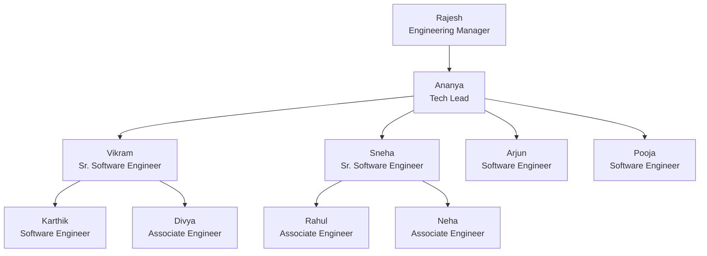

# Experiment 5 – SQL Views, View Updatability and Recursive CTEs

## Aim

To create SQL **views** for a **department salary summary** and the **employee hierarchy**, to **test the updatability of views**, and to implement a **recursive CTE** that displays **reporting chains**.

## Software Required

- MySQL Server 8.0 or later (recursive CTEs need 8.0+)
- MySQL Workbench or the MySQL command-line client

## Files

| File | Description |
|---|---|
| [`views_recursive_cte.sql`](views_recursive_cte.sql) | All views, updatability tests and recursive CTEs |
| [`../Experiment-3/company_queries.sql`](../Experiment-3/company_queries.sql) | Creates and fills `company_db` (prerequisite) |
| `README.md` | This lab record |

**How to run:**

```bash
mysql -u root -p -t < ../Experiment-3/company_queries.sql            # creates the schema and data
mysql -u root -p -t --force < views_recursive_cte.sql                # runs Experiment 5
```

> `--force` lets the script continue after the **intentional** errors in Part C. All data changes are undone at the end (Part F), so `company_db` is left exactly as Experiment 3 created it. Outputs were captured on **MySQL 8.0.46**.

---

## 1. Theory

### 1.1 Views

A **view** is a named, stored `SELECT` query that behaves like a **virtual table**. It stores only the query, not the data, so it always reflects the current contents of its base tables.

```sql
CREATE [OR REPLACE] VIEW view_name AS
SELECT ...
[WITH [CASCADED | LOCAL] CHECK OPTION];
```

| Advantage | Example in this experiment |
|---|---|
| **Simplicity**: hide complex joins and aggregates | `v_dept_salary_summary` |
| **Security**: expose only some columns or rows | `v_employee_public` hides salary and date of birth |
| **Reusability**: write the logic once, query it many times | `v_employee_hierarchy` |
| **Logical independence**: base tables can change behind a stable view | `CREATE OR REPLACE VIEW` |

### 1.2 When Is a View Updatable?

A view is **updatable** (UPDATE / DELETE / INSERT allowed) only if each row of the view maps to **exactly one row of one base table**. MySQL makes a view non-updatable if it contains any of these:

| Construct | Updatable? |
|---|---|
| Aggregate functions (`SUM`, `COUNT`, `AVG`…) or `GROUP BY` / `HAVING` | ❌ |
| `DISTINCT` | ❌ |
| `UNION` / `UNION ALL` | ❌ |
| Subquery in the SELECT list, or a recursive CTE | ❌ |
| The same table referenced more than once (self-join) | ❌ |
| Outer joins | ❌ (in most cases) |
| Inner join of several tables | ⚠️ UPDATE of **one** table only. No DELETE. INSERT into one table only. |
| Computed column (e.g. `salary * 12`) | ⚠️ That column can't be updated, and the view is not insertable |
| Simple `SELECT` from one table with `WHERE` | ✅ Fully updatable |

### 1.3 WITH CHECK OPTION

| Option | Effect |
|---|---|
| *(none)* | Rows can be changed so that they **disappear** from the view |
| `WITH CHECK OPTION` / `WITH CASCADED CHECK OPTION` | Rejects INSERT or UPDATE results that would not satisfy the WHERE clause of **this view and every view under it** |
| `WITH LOCAL CHECK OPTION` | Checks only **this view's** own WHERE clause |

### 1.4 Recursive Common Table Expressions (CTEs)

A **CTE** (`WITH name AS (…)`) is a temporary named result set for one query. A **recursive CTE** refers to itself, which makes it ideal for **hierarchies** such as an org chart.

```sql
WITH RECURSIVE cte_name AS (
    SELECT ...                    -- 1. anchor member: starting rows (e.g. the CEO)
    UNION ALL
    SELECT ... FROM table
    JOIN cte_name ON ...          -- 2. recursive member: next level, using the previous level
)                                 -- 3. stops automatically when the recursive member returns no rows
SELECT * FROM cte_name;
```

```
Iteration 0 (anchor)   : Rajesh
Iteration 1            : Ananya                  (manager_id = Rajesh)
Iteration 2            : Vikram, Sneha, Arjun, Pooja   (manager_id = Ananya)
Iteration 3            : Karthik, Divya, Rahul, Neha   (manager_id = Vikram / Sneha)
Iteration 4            : (no rows)  → recursion stops
```

---

## 2. Schema Used (from Experiment 3)

```
DEPARTMENT (dept_id, dept_name, location, manager_id → EMPLOYEE, established)
EMPLOYEE   (emp_id, first_name, last_name, gender, dob, hire_date, email, city, designation,
            salary, commission, manager_id → EMPLOYEE, dept_id → DEPARTMENT)
PROJECT    (proj_id, proj_name, dept_id → DEPARTMENT, location, budget, start_date, end_date, status)
WORKS_ON   (emp_id → EMPLOYEE, proj_id → PROJECT, hours_per_week, role)
```

`employee.manager_id → employee.emp_id` is the self-referencing relationship that forms the hierarchy:



*(Engineering department shown. Every department has a similar tree under its manager.)*

---

## 3. Views Created

| View | Type | Purpose | Updatable? |
|---|---|---|---|
| `v_dept_salary_summary` | Aggregate (GROUP BY) | Department salary summary | ❌ |
| `v_employee_manager` | Self-join | Employee with direct manager | ❌ |
| `v_employee_hierarchy` | Recursive CTE | Level and reporting path of every employee | ❌ |
| `v_engineering` | Single table + WHERE + CHECK OPTION | Engineering staff | ✅ |
| `v_engineering_nocheck` | Single table + WHERE | Same view, without CHECK OPTION | ✅ |
| `v_eng_senior_local` / `_cascaded` | View on a view | LOCAL vs CASCADED check | ✅ |
| `v_emp_pay` | Computed column | Salary with annual CTC | ⚠️ Partly |
| `v_emp_dept` | Inner join | Employee with department | ⚠️ One table only |
| `v_distinct_designations` / `v_all_people` | DISTINCT / UNION | Non-updatable examples | ❌ |
| `v_employee_public` | Inner join (security) | Hides salary and personal data | ⚠️ |

---

## 4. Part A – View 1: Department Salary Summary

#### V1. Department-wise salary summary view.

```sql
CREATE VIEW v_dept_salary_summary AS
SELECT d.dept_id,
       d.dept_name,
       d.location,
       COUNT(e.emp_id)           AS headcount,
       SUM(e.salary)             AS total_monthly_salary,
       ROUND(AVG(e.salary), 2)   AS avg_salary,
       MIN(e.salary)             AS min_salary,
       MAX(e.salary)             AS max_salary,
       SUM(e.salary) * 12        AS annual_payroll
FROM department d
LEFT JOIN employee e ON e.dept_id = d.dept_id
GROUP BY d.dept_id, d.dept_name, d.location;

SELECT * FROM v_dept_salary_summary ORDER BY dept_id;
```

**Output:**

```
mysql> CREATE VIEW v_dept_salary_summary AS ...
Query OK, 0 rows affected

mysql> SELECT * FROM v_dept_salary_summary ORDER BY dept_id;
+---------+-----------------+-----------+-----------+----------------------+------------+------------+------------+----------------+
| dept_id | dept_name       | location  | headcount | total_monthly_salary | avg_salary | min_salary | max_salary | annual_payroll |
+---------+-----------------+-----------+-----------+----------------------+------------+------------+------------+----------------+
| D01     | Engineering     | Bengaluru |        10 |           1078000.00 |  107800.00 |   55000.00 |  210000.00 |    12936000.00 |
| D02     | Human Resources | Mumbai    |         4 |            342000.00 |   85500.00 |   42000.00 |  150000.00 |     4104000.00 |
| D03     | Finance         | Mumbai    |         5 |            495000.00 |   99000.00 |   48000.00 |  185000.00 |     5940000.00 |
| D04     | Marketing       | New Delhi |         6 |            501000.00 |   83500.00 |   45000.00 |  160000.00 |     6012000.00 |
| D05     | Operations      | Chennai   |         7 |            608000.00 |   86857.14 |   35000.00 |  175000.00 |     7296000.00 |
+---------+-----------------+-----------+-----------+----------------------+------------+------------+------------+----------------+
5 rows in set
```

#### V2. A view is used like a table: filter and sort it.

```sql
SELECT dept_name, headcount, avg_salary
FROM v_dept_salary_summary
WHERE avg_salary > 90000
ORDER BY avg_salary DESC;
```

**Output:**

```
+-------------+-----------+------------+
| dept_name   | headcount | avg_salary |
+-------------+-----------+------------+
| Engineering |        10 |  107800.00 |
| Finance     |         5 |   99000.00 |
+-------------+-----------+------------+
2 rows in set
```

#### V3. A view stores the query, not the data: a salary change shows up immediately.

```sql
SELECT dept_name, total_monthly_salary FROM v_dept_salary_summary WHERE dept_id = 'D02';
UPDATE employee SET salary = salary + 10000 WHERE emp_id = 114;
SELECT dept_name, total_monthly_salary FROM v_dept_salary_summary WHERE dept_id = 'D02';
```

**Output:**

```
mysql> SELECT dept_name, total_monthly_salary FROM v_dept_salary_summary WHERE dept_id = 'D02';
+-----------------+----------------------+
| dept_name       | total_monthly_salary |
+-----------------+----------------------+
| Human Resources |            342000.00 |
+-----------------+----------------------+
1 row in set

mysql> UPDATE employee SET salary = salary + 10000 WHERE emp_id = 114;
Query OK, 1 row affected
Rows matched: 1  Changed: 1  Warnings: 0

mysql> SELECT dept_name, total_monthly_salary FROM v_dept_salary_summary WHERE dept_id = 'D02';
+-----------------+----------------------+
| dept_name       | total_monthly_salary |
+-----------------+----------------------+
| Human Resources |            352000.00 |
+-----------------+----------------------+
1 row in set
```

> **Observation:** The view's total went up by ₹10,000 right after the base-table UPDATE. A view stores only the **query**. It holds no copy of the data, so it always shows current values.

---

## 5. Part B – View 2: Employee Hierarchy

#### V4. Each employee with their direct manager.

```sql
CREATE VIEW v_employee_manager AS
SELECT e.emp_id,
       CONCAT(e.first_name, ' ', e.last_name) AS employee_name,
       e.designation,
       e.dept_id,
       e.manager_id,
       CONCAT(m.first_name, ' ', m.last_name) AS manager_name,
       m.designation                          AS manager_designation
FROM employee e
LEFT JOIN employee m ON e.manager_id = m.emp_id;

SELECT * FROM v_employee_manager WHERE dept_id = 'D01' ORDER BY emp_id;
```

**Output:**

```
mysql> CREATE VIEW v_employee_manager AS ...
Query OK, 0 rows affected

mysql> SELECT * FROM v_employee_manager WHERE dept_id = 'D01' ORDER BY emp_id;
+--------+----------------+--------------------------+---------+------------+----------------+--------------------------+
| emp_id | employee_name  | designation              | dept_id | manager_id | manager_name   | manager_designation      |
+--------+----------------+--------------------------+---------+------------+----------------+--------------------------+
|    101 | Rajesh Kumar   | Engineering Manager      | D01     |       NULL | NULL           | NULL                     |
|    102 | Ananya Reddy   | Tech Lead                | D01     |        101 | Rajesh Kumar   | Engineering Manager      |
|    103 | Vikram Singh   | Senior Software Engineer | D01     |        102 | Ananya Reddy   | Tech Lead                |
|    104 | Sneha Kulkarni | Senior Software Engineer | D01     |        102 | Ananya Reddy   | Tech Lead                |
|    105 | Arjun Nair     | Software Engineer        | D01     |        102 | Ananya Reddy   | Tech Lead                |
|    106 | Pooja Desai    | Software Engineer        | D01     |        102 | Ananya Reddy   | Tech Lead                |
|    107 | Karthik Iyer   | Software Engineer        | D01     |        103 | Vikram Singh   | Senior Software Engineer |
|    108 | Divya Menon    | Associate Engineer       | D01     |        103 | Vikram Singh   | Senior Software Engineer |
|    109 | Rahul Verma    | Associate Engineer       | D01     |        104 | Sneha Kulkarni | Senior Software Engineer |
|    110 | Neha Joshi     | Associate Engineer       | D01     |        104 | Sneha Kulkarni | Senior Software Engineer |
+--------+----------------+--------------------------+---------+------------+----------------+--------------------------+
10 rows in set
```

#### V5. Full employee hierarchy with level and reporting path.

```sql
CREATE VIEW v_employee_hierarchy AS
WITH RECURSIVE org AS (
    -- anchor member: top-level managers (no manager)
    SELECT emp_id,
           CONCAT(first_name, ' ', last_name)     AS employee_name,
           designation,
           dept_id,
           manager_id,
           1                                      AS level,
           CAST(first_name AS CHAR(500))          AS reporting_path
    FROM employee
    WHERE manager_id IS NULL
    UNION ALL
    -- recursive member: people who report to someone already in org
    SELECT e.emp_id,
           CONCAT(e.first_name, ' ', e.last_name),
           e.designation,
           e.dept_id,
           e.manager_id,
           o.level + 1,
           CONCAT(o.reporting_path, ' > ', e.first_name)
    FROM employee e
    JOIN org o ON e.manager_id = o.emp_id
)
SELECT * FROM org;

SELECT emp_id, employee_name, level, reporting_path
FROM v_employee_hierarchy
WHERE dept_id = 'D01'
ORDER BY reporting_path;
```

**Output:**

```
mysql> CREATE VIEW v_employee_hierarchy AS ...
Query OK, 0 rows affected

mysql> SELECT emp_id, employee_name, level, reporting_path ...
+--------+----------------+-------+------------------------------------+
| emp_id | employee_name  | level | reporting_path                     |
+--------+----------------+-------+------------------------------------+
|    101 | Rajesh Kumar   |     1 | Rajesh                             |
|    102 | Ananya Reddy   |     2 | Rajesh > Ananya                    |
|    105 | Arjun Nair     |     3 | Rajesh > Ananya > Arjun            |
|    106 | Pooja Desai    |     3 | Rajesh > Ananya > Pooja            |
|    104 | Sneha Kulkarni |     3 | Rajesh > Ananya > Sneha            |
|    110 | Neha Joshi     |     4 | Rajesh > Ananya > Sneha > Neha     |
|    109 | Rahul Verma    |     4 | Rajesh > Ananya > Sneha > Rahul    |
|    103 | Vikram Singh   |     3 | Rajesh > Ananya > Vikram           |
|    108 | Divya Menon    |     4 | Rajesh > Ananya > Vikram > Divya   |
|    107 | Karthik Iyer   |     4 | Rajesh > Ananya > Vikram > Karthik |
+--------+----------------+-------+------------------------------------+
10 rows in set
```

> **Observation:** The anchor member selects the top managers (level 1). The recursive member adds everyone who reports to a person already found, until no new rows appear. `CAST(first_name AS CHAR(500))` matters: the anchor fixes the column width for the whole CTE, so without the cast longer paths would be cut off or raise an error.

#### V6. Number of employees at each level of the organisation.

```sql
SELECT level, COUNT(*) AS employees
FROM v_employee_hierarchy
GROUP BY level
ORDER BY level;
```

**Output:**

```
+-------+-----------+
| level | employees |
+-------+-----------+
|     1 |         5 |
|     2 |        10 |
|     3 |        13 |
|     4 |         4 |
+-------+-----------+
4 rows in set
```

#### V7. List every view in the database.

```sql
SHOW FULL TABLES WHERE Table_type = 'VIEW';
```

**Output:**

```
+-----------------------+------------+
| Tables_in_company_db  | Table_type |
+-----------------------+------------+
| v_dept_salary_summary | VIEW       |
| v_employee_hierarchy  | VIEW       |
| v_employee_manager    | VIEW       |
+-----------------------+------------+
3 rows in set
```

---

## 6. Part C – Testing Updatability of Views

#### U1. Simple single-table view of Engineering staff, WITH CHECK OPTION.

```sql
CREATE VIEW v_engineering AS
SELECT emp_id, first_name, last_name, gender, dob, hire_date, email,
       city, designation, salary, manager_id, dept_id
FROM employee
WHERE dept_id = 'D01'
WITH CHECK OPTION;

SELECT emp_id, first_name, designation, salary FROM v_engineering WHERE emp_id IN (109, 110);
```

**Output:**

```
mysql> CREATE VIEW v_engineering AS ...
Query OK, 0 rows affected

mysql> SELECT emp_id, first_name, designation, salary FROM v_engineering WHERE emp_id IN (109, 110);
+--------+------------+--------------------+----------+
| emp_id | first_name | designation        | salary   |
+--------+------------+--------------------+----------+
|    109 | Rahul      | Associate Engineer | 58000.00 |
|    110 | Neha       | Associate Engineer | 55000.00 |
+--------+------------+--------------------+----------+
2 rows in set
```

#### U2. Give the associate engineers a raise through the view.

```sql
UPDATE v_engineering SET salary = salary + 5000 WHERE designation = 'Associate Engineer';
SELECT emp_id, first_name, salary FROM employee WHERE designation = 'Associate Engineer';
```

**Output:**

```
mysql> UPDATE v_engineering SET salary = salary + 5000 WHERE designation = 'Associate Engineer';
Query OK, 3 rows affected
Rows matched: 3  Changed: 3  Warnings: 0

mysql> SELECT emp_id, first_name, salary FROM employee WHERE designation = 'Associate Engineer';
+--------+------------+----------+
| emp_id | first_name | salary   |
+--------+------------+----------+
|    108 | Divya      | 67000.00 |
|    109 | Rahul      | 63000.00 |
|    110 | Neha       | 60000.00 |
+--------+------------+----------+
3 rows in set
```

> **Observation:** An UPDATE on the view was applied to the underlying `employee` table.

#### U3. Add a new Engineering employee through the view.

```sql
INSERT INTO v_engineering (emp_id, first_name, last_name, gender, dob, hire_date, email,
                           city, designation, salary, manager_id, dept_id)
VALUES (133, 'Ishaan', 'Malik', 'M', '2001-02-11', '2026-07-01', 'ishaan.malik@company.in',
        'Bengaluru', 'Associate Engineer', 52000, 103, 'D01');
SELECT emp_id, first_name, designation, salary, commission, dept_id FROM employee WHERE emp_id = 133;
```

**Output:**

```
mysql> INSERT INTO v_engineering (emp_id, first_name, last_name, gender, dob, hire_date, email, ...
Query OK, 1 row affected

mysql> SELECT emp_id, first_name, designation, salary, commission, dept_id FROM employee WHERE emp_id = 133;
+--------+------------+--------------------+----------+------------+---------+
| emp_id | first_name | designation        | salary   | commission | dept_id |
+--------+------------+--------------------+----------+------------+---------+
|    133 | Ishaan     | Associate Engineer | 52000.00 |       NULL | D01     |
+--------+------------+--------------------+----------+------------+---------+
1 row in set
```

> **Observation:** An INSERT through the view created a row in `employee`. Columns not in the view (`commission`) got their default value, NULL.
