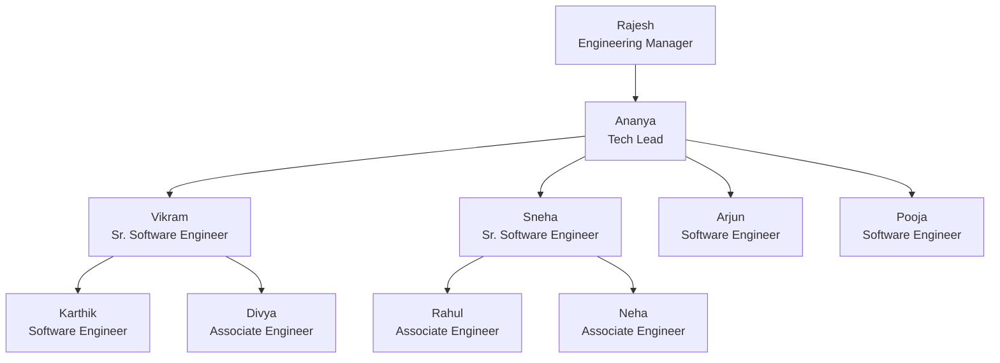

# Experiment 5 – SQL Views, View Updatability and Recursive CTEs

## Aim

To create SQL **views** for a **department salary summary** and the **employee hierarchy**, to **test the updatability of views**, and to implement a **recursive CTE** that displays **reporting chains**.

## Software Required

- MySQL Server 8.0 or later (recursive CTEs need 8.0+)
- MySQL Workbench or the MySQL command-line client

## Files

| File | Description |
|---|---|
| [`views_recursive_cte.sql`](views_recursive_cte.sql) | All views, updatability tests and recursive CTEs |
| [`../Experiment-3/company_queries.sql`](../Experiment-3/company_queries.sql) | Creates and fills `company_db` (prerequisite) |
| `README.md` | This lab record |

**How to run:**

```bash
mysql -u root -p -t < ../Experiment-3/company_queries.sql            # creates the schema and data
mysql -u root -p -t --force < views_recursive_cte.sql                # runs Experiment 5
```

> `--force` lets the script continue after the **intentional** errors in Part C. All data changes are undone at the end (Part F), so `company_db` is left exactly as Experiment 3 created it. Outputs were captured on **MySQL 8.0.46**.

---

## 1. Theory

### 1.1 Views

A **view** is a named, stored `SELECT` query that behaves like a **virtual table**. It stores only the query, not the data, so it always reflects the current contents of its base tables.

```sql
CREATE [OR REPLACE] VIEW view_name AS
SELECT ...
[WITH [CASCADED | LOCAL] CHECK OPTION];
```

| Advantage | Example in this experiment |
|---|---|
| **Simplicity**: hide complex joins and aggregates | `v_dept_salary_summary` |
| **Security**: expose only some columns or rows | `v_employee_public` hides salary and date of birth |
| **Reusability**: write the logic once, query it many times | `v_employee_hierarchy` |
| **Logical independence**: base tables can change behind a stable view | `CREATE OR REPLACE VIEW` |

### 1.2 When Is a View Updatable?

A view is **updatable** (UPDATE / DELETE / INSERT allowed) only if each row of the view maps to **exactly one row of one base table**. MySQL makes a view non-updatable if it contains any of these:

| Construct | Updatable? |
|---|---|
| Aggregate functions (`SUM`, `COUNT`, `AVG`…) or `GROUP BY` / `HAVING` | ❌ |
| `DISTINCT` | ❌ |
| `UNION` / `UNION ALL` | ❌ |
| Subquery in the SELECT list, or a recursive CTE | ❌ |
| The same table referenced more than once (self-join) | ❌ |
| Outer joins | ❌ (in most cases) |
| Inner join of several tables | ⚠️ UPDATE of **one** table only. No DELETE. INSERT into one table only. |
| Computed column (e.g. `salary * 12`) | ⚠️ That column can't be updated, and the view is not insertable |
| Simple `SELECT` from one table with `WHERE` | ✅ Fully updatable |

### 1.3 WITH CHECK OPTION

| Option | Effect |
|---|---|
| *(none)* | Rows can be changed so that they **disappear** from the view |
| `WITH CHECK OPTION` / `WITH CASCADED CHECK OPTION` | Rejects INSERT or UPDATE results that would not satisfy the WHERE clause of **this view and every view under it** |
| `WITH LOCAL CHECK OPTION` | Checks only **this view's** own WHERE clause |

### 1.4 Recursive Common Table Expressions (CTEs)

A **CTE** (`WITH name AS (…)`) is a temporary named result set for one query. A **recursive CTE** refers to itself, which makes it ideal for **hierarchies** such as an org chart.

```sql
WITH RECURSIVE cte_name AS (
    SELECT ...                    -- 1. anchor member: starting rows (e.g. the CEO)
    UNION ALL
    SELECT ... FROM table
    JOIN cte_name ON ...          -- 2. recursive member: next level, using the previous level
)                                 -- 3. stops automatically when the recursive member returns no rows
SELECT * FROM cte_name;
```

```
Iteration 0 (anchor)   : Rajesh
Iteration 1            : Ananya                  (manager_id = Rajesh)
Iteration 2            : Vikram, Sneha, Arjun, Pooja   (manager_id = Ananya)
Iteration 3            : Karthik, Divya, Rahul, Neha   (manager_id = Vikram / Sneha)
Iteration 4            : (no rows)  → recursion stops
```

---

## 2. Schema Used (from Experiment 3)

```
DEPARTMENT (dept_id, dept_name, location, manager_id → EMPLOYEE, established)
EMPLOYEE   (emp_id, first_name, last_name, gender, dob, hire_date, email, city, designation,
            salary, commission, manager_id → EMPLOYEE, dept_id → DEPARTMENT)
PROJECT    (proj_id, proj_name, dept_id → DEPARTMENT, location, budget, start_date, end_date, status)
WORKS_ON   (emp_id → EMPLOYEE, proj_id → PROJECT, hours_per_week, role)
```

`employee.manager_id → employee.emp_id` is the self-referencing relationship that forms the hierarchy:



*(Engineering department shown. Every department has a similar tree under its manager.)*

---

## 3. Views Created

| View | Type | Purpose | Updatable? |
|---|---|---|---|
| `v_dept_salary_summary` | Aggregate (GROUP BY) | Department salary summary | ❌ |
| `v_employee_manager` | Self-join | Employee with direct manager | ❌ |
| `v_employee_hierarchy` | Recursive CTE | Level and reporting path of every employee | ❌ |
| `v_engineering` | Single table + WHERE + CHECK OPTION | Engineering staff | ✅ |
| `v_engineering_nocheck` | Single table + WHERE | Same view, without CHECK OPTION | ✅ |
| `v_eng_senior_local` / `_cascaded` | View on a view | LOCAL vs CASCADED check | ✅ |
| `v_emp_pay` | Computed column | Salary with annual CTC | ⚠️ Partly |
| `v_emp_dept` | Inner join | Employee with department | ⚠️ One table only |
| `v_distinct_designations` / `v_all_people` | DISTINCT / UNION | Non-updatable examples | ❌ |
| `v_employee_public` | Inner join (security) | Hides salary and personal data | ⚠️ |

---

## 4. Part A – View 1: Department Salary Summary

#### V1. Department-wise salary summary view.

```sql
CREATE VIEW v_dept_salary_summary AS
SELECT d.dept_id,
       d.dept_name,
       d.location,
       COUNT(e.emp_id)           AS headcount,
       SUM(e.salary)             AS total_monthly_salary,
       ROUND(AVG(e.salary), 2)   AS avg_salary,
       MIN(e.salary)             AS min_salary,
       MAX(e.salary)             AS max_salary,
       SUM(e.salary) * 12        AS annual_payroll
FROM department d
LEFT JOIN employee e ON e.dept_id = d.dept_id
GROUP BY d.dept_id, d.dept_name, d.location;

SELECT * FROM v_dept_salary_summary ORDER BY dept_id;
```

**Output:**

```
mysql> CREATE VIEW v_dept_salary_summary AS ...
Query OK, 0 rows affected

mysql> SELECT * FROM v_dept_salary_summary ORDER BY dept_id;
+---------+-----------------+-----------+-----------+----------------------+------------+------------+------------+----------------+
| dept_id | dept_name       | location  | headcount | total_monthly_salary | avg_salary | min_salary | max_salary | annual_payroll |
+---------+-----------------+-----------+-----------+----------------------+------------+------------+------------+----------------+
| D01     | Engineering     | Bengaluru |        10 |           1078000.00 |  107800.00 |   55000.00 |  210000.00 |    12936000.00 |
| D02     | Human Resources | Mumbai    |         4 |            342000.00 |   85500.00 |   42000.00 |  150000.00 |     4104000.00 |
| D03     | Finance         | Mumbai    |         5 |            495000.00 |   99000.00 |   48000.00 |  185000.00 |     5940000.00 |
| D04     | Marketing       | New Delhi |         6 |            501000.00 |   83500.00 |   45000.00 |  160000.00 |     6012000.00 |
| D05     | Operations      | Chennai   |         7 |            608000.00 |   86857.14 |   35000.00 |  175000.00 |     7296000.00 |
+---------+-----------------+-----------+-----------+----------------------+------------+------------+------------+----------------+
5 rows in set
```

#### V2. A view is used like a table: filter and sort it.

```sql
SELECT dept_name, headcount, avg_salary
FROM v_dept_salary_summary
WHERE avg_salary > 90000
ORDER BY avg_salary DESC;
```

**Output:**

```
+-------------+-----------+------------+
| dept_name   | headcount | avg_salary |
+-------------+-----------+------------+
| Engineering |        10 |  107800.00 |
| Finance     |         5 |   99000.00 |
+-------------+-----------+------------+
2 rows in set
```

#### V3. A view stores the query, not the data: a salary change shows up immediately.

```sql
SELECT dept_name, total_monthly_salary FROM v_dept_salary_summary WHERE dept_id = 'D02';
UPDATE employee SET salary = salary + 10000 WHERE emp_id = 114;
SELECT dept_name, total_monthly_salary FROM v_dept_salary_summary WHERE dept_id = 'D02';
```

**Output:**

```
mysql> SELECT dept_name, total_monthly_salary FROM v_dept_salary_summary WHERE dept_id = 'D02';
+-----------------+----------------------+
| dept_name       | total_monthly_salary |
+-----------------+----------------------+
| Human Resources |            342000.00 |
+-----------------+----------------------+
1 row in set

mysql> UPDATE employee SET salary = salary + 10000 WHERE emp_id = 114;
Query OK, 1 row affected
Rows matched: 1  Changed: 1  Warnings: 0

mysql> SELECT dept_name, total_monthly_salary FROM v_dept_salary_summary WHERE dept_id = 'D02';
+-----------------+----------------------+
| dept_name       | total_monthly_salary |
+-----------------+----------------------+
| Human Resources |            352000.00 |
+-----------------+----------------------+
1 row in set
```

> **Observation:** The view's total went up by ₹10,000 right after the base-table UPDATE. A view stores only the **query**. It holds no copy of the data, so it always shows current values.

---

## 5. Part B – View 2: Employee Hierarchy

#### V4. Each employee with their direct manager.

```sql
CREATE VIEW v_employee_manager AS
SELECT e.emp_id,
       CONCAT(e.first_name, ' ', e.last_name) AS employee_name,
       e.designation,
       e.dept_id,
       e.manager_id,
       CONCAT(m.first_name, ' ', m.last_name) AS manager_name,
       m.designation                          AS manager_designation
FROM employee e
LEFT JOIN employee m ON e.manager_id = m.emp_id;

SELECT * FROM v_employee_manager WHERE dept_id = 'D01' ORDER BY emp_id;
```

**Output:**

```
mysql> CREATE VIEW v_employee_manager AS ...
Query OK, 0 rows affected

mysql> SELECT * FROM v_employee_manager WHERE dept_id = 'D01' ORDER BY emp_id;
+--------+----------------+--------------------------+---------+------------+----------------+--------------------------+
| emp_id | employee_name  | designation              | dept_id | manager_id | manager_name   | manager_designation      |
+--------+----------------+--------------------------+---------+------------+----------------+--------------------------+
|    101 | Rajesh Kumar   | Engineering Manager      | D01     |       NULL | NULL           | NULL                     |
|    102 | Ananya Reddy   | Tech Lead                | D01     |        101 | Rajesh Kumar   | Engineering Manager      |
|    103 | Vikram Singh   | Senior Software Engineer | D01     |        102 | Ananya Reddy   | Tech Lead                |
|    104 | Sneha Kulkarni | Senior Software Engineer | D01     |        102 | Ananya Reddy   | Tech Lead                |
|    105 | Arjun Nair     | Software Engineer        | D01     |        102 | Ananya Reddy   | Tech Lead                |
|    106 | Pooja Desai    | Software Engineer        | D01     |        102 | Ananya Reddy   | Tech Lead                |
|    107 | Karthik Iyer   | Software Engineer        | D01     |        103 | Vikram Singh   | Senior Software Engineer |
|    108 | Divya Menon    | Associate Engineer       | D01     |        103 | Vikram Singh   | Senior Software Engineer |
|    109 | Rahul Verma    | Associate Engineer       | D01     |        104 | Sneha Kulkarni | Senior Software Engineer |
|    110 | Neha Joshi     | Associate Engineer       | D01     |        104 | Sneha Kulkarni | Senior Software Engineer |
+--------+----------------+--------------------------+---------+------------+----------------+--------------------------+
10 rows in set
```

#### V5. Full employee hierarchy with level and reporting path.

```sql
CREATE VIEW v_employee_hierarchy AS
WITH RECURSIVE org AS (
    -- anchor member: top-level managers (no manager)
    SELECT emp_id,
           CONCAT(first_name, ' ', last_name)     AS employee_name,
           designation,
           dept_id,
           manager_id,
           1                                      AS level,
           CAST(first_name AS CHAR(500))          AS reporting_path
    FROM employee
    WHERE manager_id IS NULL
    UNION ALL
    -- recursive member: people who report to someone already in org
    SELECT e.emp_id,
           CONCAT(e.first_name, ' ', e.last_name),
           e.designation,
           e.dept_id,
           e.manager_id,
           o.level + 1,
           CONCAT(o.reporting_path, ' > ', e.first_name)
    FROM employee e
    JOIN org o ON e.manager_id = o.emp_id
)
SELECT * FROM org;

SELECT emp_id, employee_name, level, reporting_path
FROM v_employee_hierarchy
WHERE dept_id = 'D01'
ORDER BY reporting_path;
```

**Output:**

```
mysql> CREATE VIEW v_employee_hierarchy AS ...
Query OK, 0 rows affected

mysql> SELECT emp_id, employee_name, level, reporting_path ...
+--------+----------------+-------+------------------------------------+
| emp_id | employee_name  | level | reporting_path                     |
+--------+----------------+-------+------------------------------------+
|    101 | Rajesh Kumar   |     1 | Rajesh                             |
|    102 | Ananya Reddy   |     2 | Rajesh > Ananya                    |
|    105 | Arjun Nair     |     3 | Rajesh > Ananya > Arjun            |
|    106 | Pooja Desai    |     3 | Rajesh > Ananya > Pooja            |
|    104 | Sneha Kulkarni |     3 | Rajesh > Ananya > Sneha            |
|    110 | Neha Joshi     |     4 | Rajesh > Ananya > Sneha > Neha     |
|    109 | Rahul Verma    |     4 | Rajesh > Ananya > Sneha > Rahul    |
|    103 | Vikram Singh   |     3 | Rajesh > Ananya > Vikram           |
|    108 | Divya Menon    |     4 | Rajesh > Ananya > Vikram > Divya   |
|    107 | Karthik Iyer   |     4 | Rajesh > Ananya > Vikram > Karthik |
+--------+----------------+-------+------------------------------------+
10 rows in set
```

> **Observation:** The anchor member selects the top managers (level 1). The recursive member adds everyone who reports to a person already found, until no new rows appear. `CAST(first_name AS CHAR(500))` matters: the anchor fixes the column width for the whole CTE, so without the cast longer paths would be cut off or raise an error.

#### V6. Number of employees at each level of the organisation.

```sql
SELECT level, COUNT(*) AS employees
FROM v_employee_hierarchy
GROUP BY level
ORDER BY level;
```

**Output:**

```
+-------+-----------+
| level | employees |
+-------+-----------+
|     1 |         5 |
|     2 |        10 |
|     3 |        13 |
|     4 |         4 |
+-------+-----------+
4 rows in set
```

#### V7. List every view in the database.

```sql
SHOW FULL TABLES WHERE Table_type = 'VIEW';
```

**Output:**

```
+-----------------------+------------+
| Tables_in_company_db  | Table_type |
+-----------------------+------------+
| v_dept_salary_summary | VIEW       |
| v_employee_hierarchy  | VIEW       |
| v_employee_manager    | VIEW       |
+-----------------------+------------+
3 rows in set
```

---

## 6. Part C – Testing Updatability of Views

#### U1. Simple single-table view of Engineering staff, WITH CHECK OPTION.

```sql
CREATE VIEW v_engineering AS
SELECT emp_id, first_name, last_name, gender, dob, hire_date, email,
       city, designation, salary, manager_id, dept_id
FROM employee
WHERE dept_id = 'D01'
WITH CHECK OPTION;

SELECT emp_id, first_name, designation, salary FROM v_engineering WHERE emp_id IN (109, 110);
```

**Output:**

```
mysql> CREATE VIEW v_engineering AS ...
Query OK, 0 rows affected

mysql> SELECT emp_id, first_name, designation, salary FROM v_engineering WHERE emp_id IN (109, 110);
+--------+------------+--------------------+----------+
| emp_id | first_name | designation        | salary   |
+--------+------------+--------------------+----------+
|    109 | Rahul      | Associate Engineer | 58000.00 |
|    110 | Neha       | Associate Engineer | 55000.00 |
+--------+------------+--------------------+----------+
2 rows in set
```

#### U2. Give the associate engineers a raise through the view.

```sql
UPDATE v_engineering SET salary = salary + 5000 WHERE designation = 'Associate Engineer';
SELECT emp_id, first_name, salary FROM employee WHERE designation = 'Associate Engineer';
```

**Output:**

```
mysql> UPDATE v_engineering SET salary = salary + 5000 WHERE designation = 'Associate Engineer';
Query OK, 3 rows affected
Rows matched: 3  Changed: 3  Warnings: 0

mysql> SELECT emp_id, first_name, salary FROM employee WHERE designation = 'Associate Engineer';
+--------+------------+----------+
| emp_id | first_name | salary   |
+--------+------------+----------+
|    108 | Divya      | 67000.00 |
|    109 | Rahul      | 63000.00 |
|    110 | Neha       | 60000.00 |
+--------+------------+----------+
3 rows in set
```

> **Observation:** An UPDATE on the view was applied to the underlying `employee` table.

#### U3. Add a new Engineering employee through the view.

```sql
INSERT INTO v_engineering (emp_id, first_name, last_name, gender, dob, hire_date, email,
                           city, designation, salary, manager_id, dept_id)
VALUES (133, 'Ishaan', 'Malik', 'M', '2001-02-11', '2026-07-01', 'ishaan.malik@company.in',
        'Bengaluru', 'Associate Engineer', 52000, 103, 'D01');
SELECT emp_id, first_name, designation, salary, commission, dept_id FROM employee WHERE emp_id = 133;
```

**Output:**

```
mysql> INSERT INTO v_engineering (emp_id, first_name, last_name, gender, dob, hire_date, email, ...
Query OK, 1 row affected

mysql> SELECT emp_id, first_name, designation, salary, commission, dept_id FROM employee WHERE emp_id = 133;
+--------+------------+--------------------+----------+------------+---------+
| emp_id | first_name | designation        | salary   | commission | dept_id |
+--------+------------+--------------------+----------+------------+---------+
|    133 | Ishaan     | Associate Engineer | 52000.00 |       NULL | D01     |
+--------+------------+--------------------+----------+------------+---------+
1 row in set
```

> **Observation:** An INSERT through the view created a row in `employee`. Columns not in the view (`commission`) got their default value, NULL.


#### U4. Inserting a Finance employee through the Engineering view is rejected.

```sql
INSERT INTO v_engineering (emp_id, first_name, last_name, gender, dob, hire_date, email,
                           city, designation, salary, manager_id, dept_id)
VALUES (134, 'Riya', 'Sen', 'F', '2000-08-08', '2026-07-01', 'riya.sen@company.in',
        'Kolkata', 'Accountant', 50000, 116, 'D03');
```

**Output:**

```
mysql> INSERT INTO v_engineering (emp_id, first_name, last_name, gender, dob, hire_date, email, ...
ERROR 1369 (HY000): CHECK OPTION failed 'company_db.v_engineering'
```

> **Observation:** `WITH CHECK OPTION` rejects any row that would not be visible through the view (dept_id = 'D03' does not satisfy `dept_id = 'D01'`).

#### U5. Moving an employee out of the view's WHERE condition is rejected.

```sql
UPDATE v_engineering SET dept_id = 'D05' WHERE emp_id = 133;
```

**Output:**

```
mysql> UPDATE v_engineering SET dept_id = 'D05' WHERE emp_id = 133;
ERROR 1369 (HY000): CHECK OPTION failed 'company_db.v_engineering'
```

#### U6. The same UPDATE succeeds, and the row disappears from the view.

```sql
CREATE VIEW v_engineering_nocheck AS
SELECT emp_id, first_name, dept_id, salary FROM employee WHERE dept_id = 'D01';

UPDATE v_engineering_nocheck SET dept_id = 'D05' WHERE emp_id = 133;
SELECT * FROM v_engineering_nocheck WHERE emp_id = 133;
SELECT emp_id, first_name, dept_id FROM employee WHERE emp_id = 133;
```

**Output:**

```
mysql> CREATE VIEW v_engineering_nocheck AS ...
Query OK, 0 rows affected

mysql> UPDATE v_engineering_nocheck SET dept_id = 'D05' WHERE emp_id = 133;
Query OK, 1 row affected
Rows matched: 1  Changed: 1  Warnings: 0

mysql> SELECT * FROM v_engineering_nocheck WHERE emp_id = 133;
Empty set

mysql> SELECT emp_id, first_name, dept_id FROM employee WHERE emp_id = 133;
+--------+------------+---------+
| emp_id | first_name | dept_id |
+--------+------------+---------+
|    133 | Ishaan     | D05     |
+--------+------------+---------+
1 row in set
```

> **Observation:** Without CHECK OPTION, the UPDATE succeeded but the row **vanished from the view**, because it no longer satisfies the view's WHERE clause. CHECK OPTION exists to prevent this.

#### U7. Delete the new employee through a view.

```sql
UPDATE employee SET dept_id = 'D01' WHERE emp_id = 133;
DELETE FROM v_engineering WHERE emp_id = 133;
SELECT COUNT(*) AS rows_left FROM employee WHERE emp_id = 133;
```

**Output:**

```
mysql> UPDATE employee SET dept_id = 'D01' WHERE emp_id = 133;
Query OK, 1 row affected
Rows matched: 1  Changed: 1  Warnings: 0

mysql> DELETE FROM v_engineering WHERE emp_id = 133;
Query OK, 1 row affected

mysql> SELECT COUNT(*) AS rows_left FROM employee WHERE emp_id = 133;
+-----------+
| rows_left |
+-----------+
|         0 |
+-----------+
1 row in set
```

#### U8. Views built on a view without its own check.

```sql
CREATE VIEW v_eng_senior_local AS
SELECT * FROM v_engineering_nocheck WHERE salary >= 100000
WITH LOCAL CHECK OPTION;

CREATE VIEW v_eng_senior_cascaded AS
SELECT * FROM v_engineering_nocheck WHERE salary >= 100000
WITH CASCADED CHECK OPTION;

UPDATE v_eng_senior_local SET dept_id = 'D05' WHERE emp_id = 104;
SELECT emp_id, first_name, dept_id FROM employee WHERE emp_id = 104;
UPDATE employee SET dept_id = 'D01' WHERE emp_id = 104;

UPDATE v_eng_senior_cascaded SET dept_id = 'D05' WHERE emp_id = 104;
```

**Output:**

```
mysql> CREATE VIEW v_eng_senior_local AS ...
Query OK, 0 rows affected

mysql> CREATE VIEW v_eng_senior_cascaded AS ...
Query OK, 0 rows affected

mysql> UPDATE v_eng_senior_local SET dept_id = 'D05' WHERE emp_id = 104;
Query OK, 1 row affected
Rows matched: 1  Changed: 1  Warnings: 0

mysql> SELECT emp_id, first_name, dept_id FROM employee WHERE emp_id = 104;
+--------+------------+---------+
| emp_id | first_name | dept_id |
+--------+------------+---------+
|    104 | Sneha      | D05     |
+--------+------------+---------+
1 row in set

mysql> UPDATE employee SET dept_id = 'D01' WHERE emp_id = 104;
Query OK, 1 row affected
Rows matched: 1  Changed: 1  Warnings: 0

mysql> UPDATE v_eng_senior_cascaded SET dept_id = 'D05' WHERE emp_id = 104;
ERROR 1369 (HY000): CHECK OPTION failed 'company_db.v_eng_senior_cascaded'
```

> **Observation:** **LOCAL** checks only the condition of the view itself (`salary >= 100000`), so moving Sneha to D05 was allowed. **CASCADED** (the default) also checks every underlying view's condition (`dept_id = 'D01'`), so the same change was rejected.

#### U9. Views with GROUP BY / aggregates cannot be updated.

```sql
UPDATE v_dept_salary_summary SET headcount = 20 WHERE dept_id = 'D01';
```

**Output:**

```
mysql> UPDATE v_dept_salary_summary SET headcount = 20 WHERE dept_id = 'D01';
ERROR 1288 (HY000): The target table v_dept_salary_summary of the UPDATE is not updatable
```

#### U10. ... and cannot be inserted into or deleted from.

```sql
DELETE FROM v_dept_salary_summary WHERE dept_id = 'D01';
```

**Output:**

```
mysql> DELETE FROM v_dept_salary_summary WHERE dept_id = 'D01';
ERROR 1288 (HY000): The target table v_dept_salary_summary of the DELETE is not updatable
```

#### U11. Base columns can be updated, a derived column cannot.

```sql
CREATE VIEW v_emp_pay AS
SELECT emp_id, first_name, salary, salary * 12 AS annual_ctc
FROM employee;

UPDATE v_emp_pay SET salary = 47000 WHERE emp_id = 114;
SELECT * FROM v_emp_pay WHERE emp_id = 114;
UPDATE v_emp_pay SET annual_ctc = 600000 WHERE emp_id = 114;
```

**Output:**

```
mysql> CREATE VIEW v_emp_pay AS ...
Query OK, 0 rows affected

mysql> UPDATE v_emp_pay SET salary = 47000 WHERE emp_id = 114;
Query OK, 1 row affected
Rows matched: 1  Changed: 1  Warnings: 0

mysql> SELECT * FROM v_emp_pay WHERE emp_id = 114;
+--------+------------+----------+------------+
| emp_id | first_name | salary   | annual_ctc |
+--------+------------+----------+------------+
|    114 | Aditya     | 47000.00 |  564000.00 |
+--------+------------+----------+------------+
1 row in set

mysql> UPDATE v_emp_pay SET annual_ctc = 600000 WHERE emp_id = 114;
ERROR 1348 (HY000): Column 'annual_ctc' is not updatable
```

> **Observation:** A view can be **partly updatable**. Base columns (`salary`) can be changed. A computed column (`annual_ctc = salary * 12`) cannot, because MySQL has no way to work backwards from it to a base value.

#### U12. INSERT is not possible when the view has a derived column.

```sql
INSERT INTO v_emp_pay (emp_id, first_name, salary) VALUES (135, 'Test', 40000);
```

**Output:**

```
mysql> INSERT INTO v_emp_pay (emp_id, first_name, salary) VALUES (135, 'Test', 40000);
ERROR 1471 (HY000): The target table v_emp_pay of the INSERT is not insertable-into
```

> **Observation:** The view is updatable but not **insertable**. A view with a derived column cannot accept INSERTs.

#### U13. Columns of ONE base table can be updated through an INNER JOIN view ...

```sql
CREATE VIEW v_emp_dept AS
SELECT e.emp_id, e.first_name, e.designation, e.salary, d.dept_name, d.location
FROM employee e
JOIN department d ON d.dept_id = e.dept_id;

UPDATE v_emp_dept SET designation = 'Senior Associate Engineer' WHERE emp_id = 109;
SELECT * FROM v_emp_dept WHERE emp_id = 109;
UPDATE employee SET designation = 'Associate Engineer' WHERE emp_id = 109;
```

**Output:**

```
mysql> CREATE VIEW v_emp_dept AS ...
Query OK, 0 rows affected

mysql> UPDATE v_emp_dept SET designation = 'Senior Associate Engineer' WHERE emp_id = 109;
Query OK, 1 row affected
Rows matched: 1  Changed: 1  Warnings: 0

mysql> SELECT * FROM v_emp_dept WHERE emp_id = 109;
+--------+------------+---------------------------+----------+-------------+-----------+
| emp_id | first_name | designation               | salary   | dept_name   | location  |
+--------+------------+---------------------------+----------+-------------+-----------+
|    109 | Rahul      | Senior Associate Engineer | 63000.00 | Engineering | Bengaluru |
+--------+------------+---------------------------+----------+-------------+-----------+
1 row in set

mysql> UPDATE employee SET designation = 'Associate Engineer' WHERE emp_id = 109;
Query OK, 1 row affected
Rows matched: 1  Changed: 1  Warnings: 0
```

#### U14. ... but one UPDATE cannot change BOTH base tables, and DELETE is not allowed.

```sql
UPDATE v_emp_dept SET salary = 60000, location = 'Pune' WHERE emp_id = 109;
DELETE FROM v_emp_dept WHERE emp_id = 109;
```

**Output:**

```
mysql> UPDATE v_emp_dept SET salary = 60000, location = 'Pune' WHERE emp_id = 109;
ERROR 1393 (HY000): Can not modify more than one base table through a join view 'company_db.v_emp_dept'

mysql> DELETE FROM v_emp_dept WHERE emp_id = 109;
ERROR 1395 (HY000): Can not delete from join view 'company_db.v_emp_dept'
```

> **Observation:** For a join view, MySQL allows an UPDATE only if it changes columns of **one** base table, allows INSERT only into one table, and never allows DELETE.

#### U15. v_employee_manager (LEFT self-join of employee) is not updatable at all.

```sql
UPDATE v_employee_manager SET designation = 'Senior Associate Engineer' WHERE emp_id = 109;
```

**Output:**

```
mysql> UPDATE v_employee_manager SET designation = 'Senior Associate Engineer' WHERE emp_id = 109;
ERROR 1288 (HY000): The target table v_employee_manager of the UPDATE is not updatable
```

> **Observation:** `v_employee_manager` reads the `employee` table **twice** (a self-join through LEFT JOIN), so MySQL cannot map a view row to a single base row.

#### U16. Views using DISTINCT or UNION cannot be updated.

```sql
CREATE VIEW v_distinct_designations AS
SELECT DISTINCT designation, dept_id FROM employee;

CREATE VIEW v_all_people AS
SELECT emp_id AS id, first_name AS name, 'Employee' AS type FROM employee
UNION
SELECT manager_id, dept_name, 'Department' FROM department;

UPDATE v_distinct_designations SET designation = 'Engineer' WHERE designation = 'Software Engineer';
UPDATE v_all_people SET name = 'X' WHERE id = 101;
```

**Output:**

```
mysql> CREATE VIEW v_distinct_designations AS ...
Query OK, 0 rows affected

mysql> CREATE VIEW v_all_people AS ...
Query OK, 0 rows affected

mysql> UPDATE v_distinct_designations SET designation = 'Engineer' WHERE designation = 'Software Engineer';
ERROR 1288 (HY000): The target table v_distinct_designations of the UPDATE is not updatable

mysql> UPDATE v_all_people SET name = 'X' WHERE id = 101;
ERROR 1288 (HY000): The target table v_all_people of the UPDATE is not updatable
```

#### U17. The hierarchy view cannot be updated either.

```sql
UPDATE v_employee_hierarchy SET designation = 'CTO' WHERE emp_id = 101;
```

**Output:**

```
mysql> UPDATE v_employee_hierarchy SET designation = 'CTO' WHERE emp_id = 101;
ERROR 1288 (HY000): The target table v_employee_hierarchy of the UPDATE is not updatable
```

> **Observation:** The recursive CTE view is not updatable either. Note that U18 lists it as `IS_UPDATABLE = YES`, yet the UPDATE was rejected. That flag is only a preliminary check made when the view is created, and the real test happens when the statement runs.

#### U18. MySQL reports which views are updatable in INFORMATION_SCHEMA.VIEWS.

```sql
SELECT TABLE_NAME AS view_name, IS_UPDATABLE, CHECK_OPTION
FROM information_schema.VIEWS
WHERE TABLE_SCHEMA = 'company_db'
ORDER BY IS_UPDATABLE DESC, TABLE_NAME;
```

**Output:**

```
+-------------------------+--------------+--------------+
| view_name               | IS_UPDATABLE | CHECK_OPTION |
+-------------------------+--------------+--------------+
| v_emp_dept              | YES          | NONE         |
| v_emp_pay               | YES          | NONE         |
| v_employee_hierarchy    | YES          | NONE         |
| v_eng_senior_cascaded   | YES          | CASCADED     |
| v_eng_senior_local      | YES          | LOCAL        |
| v_engineering           | YES          | CASCADED     |
| v_engineering_nocheck   | YES          | NONE         |
| v_all_people            | NO           | NONE         |
| v_dept_salary_summary   | NO           | NONE         |
| v_distinct_designations | NO           | NONE         |
| v_employee_manager      | NO           | NONE         |
+-------------------------+--------------+--------------+
11 rows in set
```

> **Observation:** `IS_UPDATABLE = NO` is reported for views with aggregates/GROUP BY, DISTINCT, UNION, and the self-join view.

#### U19. A view that hides salary and personal data from general users.

```sql
CREATE VIEW v_employee_public AS
SELECT e.emp_id, CONCAT(e.first_name, ' ', e.last_name) AS name,
       e.designation, d.dept_name, e.email
FROM employee e
JOIN department d ON d.dept_id = e.dept_id;

SELECT * FROM v_employee_public WHERE dept_name = 'Finance' ORDER BY emp_id;
```

**Output:**

```
mysql> CREATE VIEW v_employee_public AS ...
Query OK, 0 rows affected

mysql> SELECT * FROM v_employee_public WHERE dept_name = 'Finance' ORDER BY emp_id;
+--------+----------------+--------------------+-----------+---------------------------+
| emp_id | name           | designation        | dept_name | email                     |
+--------+----------------+--------------------+-----------+---------------------------+
|    115 | Suresh Agarwal | Finance Manager    | Finance   | suresh.agarwal@company.in |
|    116 | Kavita Mehta   | Senior Accountant  | Finance   | kavita.mehta@company.in   |
|    117 | Manoj Tiwari   | Accountant         | Finance   | manoj.tiwari@company.in   |
|    118 | Lakshmi Rao    | Financial Analyst  | Finance   | lakshmi.rao@company.in    |
|    119 | Imran Khan     | Accounts Executive | Finance   | imran.khan@company.in     |
+--------+----------------+--------------------+-----------+---------------------------+
5 rows in set
```

### Updatability Test Summary

| Test | View | Operation | Result | Error |
|---|---|---|---|---|
| U2 | `v_engineering` (simple) | UPDATE | ✅ Success | – |
| U3 | `v_engineering` | INSERT | ✅ Success | – |
| U4 | `v_engineering` | INSERT row outside the view | ❌ Rejected | 1369 CHECK OPTION failed |
| U5 | `v_engineering` | UPDATE row out of the view | ❌ Rejected | 1369 CHECK OPTION failed |
| U6 | `v_engineering_nocheck` | UPDATE row out of the view | ✅ Allowed, row disappears | – |
| U7 | `v_engineering` | DELETE | ✅ Success | – |
| U8 | LOCAL vs CASCADED | UPDATE dept | LOCAL ✅ / CASCADED ❌ | 1369 |
| U9, U10 | `v_dept_salary_summary` (aggregate) | UPDATE / DELETE | ❌ | 1288 not updatable |
| U11 | `v_emp_pay` | UPDATE base / computed column | ✅ / ❌ | 1348 column not updatable |
| U12 | `v_emp_pay` | INSERT | ❌ | 1471 not insertable-into |
| U13 | `v_emp_dept` (join) | UPDATE one table | ✅ Success | – |
| U14 | `v_emp_dept` (join) | UPDATE two tables / DELETE | ❌ | 1393 / 1395 |
| U15 | `v_employee_manager` (self-join) | UPDATE | ❌ | 1288 |
| U16 | DISTINCT / UNION views | UPDATE | ❌ | 1288 |
| U17 | `v_employee_hierarchy` (recursive CTE) | UPDATE | ❌ | 1288 |

---

## 7. Part D – Recursive CTE: Reporting Chains

#### R1. Generate the numbers 1 to 10.

```sql
WITH RECURSIVE numbers AS (
    SELECT 1 AS n                         -- anchor
    UNION ALL
    SELECT n + 1 FROM numbers WHERE n < 10  -- recursive step + stop condition
)
SELECT GROUP_CONCAT(n ORDER BY n SEPARATOR ', ') AS series FROM numbers;
```

**Output:**

```
+-------------------------------+
| series                        |
+-------------------------------+
| 1, 2, 3, 4, 5, 6, 7, 8, 9, 10 |
+-------------------------------+
1 row in set
```

> **Observation:** Every recursive CTE has an **anchor member** (the start row), `UNION ALL`, and a **recursive member** that refers to the CTE itself and has a stop condition.

#### R2. From Rahul (109) up to the top: whom does he report to?

```sql
WITH RECURSIVE chain AS (
    SELECT emp_id, first_name, designation, manager_id, 0 AS steps_up
    FROM employee
    WHERE emp_id = 109
    UNION ALL
    SELECT m.emp_id, m.first_name, m.designation, m.manager_id, c.steps_up + 1
    FROM employee m
    JOIN chain c ON m.emp_id = c.manager_id
)
SELECT steps_up, emp_id, first_name, designation
FROM chain
ORDER BY steps_up;
```

**Output:**

```
+----------+--------+------------+--------------------------+
| steps_up | emp_id | first_name | designation              |
+----------+--------+------------+--------------------------+
|        0 |    109 | Rahul      | Associate Engineer       |
|        1 |    104 | Sneha      | Senior Software Engineer |
|        2 |    102 | Ananya     | Tech Lead                |
|        3 |    101 | Rajesh     | Engineering Manager      |
+----------+--------+------------+--------------------------+
4 rows in set
```

> **Observation:** Walking **up** the tree: each step joins the current row's `manager_id` to the next person's `emp_id`. It stops when `manager_id` is NULL at the top.

#### R3. The same chain printed as a single path.

```sql
WITH RECURSIVE chain AS (
    SELECT emp_id, manager_id, CAST(first_name AS CHAR(500)) AS path
    FROM employee
    WHERE emp_id = 109
    UNION ALL
    SELECT m.emp_id, m.manager_id, CONCAT(c.path, ' -> ', m.first_name)
    FROM employee m
    JOIN chain c ON m.emp_id = c.manager_id
)
SELECT path AS reporting_chain
FROM chain
WHERE manager_id IS NULL;
```

**Output:**

```
+------------------------------------+
| reporting_chain                    |
+------------------------------------+
| Rahul -> Sneha -> Ananya -> Rajesh |
+------------------------------------+
1 row in set
```

#### R4. Everyone under Ananya (102), directly or indirectly, as an indented tree.

```sql
WITH RECURSIVE team AS (
    SELECT emp_id, first_name, designation, 0 AS depth,
           CAST(LPAD(emp_id, 4, '0') AS CHAR(200)) AS sort_key
    FROM employee
    WHERE emp_id = 102
    UNION ALL
    SELECT e.emp_id, e.first_name, e.designation, t.depth + 1,
           CONCAT(t.sort_key, '/', LPAD(e.emp_id, 4, '0'))
    FROM employee e
    JOIN team t ON e.manager_id = t.emp_id
)
SELECT emp_id,
       CONCAT(REPEAT('    ', depth), '└── ', first_name) AS org_tree,
       designation, depth
FROM team
ORDER BY sort_key;
```

**Output:**

```
+--------+---------------------+--------------------------+-------+
| emp_id | org_tree            | designation              | depth |
+--------+---------------------+--------------------------+-------+
|    102 | └── Ananya          | Tech Lead                |     0 |
|    103 |     └── Vikram      | Senior Software Engineer |     1 |
|    107 |         └── Karthik | Software Engineer        |     2 |
|    108 |         └── Divya   | Associate Engineer       |     2 |
|    104 |     └── Sneha       | Senior Software Engineer |     1 |
|    109 |         └── Rahul   | Associate Engineer       |     2 |
|    110 |         └── Neha    | Associate Engineer       |     2 |
|    105 |     └── Arjun       | Software Engineer        |     1 |
|    106 |     └── Pooja       | Software Engineer        |     1 |
+--------+---------------------+--------------------------+-------+
9 rows in set
```

> **Observation:** Walking **down** the tree: each step finds people whose `manager_id` is a person already found. `sort_key` builds a path of padded IDs so that each manager is followed by their whole team.

#### R5. Reporting chain of EVERY employee, from the top manager down.

```sql
WITH RECURSIVE org AS (
    SELECT emp_id, dept_id, first_name, 1 AS level,
           CAST(first_name AS CHAR(500)) AS chain
    FROM employee
    WHERE manager_id IS NULL
    UNION ALL
    SELECT e.emp_id, e.dept_id, e.first_name, o.level + 1,
           CONCAT(o.chain, ' > ', e.first_name)
    FROM employee e
    JOIN org o ON e.manager_id = o.emp_id
)
SELECT dept_id, level, chain
FROM org
ORDER BY dept_id, chain;
```

**Output:**

```
+---------+-------+------------------------------------+
| dept_id | level | chain                              |
+---------+-------+------------------------------------+
| D01     |     1 | Rajesh                             |
| D01     |     2 | Rajesh > Ananya                    |
| D01     |     3 | Rajesh > Ananya > Arjun            |
| D01     |     3 | Rajesh > Ananya > Pooja            |
| D01     |     3 | Rajesh > Ananya > Sneha            |
| D01     |     4 | Rajesh > Ananya > Sneha > Neha     |
| D01     |     4 | Rajesh > Ananya > Sneha > Rahul    |
| D01     |     3 | Rajesh > Ananya > Vikram           |
| D01     |     4 | Rajesh > Ananya > Vikram > Divya   |
| D01     |     4 | Rajesh > Ananya > Vikram > Karthik |
| D02     |     1 | Meenakshi                          |
| D02     |     2 | Meenakshi > Aditya                 |
| D02     |     2 | Meenakshi > Ritu                   |
| D02     |     2 | Meenakshi > Sanjay                 |
| D03     |     1 | Suresh                             |
| D03     |     2 | Suresh > Kavita                    |
| D03     |     3 | Suresh > Kavita > Imran            |
| D03     |     3 | Suresh > Kavita > Manoj            |
| D03     |     2 | Suresh > Lakshmi                   |
| D04     |     1 | Nisha                              |
| D04     |     2 | Nisha > Farhan                     |
| D04     |     2 | Nisha > Rohit                      |
| D04     |     3 | Nisha > Rohit > Aman               |
| D04     |     3 | Nisha > Rohit > Shreya             |
| D04     |     3 | Nisha > Rohit > Tanvi              |
| D05     |     1 | Venkatesh                          |
| D05     |     2 | Venkatesh > Deepa                  |
| D05     |     3 | Venkatesh > Deepa > Bhavna         |
| D05     |     3 | Venkatesh > Deepa > Gaurav         |
| D05     |     3 | Venkatesh > Deepa > Harish         |
| D05     |     3 | Venkatesh > Deepa > Swati          |
| D05     |     2 | Venkatesh > Naveen                 |
+---------+-------+------------------------------------+
32 rows in set
```

#### R6. Total team size (direct + indirect reports) for each manager.

```sql
WITH RECURSIVE reports AS (
    SELECT manager_id AS boss, emp_id
    FROM employee
    WHERE manager_id IS NOT NULL
    UNION ALL
    SELECT e.manager_id, r.emp_id
    FROM reports r
    JOIN employee e ON e.emp_id = r.boss
    WHERE e.manager_id IS NOT NULL
)
SELECT r.boss AS manager_id, m.first_name AS manager,
       COUNT(*) AS total_team_size,
       SUM(s.salary) AS team_monthly_salary
FROM reports r
JOIN employee m ON m.emp_id = r.boss
JOIN employee s ON s.emp_id = r.emp_id
GROUP BY r.boss, m.first_name
ORDER BY total_team_size DESC, manager_id;
```

**Output:**

```
+------------+-----------+-----------------+---------------------+
| manager_id | manager   | total_team_size | team_monthly_salary |
+------------+-----------+-----------------+---------------------+
|        101 | Rajesh    |               9 |           883000.00 |
|        102 | Ananya    |               8 |           718000.00 |
|        126 | Venkatesh |               6 |           433000.00 |
|        120 | Nisha     |               5 |           341000.00 |
|        115 | Suresh    |               4 |           310000.00 |
|        127 | Deepa     |               4 |           215000.00 |
|        111 | Meenakshi |               3 |           197000.00 |
|        121 | Rohit     |               3 |           179000.00 |
|        103 | Vikram    |               2 |           149000.00 |
|        104 | Sneha     |               2 |           123000.00 |
|        116 | Kavita    |               2 |           120000.00 |
+------------+-----------+-----------------+---------------------+
11 rows in set
```

> **Observation:** Ananya has 4 direct reports but a total team of 8, because the recursion also counts the people under Vikram and Sneha.

#### R7. Deepest reporting chain in each department.

```sql
SELECT dept_id, MAX(level) AS max_depth,
       SUBSTRING_INDEX(GROUP_CONCAT(reporting_path ORDER BY level DESC, reporting_path SEPARATOR '|'), '|', 1)
           AS longest_chain
FROM v_employee_hierarchy
GROUP BY dept_id
ORDER BY dept_id;
```

**Output:**

```
+---------+-----------+--------------------------------+
| dept_id | max_depth | longest_chain                  |
+---------+-----------+--------------------------------+
| D01     |         4 | Rajesh > Ananya > Sneha > Neha |
| D02     |         2 | Meenakshi > Aditya             |
| D03     |         3 | Suresh > Kavita > Imran        |
| D04     |         3 | Nisha > Rohit > Aman           |
| D05     |         3 | Venkatesh > Deepa > Bhavna     |
+---------+-----------+--------------------------------+
5 rows in set
```

#### R8. A recursive CTE stops at cte_max_recursion_depth (default 1000).

```sql
SET SESSION cte_max_recursion_depth = 20;
WITH RECURSIVE runaway AS (
    SELECT 1 AS n
    UNION ALL
    SELECT n + 1 FROM runaway          -- no stop condition!
)
SELECT COUNT(*) FROM runaway;
SET SESSION cte_max_recursion_depth = 1000;
```

**Output:**

```
mysql> SET SESSION cte_max_recursion_depth = 20;
Query OK, 0 rows affected

mysql> WITH RECURSIVE runaway AS ( ...
ERROR 3636 (HY000): Recursive query aborted after 21 iterations. Try increasing @@cte_max_recursion_depth to a larger value.

mysql> SET SESSION cte_max_recursion_depth = 1000;
Query OK, 0 rows affected
```

> **Observation:** Without a stop condition, recursion would never end. MySQL aborts it once it passes `cte_max_recursion_depth` (default 1000). This protects against loops in the data, such as A managing B and B managing A.

---

## 8. Part E – Managing Views (and Cleanup)

#### M1. Add a column to an existing view without dropping it.

```sql
CREATE OR REPLACE VIEW v_employee_public AS
SELECT e.emp_id, CONCAT(e.first_name, ' ', e.last_name) AS name,
       e.designation, d.dept_name, d.location, e.email
FROM employee e
JOIN department d ON d.dept_id = e.dept_id;

SELECT * FROM v_employee_public WHERE emp_id = 120;
```

**Output:**

```
mysql> CREATE OR REPLACE VIEW v_employee_public AS ...
Query OK, 0 rows affected

mysql> SELECT * FROM v_employee_public WHERE emp_id = 120;
+--------+----------------+-------------------+-----------+-----------+---------------------------+
| emp_id | name           | designation       | dept_name | location  | email                     |
+--------+----------------+-------------------+-----------+-----------+---------------------------+
|    120 | Nisha Malhotra | Marketing Manager | Marketing | New Delhi | nisha.malhotra@company.in |
+--------+----------------+-------------------+-----------+-----------+---------------------------+
1 row in set
```

#### M2. Dropping a view removes only its definition; the base table is untouched.

```sql
DROP VIEW v_distinct_designations, v_all_people;
SELECT COUNT(*) AS employees_still_in_base_table FROM employee;
```

**Output:**

```
mysql> DROP VIEW v_distinct_designations, v_all_people;
Query OK, 0 rows affected

mysql> SELECT COUNT(*) AS employees_still_in_base_table FROM employee;
+-------------------------------+
| employees_still_in_base_table |
+-------------------------------+
|                            32 |
+-------------------------------+
1 row in set
```

#### F1. Restore the original salaries changed in V3, U2 and U11.

```sql
UPDATE employee SET salary = 42000 WHERE emp_id = 114;
UPDATE employee SET salary = salary - 5000 WHERE designation = 'Associate Engineer';
SELECT emp_id, first_name, salary FROM employee WHERE emp_id IN (108, 109, 110, 114) ORDER BY emp_id;
```

**Output:**

```
mysql> UPDATE employee SET salary = 42000 WHERE emp_id = 114;
Query OK, 1 row affected
Rows matched: 1  Changed: 1  Warnings: 0

mysql> UPDATE employee SET salary = salary - 5000 WHERE designation = 'Associate Engineer';
Query OK, 3 rows affected
Rows matched: 3  Changed: 3  Warnings: 0

mysql> SELECT emp_id, first_name, salary FROM employee WHERE emp_id IN (108, 109, 110, 114) ORDER BY emp_id;
+--------+------------+----------+
| emp_id | first_name | salary   |
+--------+------------+----------+
|    108 | Divya      | 62000.00 |
|    109 | Rahul      | 58000.00 |
|    110 | Neha       | 55000.00 |
|    114 | Aditya     | 42000.00 |
+--------+------------+----------+
4 rows in set
```

---

## Result

Two views were created and queried:
- **`v_dept_salary_summary`**: department-wise headcount, total, average, minimum and maximum salary, and annual payroll.
- **`v_employee_hierarchy`**: every employee's level and reporting path, built with a recursive CTE inside the view.

Updatability was tested through INSERT, UPDATE and DELETE:
- Simple single-table views were fully updatable. `WITH CHECK OPTION` (LOCAL and CASCADED) blocked changes that would move rows out of the view.
- Views with aggregates, DISTINCT, UNION, self-joins or recursive CTEs were **not updatable** (error 1288).
- Join views allowed updating one base table only (errors 1393 and 1395).
- Computed columns could not be updated (error 1348), and views containing them were not insertable (error 1471).

**Recursive CTEs** displayed reporting chains upward (Rahul → Sneha → Ananya → Rajesh), the full team below a manager as an indented tree, the full org chart with levels, and each manager's total team size. `cte_max_recursion_depth` stopped a runaway recursion.
