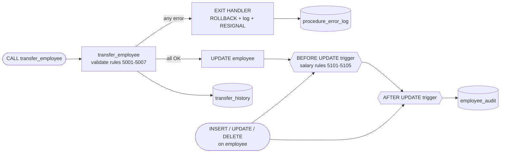

# 🧪 Experiment 6 – Stored Procedure, Triggers and Edge-Case Testing

## Aim

To create a stored procedure **`transfer_employee(emp_id, new_dept_id)`** with **validation and error handling**, to implement **triggers for salary validation and audit logging**, and to **test edge cases**.

## Software Required

- MySQL Server 8.0 or later
- MySQL Workbench or the MySQL command-line client

## Files

| File | Description |
|---|---|
| [`procedures_triggers.sql`](procedures_triggers.sql) | Tables, procedure, triggers and all test cases |
| [`../Experiment-3/company_queries.sql`](../Experiment-3/company_queries.sql) | Creates and fills `company_db` (prerequisite) |
| `README.md` | This lab record |

**How to run:**

```bash
mysql -u root -p -t < ../Experiment-3/company_queries.sql          # creates the schema and data
mysql -u root -p -t --force < procedures_triggers.sql              # runs Experiment 6
```

> `--force` lets the script continue after the **intentional** errors in the test cases. The tests change employee data, so re-run the Experiment 3 script to reset it. Outputs were captured on **MySQL 8.0.46**.

---

## 1. Theory

### 1.1 Stored Procedures

A **stored procedure** is a named block of SQL statements stored in the database and run with `CALL`. It can take `IN`, `OUT` and `INOUT` parameters, and use variables, `IF`, loops, transactions and error handlers.

| Benefit | How it is used here |
|---|---|
| Business rules in one place | All transfer rules live inside `transfer_employee` |
| Atomicity | `START TRANSACTION … COMMIT`, with `ROLLBACK` on error |
| Security | Users can be granted `EXECUTE` on the procedure without `UPDATE` on the table |
| Less network traffic | Several statements run on the server in one call |

### 1.2 Error Handling in MySQL

| Statement | Purpose |
|---|---|
| `SIGNAL SQLSTATE '45000' SET MESSAGE_TEXT = …, MYSQL_ERRNO = …` | Raise a custom error (`45000` = user-defined exception) |
| `DECLARE EXIT HANDLER FOR SQLEXCEPTION BEGIN … END` | Run cleanup code when any error occurs, then leave the procedure |
| `DECLARE CONTINUE HANDLER FOR …` | Handle the error and keep going |
| `GET DIAGNOSTICS CONDITION 1 v = MYSQL_ERRNO, …` | Read the error number, SQLSTATE and message inside a handler |
| `RESIGNAL` | Re-raise the caught error to the caller, unchanged |

### 1.3 Triggers

A **trigger** is code that runs **automatically** when a row is inserted, updated or deleted.

| Timing | Typical use | Can see |
|---|---|---|
| `BEFORE INSERT / UPDATE` | **Validate** or modify the new values. A `SIGNAL` cancels the statement. | `NEW` (and `OLD` for UPDATE) |
| `AFTER INSERT / UPDATE / DELETE` | **Audit logging** and changes to other tables | `NEW` / `OLD` (read-only) |
| `BEFORE DELETE` | Block deletions that break business rules | `OLD` |

Triggers are `FOR EACH ROW`. A statement that touches 10 rows fires the trigger 10 times, and if any one of them fails, the **entire statement is rolled back**.

### 1.4 Design of This Experiment



### 1.5 Custom Error Codes

| Code | Raised by | Rule |
|---|---|---|
| 5001 | Procedure | `emp_id` and `new_dept_id` are required (NULL or blank) |
| 5002 | Procedure | Employee does not exist |
| 5003 | Procedure | Department does not exist |
| 5004 | Procedure | Employee is already in that department |
| 5005 | Procedure | Employee is the head of a department |
| 5006 | Procedure | Employee is the Lead of an **Ongoing** project |
| 5007 | Procedure | Employee still has direct reports |
| 5101 | Trigger | Salary below ₹15,000 |
| 5102 | Trigger | Salary above ₹5,00,000 |
| 5103 | Trigger | Commission more than 50% of salary |
| 5104 | Trigger | Raise of more than 30% in one update |
| 5105 | Trigger | Salary reduction |
| 5106 | Trigger | Deleting a department head |

---

## 2. Implementation

### 2.1 Supporting Tables

```sql
-- Audit trail written by the triggers (no FK, so history survives deletes)
CREATE TABLE employee_audit (
    audit_id         INT AUTO_INCREMENT PRIMARY KEY,
    emp_id           INT          NOT NULL,
    action           ENUM('INSERT','UPDATE','DELETE') NOT NULL,
    old_dept         CHAR(3),
    new_dept         CHAR(3),
    old_salary       DECIMAL(10,2),
    new_salary       DECIMAL(10,2),
    old_designation  VARCHAR(50),
    new_designation  VARCHAR(50),
    changed_by       VARCHAR(100) NOT NULL,
    changed_at       TIMESTAMP    NOT NULL DEFAULT CURRENT_TIMESTAMP
);

-- History of successful transfers written by the procedure
CREATE TABLE transfer_history (
    transfer_id      INT AUTO_INCREMENT PRIMARY KEY,
    emp_id           INT     NOT NULL,
    from_dept        CHAR(3) NOT NULL,
    to_dept          CHAR(3) NOT NULL,
    old_manager_id   INT,
    new_manager_id   INT,
    transferred_by   VARCHAR(100) NOT NULL,
    transferred_at   TIMESTAMP NOT NULL DEFAULT CURRENT_TIMESTAMP
);

-- Failed procedure calls captured by the error handler
CREATE TABLE procedure_error_log (
    log_id           INT AUTO_INCREMENT PRIMARY KEY,
    proc_name        VARCHAR(64) NOT NULL,
    emp_id           INT,
    new_dept_id      VARCHAR(10),
    sql_state        CHAR(5),
    error_no         INT,
    error_message    VARCHAR(255),
    logged_at        TIMESTAMP NOT NULL DEFAULT CURRENT_TIMESTAMP
);
```

### 2.2 Stored Procedure `transfer_employee`

```sql
DELIMITER $$

CREATE PROCEDURE transfer_employee(IN p_emp_id INT, IN p_new_dept_id VARCHAR(10))
BEGIN
    DECLARE v_old_dept   CHAR(3);
    DECLARE v_old_mgr    INT;
    DECLARE v_new_mgr    INT;
    DECLARE v_emp_name   VARCHAR(61);
    DECLARE v_count      INT DEFAULT 0;
    DECLARE v_msg        VARCHAR(255);
    -- variables for the error handler
    DECLARE v_state      CHAR(5);
    DECLARE v_errno      INT;
    DECLARE v_errmsg     VARCHAR(255);

    -- Error handling: on ANY error, roll back, log the failure, re-raise it to the caller
    DECLARE EXIT HANDLER FOR SQLEXCEPTION
    BEGIN
        GET DIAGNOSTICS CONDITION 1
            v_state  = RETURNED_SQLSTATE,
            v_errno  = MYSQL_ERRNO,
            v_errmsg = MESSAGE_TEXT;
        ROLLBACK;
        INSERT INTO procedure_error_log (proc_name, emp_id, new_dept_id, sql_state, error_no, error_message)
        VALUES ('transfer_employee', p_emp_id, p_new_dept_id, v_state, v_errno, v_errmsg);
        RESIGNAL;
    END;

    -- Normalise input: ' d05 ' -> 'D05'
    SET p_new_dept_id = UPPER(TRIM(p_new_dept_id));

    -- Rule 5001: required parameters
    IF p_emp_id IS NULL OR p_new_dept_id IS NULL OR p_new_dept_id = '' THEN
        SIGNAL SQLSTATE '45000'
            SET MESSAGE_TEXT = 'emp_id and new_dept_id are required', MYSQL_ERRNO = 5001;
    END IF;

    START TRANSACTION;

    -- Rule 5002: employee must exist (row is locked until COMMIT/ROLLBACK)
    SELECT dept_id, manager_id, CONCAT(first_name, ' ', last_name)
      INTO v_old_dept, v_old_mgr, v_emp_name
      FROM employee
     WHERE emp_id = p_emp_id
       FOR UPDATE;

    IF v_old_dept IS NULL THEN
        SET v_msg = CONCAT('Employee ', p_emp_id, ' does not exist');
        SIGNAL SQLSTATE '45000' SET MESSAGE_TEXT = v_msg, MYSQL_ERRNO = 5002;
    END IF;

    -- Rule 5003: target department must exist
    IF NOT EXISTS (SELECT 1 FROM department WHERE dept_id = p_new_dept_id) THEN
        SET v_msg = CONCAT('Department ', p_new_dept_id, ' does not exist');
        SIGNAL SQLSTATE '45000' SET MESSAGE_TEXT = v_msg, MYSQL_ERRNO = 5003;
    END IF;

    -- Rule 5004: must be a different department
    IF v_old_dept = p_new_dept_id THEN
        SET v_msg = CONCAT(v_emp_name, ' is already in department ', p_new_dept_id);
        SIGNAL SQLSTATE '45000' SET MESSAGE_TEXT = v_msg, MYSQL_ERRNO = 5004;
    END IF;

    -- Rule 5005: department heads cannot be transferred
    IF EXISTS (SELECT 1 FROM department WHERE manager_id = p_emp_id) THEN
        SET v_msg = CONCAT(v_emp_name, ' heads a department; appoint a new head first');
        SIGNAL SQLSTATE '45000' SET MESSAGE_TEXT = v_msg, MYSQL_ERRNO = 5005;
    END IF;

    -- Rule 5006: Leads of ongoing projects cannot be transferred
    IF EXISTS (SELECT 1
                 FROM works_on w
                 JOIN project p ON p.proj_id = w.proj_id
                WHERE w.emp_id = p_emp_id AND w.role = 'Lead' AND p.status = 'Ongoing') THEN
        SET v_msg = CONCAT(v_emp_name, ' leads an ongoing project; hand over the project first');
        SIGNAL SQLSTATE '45000' SET MESSAGE_TEXT = v_msg, MYSQL_ERRNO = 5006;
    END IF;

    -- Rule 5007: employees with direct reports cannot be transferred
    SELECT COUNT(*) INTO v_count FROM employee WHERE manager_id = p_emp_id;
    IF v_count > 0 THEN
        SET v_msg = CONCAT(v_emp_name, ' has ', v_count, ' direct report(s); reassign them first');
        SIGNAL SQLSTATE '45000' SET MESSAGE_TEXT = v_msg, MYSQL_ERRNO = 5007;
    END IF;

    -- All checks passed: move the employee and report to the new department's head
    SELECT manager_id INTO v_new_mgr FROM department WHERE dept_id = p_new_dept_id;

    UPDATE employee
       SET dept_id = p_new_dept_id,
           manager_id = v_new_mgr
     WHERE emp_id = p_emp_id;

    INSERT INTO transfer_history (emp_id, from_dept, to_dept, old_manager_id, new_manager_id, transferred_by)
    VALUES (p_emp_id, v_old_dept, p_new_dept_id, v_old_mgr, v_new_mgr, CURRENT_USER());

    COMMIT;

    SELECT CONCAT('SUCCESS: ', v_emp_name, ' transferred from ', v_old_dept,
                  ' to ', p_new_dept_id, ' (new manager: ', v_new_mgr, ')') AS result;
END $$

DELIMITER ;
```

**Key points:**
- **Validation** happens before any change, in a fixed order. The first rule that fails stops the procedure with a clear message and a unique error number.
- `SELECT … FOR UPDATE` **locks** the employee row, so two sessions cannot transfer the same person at the same time.
- The **EXIT HANDLER** catches every error, whether from a `SIGNAL`, a constraint or a trigger. It reads the error with `GET DIAGNOSTICS`, runs `ROLLBACK`, writes to `procedure_error_log`, and re-raises the original error with `RESIGNAL`.
- On success, the employee's manager is set to the head of the new department, and the move is recorded in `transfer_history`.

### 2.3 Triggers

```sql
DELIMITER $$

-- Helper procedure shared by the INSERT and UPDATE triggers
CREATE PROCEDURE validate_salary(IN p_salary DECIMAL(10,2), IN p_commission DECIMAL(10,2))
BEGIN
    IF p_salary < 15000 THEN
        SIGNAL SQLSTATE '45000'
            SET MESSAGE_TEXT = 'Salary cannot be below Rs 15,000 per month', MYSQL_ERRNO = 5101;
    END IF;
    IF p_salary > 500000 THEN
        SIGNAL SQLSTATE '45000'
            SET MESSAGE_TEXT = 'Salary cannot exceed Rs 5,00,000 per month', MYSQL_ERRNO = 5102;
    END IF;
    IF p_commission IS NOT NULL AND p_commission > 0.5 * p_salary THEN
        SIGNAL SQLSTATE '45000'
            SET MESSAGE_TEXT = 'Commission cannot exceed 50% of salary', MYSQL_ERRNO = 5103;
    END IF;
END $$

-- 1. Salary validation on INSERT
CREATE TRIGGER trg_employee_before_insert
BEFORE INSERT ON employee
FOR EACH ROW
BEGIN
    CALL validate_salary(NEW.salary, NEW.commission);
END $$

-- 2. Salary validation on UPDATE (limits + no big jumps + no cuts)
CREATE TRIGGER trg_employee_before_update
BEFORE UPDATE ON employee
FOR EACH ROW
BEGIN
    DECLARE v_msg VARCHAR(255);

    CALL validate_salary(NEW.salary, NEW.commission);

    IF NEW.salary > OLD.salary * 1.30 THEN
        SET v_msg = CONCAT('Raise for employee ', OLD.emp_id, ' is ',
                           ROUND((NEW.salary - OLD.salary) * 100 / OLD.salary, 1),
                           '%; maximum allowed is 30%');
        SIGNAL SQLSTATE '45000' SET MESSAGE_TEXT = v_msg, MYSQL_ERRNO = 5104;
    END IF;

    IF NEW.salary < OLD.salary THEN
        SET v_msg = CONCAT('Salary of employee ', OLD.emp_id, ' cannot be reduced (',
                           OLD.salary, ' -> ', NEW.salary, ')');
        SIGNAL SQLSTATE '45000' SET MESSAGE_TEXT = v_msg, MYSQL_ERRNO = 5105;
    END IF;
END $$

-- 3. Protect department heads from deletion
CREATE TRIGGER trg_employee_before_delete
BEFORE DELETE ON employee
FOR EACH ROW
BEGIN
    IF EXISTS (SELECT 1 FROM department WHERE manager_id = OLD.emp_id) THEN
        SIGNAL SQLSTATE '45000'
            SET MESSAGE_TEXT = 'Cannot delete a department head; appoint a new head first',
                MYSQL_ERRNO = 5106;
    END IF;
END $$

-- 4. Audit logging: INSERT
CREATE TRIGGER trg_employee_after_insert
AFTER INSERT ON employee
FOR EACH ROW
BEGIN
    INSERT INTO employee_audit (emp_id, action, new_dept, new_salary, new_designation, changed_by)
    VALUES (NEW.emp_id, 'INSERT', NEW.dept_id, NEW.salary, NEW.designation, CURRENT_USER());
END $$

-- 5. Audit logging: UPDATE (only when a tracked column really changed)
CREATE TRIGGER trg_employee_after_update
AFTER UPDATE ON employee
FOR EACH ROW
BEGIN
    IF NOT (OLD.dept_id     <=> NEW.dept_id)
    OR NOT (OLD.salary      <=> NEW.salary)
    OR NOT (OLD.designation <=> NEW.designation) THEN
        INSERT INTO employee_audit (emp_id, action, old_dept, new_dept, old_salary, new_salary,
                                    old_designation, new_designation, changed_by)
        VALUES (NEW.emp_id, 'UPDATE', OLD.dept_id, NEW.dept_id, OLD.salary, NEW.salary,
                OLD.designation, NEW.designation, CURRENT_USER());
    END IF;
END $$

-- 6. Audit logging: DELETE
CREATE TRIGGER trg_employee_after_delete
AFTER DELETE ON employee
FOR EACH ROW
BEGIN
    INSERT INTO employee_audit (emp_id, action, old_dept, old_salary, old_designation, changed_by)
    VALUES (OLD.emp_id, 'DELETE', OLD.dept_id, OLD.salary, OLD.designation, CURRENT_USER());
END $$

DELIMITER ;
```

| Trigger | Timing | Event | Purpose |
|---|---|---|---|
| `trg_employee_before_insert` | BEFORE | INSERT | Salary and commission limits |
| `trg_employee_before_update` | BEFORE | UPDATE | Limits, maximum 30% raise, no salary cut |
| `trg_employee_before_delete` | BEFORE | DELETE | Protect department heads |
| `trg_employee_after_insert` | AFTER | INSERT | Audit the new row |
| `trg_employee_after_update` | AFTER | UPDATE | Audit changes to dept, salary or designation |
| `trg_employee_after_delete` | AFTER | DELETE | Audit the deleted row |

`validate_salary` is a helper procedure called by **both** BEFORE triggers, so the salary rules are written only once.

---

## 3. Verifying the Objects

#### D1. Stored routines in company_db.

```sql
SELECT ROUTINE_NAME, ROUTINE_TYPE, CREATED IS NOT NULL AS created
FROM information_schema.ROUTINES
WHERE ROUTINE_SCHEMA = 'company_db'
ORDER BY ROUTINE_NAME;
```

**Output:**

```
+-------------------+--------------+---------+
| ROUTINE_NAME      | ROUTINE_TYPE | created |
+-------------------+--------------+---------+
| transfer_employee | PROCEDURE    |       1 |
| validate_salary   | PROCEDURE    |       1 |
+-------------------+--------------+---------+
2 rows in set
```

#### D2. Triggers on the employee table.

```sql
SELECT TRIGGER_NAME, ACTION_TIMING AS timing, EVENT_MANIPULATION AS event, EVENT_OBJECT_TABLE AS on_table
FROM information_schema.TRIGGERS
WHERE TRIGGER_SCHEMA = 'company_db'
ORDER BY ACTION_TIMING DESC, EVENT_MANIPULATION;
```

**Output:**

```
+----------------------------+--------+--------+----------+
| TRIGGER_NAME               | timing | event  | on_table |
+----------------------------+--------+--------+----------+
| trg_employee_after_insert  | AFTER  | INSERT | employee |
| trg_employee_after_update  | AFTER  | UPDATE | employee |
| trg_employee_after_delete  | AFTER  | DELETE | employee |
| trg_employee_before_insert | BEFORE | INSERT | employee |
| trg_employee_before_update | BEFORE | UPDATE | employee |
| trg_employee_before_delete | BEFORE | DELETE | employee |
+----------------------------+--------+--------+----------+
6 rows in set
```

---

## 4. Testing the Procedure

#### T1. Transfer Arjun (105) from Engineering (D01) to Finance (D03).

```sql
SELECT emp_id, first_name, dept_id, manager_id FROM employee WHERE emp_id = 105;
CALL transfer_employee(105, 'D03');
SELECT emp_id, first_name, dept_id, manager_id FROM employee WHERE emp_id = 105;
SELECT transfer_id, emp_id, from_dept, to_dept, old_manager_id, new_manager_id FROM transfer_history;
```

**Output:**

```
mysql> SELECT emp_id, first_name, dept_id, manager_id FROM employee WHERE emp_id = 105;
+--------+------------+---------+------------+
| emp_id | first_name | dept_id | manager_id |
+--------+------------+---------+------------+
|    105 | Arjun      | D01     |        102 |
+--------+------------+---------+------------+
1 row in set

mysql> CALL transfer_employee(105, 'D03');
+--------------------------------------------------------------------+
| result                                                             |
+--------------------------------------------------------------------+
| SUCCESS: Arjun Nair transferred from D01 to D03 (new manager: 115) |
+--------------------------------------------------------------------+
1 row in set

mysql> SELECT emp_id, first_name, dept_id, manager_id FROM employee WHERE emp_id = 105;
+--------+------------+---------+------------+
| emp_id | first_name | dept_id | manager_id |
+--------+------------+---------+------------+
|    105 | Arjun      | D03     |        115 |
+--------+------------+---------+------------+
1 row in set

mysql> SELECT transfer_id, emp_id, from_dept, to_dept, old_manager_id, new_manager_id FROM transfer_history;
+-------------+--------+-----------+---------+----------------+----------------+
| transfer_id | emp_id | from_dept | to_dept | old_manager_id | new_manager_id |
+-------------+--------+-----------+---------+----------------+----------------+
|           1 |    105 | D01       | D03     |            102 |            115 |
+-------------+--------+-----------+---------+----------------+----------------+
1 row in set
```

> **Observation:** All checks passed. In one transaction, the employee moved to D03, now reports to the Finance head (115), and a row was added to `transfer_history`.

#### T2. Lower-case department code with spaces is accepted.

```sql
CALL transfer_employee(132, '  d02 ');
SELECT emp_id, first_name, dept_id, manager_id FROM employee WHERE emp_id = 132;
```

**Output:**

```
mysql> CALL transfer_employee(132, '  d02 ');
+-----------------------------------------------------------------------+
| result                                                                |
+-----------------------------------------------------------------------+
| SUCCESS: Naveen Prasad transferred from D05 to D02 (new manager: 111) |
+-----------------------------------------------------------------------+
1 row in set

mysql> SELECT emp_id, first_name, dept_id, manager_id FROM employee WHERE emp_id = 132;
+--------+------------+---------+------------+
| emp_id | first_name | dept_id | manager_id |
+--------+------------+---------+------------+
|    132 | Naveen     | D02     |        111 |
+--------+------------+---------+------------+
1 row in set
```

> **Observation:** `UPPER(TRIM(p_new_dept_id))` turned `'  d02 '` into `'D02'`, so careless input is accepted safely.

#### T3. Sanjay (112) is Lead only of a COMPLETED project, so he may move.

```sql
CALL transfer_employee(112, 'D04');
```

**Output:**

```
+----------------------------------------------------------------------+
| result                                                               |
+----------------------------------------------------------------------+
| SUCCESS: Sanjay Gupta transferred from D02 to D04 (new manager: 120) |
+----------------------------------------------------------------------+
1 row in set
```

> **Observation:** Rule 5006 blocks only Leads of **Ongoing** projects. Sanjay led P04, which is *Completed*, so his transfer is allowed.

#### T4. NULL employee id.

```sql
CALL transfer_employee(NULL, 'D02');
```

**Output:**

```
mysql> CALL transfer_employee(NULL, 'D02');
ERROR 5001 (45000): emp_id and new_dept_id are required
```

> **Observation:** A NULL input is caught before any table is touched.

#### T5. Blank department code.

```sql
CALL transfer_employee(110, '   ');
```

**Output:**

```
mysql> CALL transfer_employee(110, '   ');
ERROR 5001 (45000): emp_id and new_dept_id are required
```

> **Observation:** After trimming, the department code is an empty string, which is treated the same as NULL.

#### T6. Employee that does not exist.

```sql
CALL transfer_employee(999, 'D02');
```

**Output:**

```
mysql> CALL transfer_employee(999, 'D02');
ERROR 5002 (45000): Employee 999 does not exist
```

#### T7. Department that does not exist.

```sql
CALL transfer_employee(110, 'D09');
```

**Output:**

```
mysql> CALL transfer_employee(110, 'D09');
ERROR 5003 (45000): Department D09 does not exist
```

#### T8. Transfer to the department the employee is already in.

```sql
CALL transfer_employee(110, 'D01');
```

**Output:**

```
mysql> CALL transfer_employee(110, 'D01');
ERROR 5004 (45000): Neha Joshi is already in department D01
```
