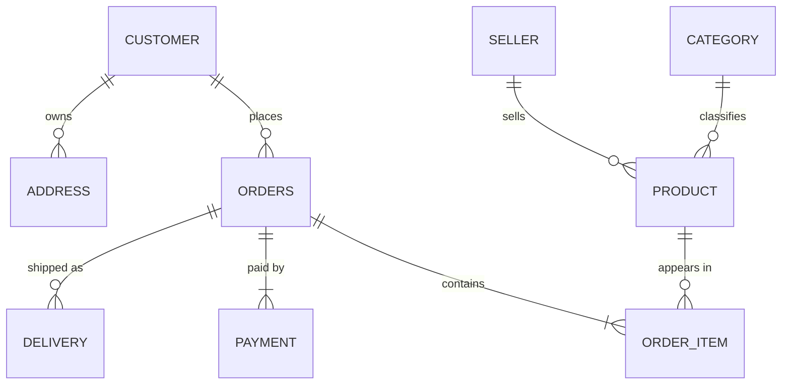
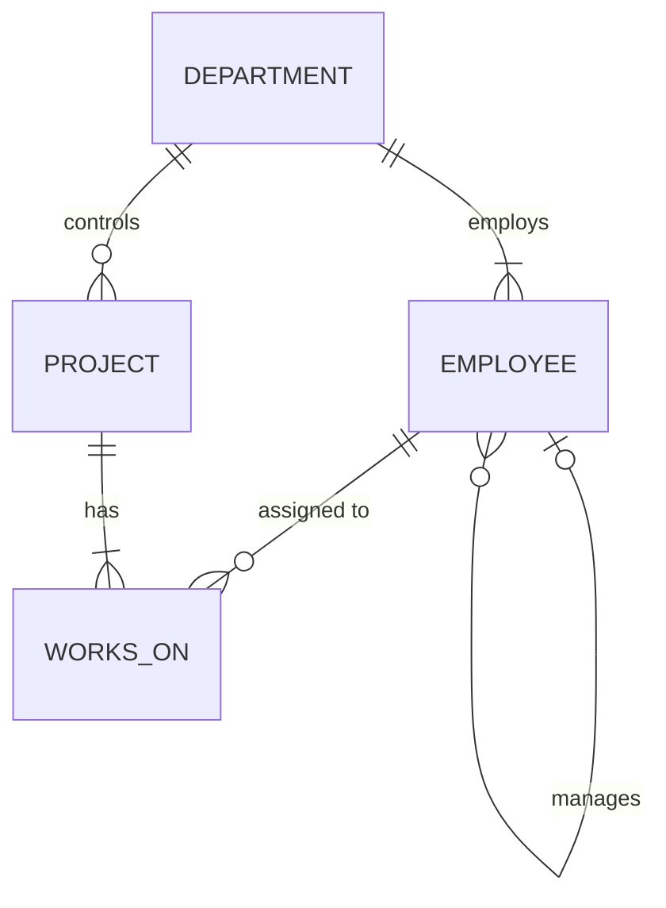

<div align="center">

# DBMS Lab

**Database Management Systems laboratory work: from ER modelling to stored procedures, implemented in MySQL 8**


[Experiments](#experiments) •
[Repository Structure](#repository-structure) •
[Getting Started](#getting-started) •
[Databases](#databases-used) •
[Concepts Covered](#concepts-covered)

</div>

---

## About

This repository contains my **DBMS lab experiments**. Each experiment has:

- a **lab record** (`Exp_N.md`) with the aim, theory, implementation, output and result
- a **runnable SQL script** that reproduces every output shown in the record

All queries were executed on **MySQL 8.0**, and the outputs in each record are copied from real runs. The diagrams are written in **Mermaid**, so GitHub renders them directly in the browser.

---

## Experiments

| No. | Experiment | Key Topics | Lab Record | SQL Script |
|:---:|---|---|:---:|:---:|
| **1** | **ER Diagram:** Indian E-Commerce Platform | Entities, keys, composite and multi-valued attributes, weak entities, specialization, participation constraints | [Exp_1.md](Exp_1.md) | — |
| **2** | **ER to Relational Schema** | `CREATE TABLE`, PK / FK, `NOT NULL`, `UNIQUE`, `CHECK`, `ON DELETE CASCADE / SET NULL`, referential integrity violations | [Exp_2.md](Exp_2.md) | [ecommerce_schema.sql](ecommerce_schema.sql) |
| **3** | **Employee–Department–Project Queries** | Selection, projection, aggregates, `GROUP BY`, `HAVING`, `CASE`, `ORDER BY` | [Exp_3.md](Exp_3.md) | [company_queries.sql](company_queries.sql) |
| **4** | **Joins, Subqueries and EXPLAIN** | `INNER` / `LEFT` / self / 3-way joins, correlated subqueries, `EXISTS`, simulated `INTERSECT` and `EXCEPT`, execution plans | [Exp_4.md](Exp_4.md) | [joins_subqueries.sql](joins_subqueries.sql) |
| **5** | **Views and Recursive CTEs** | Salary summary and hierarchy views, view updatability, `WITH CHECK OPTION`, `WITH RECURSIVE` reporting chains | [Exp_5.md](Exp_5.md) | [views_recursive_cte.sql](views_recursive_cte.sql) |
| **6** | **Stored Procedures and Triggers** | `transfer_employee` procedure, `SIGNAL` / `RESIGNAL`, error handlers, salary-validation and audit triggers, edge cases | [Exp_6.md](Exp_6.md) | [procedures_triggers.sql](procedures_triggers.sql) |

---

## Repository Structure

```
DBMS-Lab/
│
├── README.md                    ← you are here
│
├── Exp_1.md                     ← ER diagram (Mermaid)
├── Exp_2.md                     ← Relational schema and constraints
├── Exp_3.md                     ← Basic SQL queries
├── Exp_4.md                     ← Joins, subqueries, EXPLAIN
├── Exp_5.md                     ← Views and recursive CTEs
├── Exp_6.md                     ← Procedures and triggers
│
├── ecommerce_schema.sql         ← Exp 2  (creates ecommerce_db)
├── company_queries.sql          ← Exp 3  (creates company_db, used by Exp 4–6)
├── joins_subqueries.sql         ← Exp 4
├── views_recursive_cte.sql      ← Exp 5
└── procedures_triggers.sql      ← Exp 6
```

---

## Getting Started

### Prerequisites

- **MySQL Server 8.0.31 or later** (needed for native `INTERSECT` / `EXCEPT` in Exp 4)
- MySQL command-line client or **MySQL Workbench**

### Clone the repository

```bash
git clone https://github.com/priyanshi2807/<repository-name>.git
cd <repository-name>
```

### Run the experiments

```bash
# Experiment 2: e-commerce database (independent)
mysql -u root -p -t --force < ecommerce_schema.sql

# Experiment 3: creates company_db. Run this BEFORE Experiments 4, 5 and 6
mysql -u root -p -t < company_queries.sql

# Experiments 4–6 run on company_db
mysql -u root -p -t          < joins_subqueries.sql
mysql -u root -p -t --force  < views_recursive_cte.sql
mysql -u root -p -t --force  < procedures_triggers.sql
```

> [!NOTE]
> `--force` keeps the script running after errors that are **intentional**. Experiments 2, 5 and 6 deliberately trigger constraint, view and trigger violations to demonstrate them.

> [!TIP]
> Experiment 6 changes employee data. To start again from clean data, re-run `company_queries.sql`.

---

## Databases Used

### 1. `ecommerce_db`: Indian e-commerce platform (Exp 1–2)



**16 tables:** customers with multiple phone numbers and saved addresses; sellers with GSTIN and PAN; products specialised into Electronics, Clothing, Book and Grocery; orders, UPI / Card / COD payments, and deliveries through Indian courier partners.

### 2. `company_db`: Employee–Department–Project (Exp 3–6)



| Table | Rows | Description |
|---|:---:|---|
| `department` | 5 | Engineering, HR, Finance, Marketing, Operations |
| `employee` | 32 | Indian employees with a manager hierarchy (self-reference) |
| `project` | 8 | e.g. UPI Payment Gateway, GST Compliance Automation, Diwali Festive Campaign |
| `works_on` | 40 | M : N assignments with weekly hours and role |

---

## Concepts Covered

<table>
<tr>
<td valign="top" width="50%">

**Data Modelling**
- [x] ER diagrams and notation
- [x] Composite, multi-valued and derived attributes
- [x] Weak entities and identifying relationships
- [x] Specialization (disjoint, partial)
- [x] Participation and cardinality constraints
- [x] ER-to-relational mapping

**Constraints and Integrity**
- [x] Primary, foreign and unique keys
- [x] `NOT NULL` and `CHECK`
- [x] `ON DELETE CASCADE / SET NULL / RESTRICT`
- [x] Referential integrity violations

**Querying**
- [x] Selection, projection and `DISTINCT`
- [x] Aggregates, `GROUP BY`, `HAVING`
- [x] `CASE` expressions and `ORDER BY`

</td>
<td valign="top" width="50%">

**Advanced Queries**
- [x] Inner, outer, self and multi-table joins
- [x] Correlated subqueries
- [x] `EXISTS` / `NOT EXISTS` and relational division
- [x] `INTERSECT` and `EXCEPT` (native and simulated)

**Query Optimisation**
- [x] `EXPLAIN`, `EXPLAIN FORMAT=TREE`, `EXPLAIN ANALYZE`
- [x] Indexes and access types
- [x] Semi-join and anti-join plans

**Database Programming**
- [x] Views and view updatability
- [x] `WITH CHECK OPTION` (LOCAL / CASCADED)
- [x] Recursive CTEs
- [x] Stored procedures and transactions
- [x] `SIGNAL`, `RESIGNAL`, `GET DIAGNOSTICS`
- [x] `BEFORE` / `AFTER` triggers and audit logging

</td>
</tr>
</table>

---

## Tools and Technologies

| Tool | Purpose |
|---|---|
| **MySQL 8.0** | Database server used for every experiment |
| **MySQL Workbench / CLI** | Running scripts and viewing results |
| **Mermaid** | ER and flow diagrams rendered by GitHub |
| **Git and GitHub** | Version control and hosting the lab records |

---

<div align="center">

**Author:** [priyanshi2807](https://github.com/priyanshi2807)

*If you find this repository helpful, consider giving it a star.*

</div>
